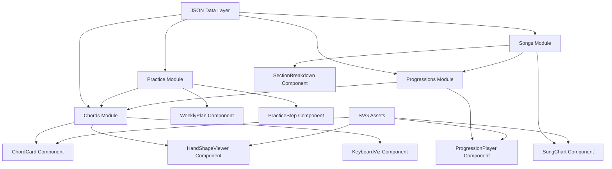

## 产品概述

将当前基于 Docsify 的 Markdown 文档站中"实战篇"的内容，重构为一个独立的前端交互式应用。和弦知识（构成、手型、指法）、每日练习（五组调性轮动）、和弦进行、经典曲目拆解各自成为解耦的模块，通过统一的 JSON 数据层驱动渲染。不再是文本堆砌，而是以交互式卡片、可切换的键盘可视化、可筛选的练习面板呈现。

## 核心功能

- **和弦知识模块**：统一展示 9 种和弦（大三、小三、大七、小七、sus2、sus4、add9、maj6/maj69、dom7）的构成音、手型定义、指法编号、声部排列，支持手型切换与十二调平移预览
- **每日练习模块**：五度圈周维度轮动（周一至周日五组调），每种和弦的练习步骤（纵向→横向→视唱）以可交互面板呈现，与和弦定义解耦——练习模块引用和弦模块的 chordId
- **和弦进行模块**：将散落在各练习页中的进行（如 4566、1maj7→4maj7、Fsus2→Gsus4→C 等）统一管理，每个进行定义其级数序列、和弦引用、手型表、节奏型 SVG
- **经典曲目拆解模块**：曲目按统一五维度（曲目信息、和弦进行分析、段落拆解、伴奏手法、练习要点）结构化呈现，支持弹唱谱与功能谱 SVG 展示
- **统一 JSON 数据层**：所有和弦、练习、进行、曲目数据以结构化 JSON 管理，支持增删改查，便于后续大模型应用解析

## 技术栈

- **前端框架**：React 18 + TypeScript（组件化、类型安全，适合复杂交互）
- **构建工具**：Vite（快速开发服务器，轻量构建）
- **样式**：Tailwind CSS（与现有项目 SVG 风格一致，快速实现响应式布局）
- **组件库**：shadcn/ui（可定制、可访问性好的组件，适合交互式面板）
- **数据层**：JSON 静态文件 + TypeScript 类型定义（编译时类型检查，运行时零依赖）
- **已有资产复用**：所有 SVG 图片（`docs/assets/images/`）直接复用，Python 生成脚本保持不变

## 实现方案

### 核心策略

将"数据"与"视图"彻底分离：所有和弦、手型、练习、进行、曲目信息抽取为结构化 JSON，前端通过类型安全的 TypeScript 接口消费 JSON，渲染为交互式组件。和弦模块作为"数据源"，练习模块和进行模块通过 chordId 引用和弦定义，实现解耦。

### 关键技术决策

1. **JSON 而非 Markdown**：现有 Markdown 内容中表格、图片引用、手型定义混杂，无法程序化查询。抽取为 JSON 后，每个和弦是一个对象（含 intervals、handShapes、voicings），每个练习是一个对象（含 chordId 引用、practiceGroups、steps），支持 CRUD。
2. **chordId 引用解耦**：练习模块不内联和弦定义，而是 `"chordId": "major"` 引用，和弦定义变更自动反映到所有练习页。
3. **复用 SVG 资产**：现有 247 张 SVG 已由 Python 脚本生成，前端通过 JSON 中的图片路径引用，不重复生成。
4. **单页应用（SPA）**：React Router 实现和弦库/每日练习/和弦进行/曲目拆解四个路由，每个路由内用 Tab/Accordion 组织子内容。

### 性能考量

- JSON 文件按模块拆分（chords.json、practice.json、progressions.json、songs.json），按路由懒加载，避免首屏加载全量数据
- SVG 图片懒加载（IntersectionObserver），避免一次加载 247 张
- 和弦键盘可视化如需动态渲染，复用现有 Python 脚本的半音模型逻辑，用 Canvas/SVG 在前端绘制

## 架构设计



### 模块关系

- **和弦模块**：数据源，定义所有和弦类型与手型，被其他模块引用
- **练习模块**：通过 `chordId` 引用和弦定义，管理练习分组与步骤
- **进行模块**：通过 `chordIds[]` 引用多个和弦，管理和弦进行的声部连接
- **曲目模块**：通过 `progressionId` 引用和弦进行，管理段落与弹唱谱

## 目录结构

```
chords-keys-cookbook/
├── docs/                          # [保留] 原有 Docsify 站点不动
├── scripts/                       # [保留] 原有 Python SVG 生成脚本
├── data/                          # [NEW] 统一 JSON 数据层
│   ├── chords.json                # [NEW] 9种和弦定义：intervals、handShapes、voicings、svg路径
│   ├── practice.json              # [NEW] 练习模式：chordId引用、weeklyGroups、steps
│   ├── progressions.json          # [NEW] 和弦进行：级数序列、chordId引用、手型表、节奏SVG
│   └── songs.json                 # [NEW] 曲目拆解：曲目信息、段落分析、练习要点
├── web/                           # [NEW] 前端独立应用
│   ├── src/
│   │   ├── types/                 # [NEW] TypeScript 类型定义
│   │   │   ├── chord.ts           # [NEW] ChordType、HandShape、Voicing 接口
│   │   │   ├── practice.ts        # [NEW] PracticeModule、WeeklyGroup、PracticeStep 接口
│   │   │   ├── progression.ts     # [NEW] Progression、ProgressionMeasure 接口
│   │   │   └── song.ts            # [NEW] Song、SongSection、SectionBreakdown 接口
│   │   ├── data/                  # [NEW] JSON 加载与验证
│   │   │   └── loader.ts          # [NEW] 按路由懒加载JSON，类型校验
│   │   ├── components/
│   │   │   ├── chord/             # [NEW] 和弦模块组件
│   │   │   │   ├── ChordCard.tsx        # [NEW] 和弦卡片：结构、构成音、唱名
│   │   │   │   ├── HandShapeViewer.tsx  # [NEW] 手型切换器：手型一/二/三 Tab
│   │   │   │   └── VoicingTable.tsx     # [NEW] 声部排列表：三种排列切换
│   │   │   ├── practice/          # [NEW] 练习模块组件
│   │   │   │   ├── WeeklyPlan.tsx       # [NEW] 周维度轮动面板：周一至周日
│   │   │   │   └── PracticeSteps.tsx    # [NEW] 练习步骤：纵向→横向→视唱
│   │   │   ├── progression/      # [NEW] 进行模块组件
│   │   │   │   └── ProgressionPlayer.tsx # [NEW] 和弦进行展示：级数、手型表
│   │   │   ├── song/             # [NEW] 曲目模块组件
│   │   │   │   ├── SongChart.tsx        # [NEW] 曲目功能谱展示
│   │   │   │   └── SectionBreakdown.tsx # [NEW] 段落拆解面板
│   │   │   └── common/            # [NEW] 公共组件
│   │   │       ├── KeyboardViz.tsx      # [NEW] 键盘可视化（复用SVG或动态渲染）
│   │   │       └── SvgImage.tsx        # [NEW] SVG懒加载图片
│   │   ├── pages/                # [NEW] 路由页面
│   │   │   ├── ChordsPage.tsx    # [NEW] 和弦库页面
│   │   │   ├── PracticePage.tsx  # [NEW] 每日练习页面
│   │   │   ├── ProgressionsPage.tsx # [NEW] 和弦进行页面
│   │   │   └── SongsPage.tsx     # [NEW] 经典曲目页面
│   │   ├── App.tsx               # [NEW] 根组件 + Router
│   │   └── main.tsx              # [NEW] 入口
│   ├── public/
│   │   └── images/               # [SYMLINK] 指向 docs/assets/images
│   ├── package.json              # [NEW] 依赖配置
│   ├── vite.config.ts           # [NEW] Vite配置
│   └── tsconfig.json             # [NEW] TypeScript配置
└── README.md                     # [MODIFY] 补充前端应用说明
```

## 关键数据结构

### chords.json（和弦定义）

```typescript
interface ChordType {
  id: string;                    // "major" | "minor" | "maj7" | ...
  name: string;                  // "大三和弦"
  symbol: string;                // "C" | "Cm" | "Cmaj7" | ...
  category: "triad" | "seventh" | "color";
  intervals: number[];           // [0, 4, 7] 半音偏移
  intervalNames: string[];       // ["根音", "大三度", "纯五度"]
  solfege: string[];             // ["do", "mi", "so"]
  description: string;            // 结构说明
  handShapes: HandShape[];        // 手型定义
}

interface HandShape {
  id: number;                    // 1 | 2 | 3
  label: string;                 // "紧凑型" | "扩张型"
  subtitle: string;              // "手型一"
  description: string;
  notes: { offset: number; finger: number; hand: "L" | "R" }[];
  range: [number, number];
  svgDir: string;                // "assets/images/major-triads"
  svgPattern: string;            // "{tonic}-hand-shape-{id}.svg"
}
```

### practice.json（练习模块）

```typescript
interface PracticeModule {
  chordId: string;               // 引用 chords.json 中的 id
  weeklyGroups: WeeklyGroup[];
  steps: PracticeStep[];
  progressionId?: string;        // 引用 progressions.json
}

interface WeeklyGroup {
  day: string;                   // "周一" | "周二" | ...
  tonics: string[];              // ["F", "C", "G"]
  note?: string;                 // 练习说明
}
```

### progressions.json（和弦进行）

```typescript
interface Progression {
  id: string;                    // "4566" | "maj7-1-4" | ...
  name: string;
  key: string;                    // "C大调"
  measures: ProgressionMeasure[];
  rhythmSvg?: string;            // 节奏型SVG路径
}

interface ProgressionMeasure {
  degree: string;                // "IV" | "V" | "vi"
  chordId: string;               // 引用 chords.json
  tonic: string;                  // "F" | "G" | "Am"
  handShapeId: number;           // 引用手型
  leftHand: string;              // "F - C - F（5-2-1）"
  rightHand: string;             // "G - C - G（1-2-5）"
}
```

## 设计风格

采用现代深色主题音乐工具风格，以玻璃态（Glassmorphism）面板 + 霓虹强调色营造专业钢琴学习工具的视觉体验。整体氛围参考音乐制作软件（DAW）的深色界面，搭配温暖的木质色调作为背景纹理，呼应钢琴本体。

## 页面规划

### 1. 和弦库页面

- **顶部导航栏**：Logo + 四个路由 Tab（和弦库/每日练习/和弦进行/曲目拆解）
- **和弦分类卡片网格**：按三和弦/七和弦/色彩和弦三行展示，每张卡片显示和弦名称、符号、构成音预览，点击展开详情
- **和弦详情面板**（展开后）：
- 左侧：和弦结构（构成音表 + 唱名）
- 中间：手型切换 Tab + 键盘 SVG 可视化
- 右侧：声部排列表 + 两种手型对比表
- **底部**：五度圈可视化导航器，点击调名切换预览

### 2. 每日练习页面

- **周维度轮动选择器**：横向时间轴（周一~周日），点击切换当日练习组
- **当前调组面板**：展示当日 3 个调（如 F、C、G），每个调一张卡片
- **练习步骤面板**：纵向→横向→视唱三步骤，每步骤一个折叠面板
- **和弦引用卡片**：嵌入当前练习的和弦定义摘要（引用自和弦模块）

### 3. 和弦进行页面

- **进行列表**：卡片网格展示所有和弦进行（4566、1-4-1-4、Fsus2-Gsus4-C 等）
- **进行详情面板**：
- 小节网格表（级数/和弦/手型/左手/右手）
- 节奏型 SVG 展示
- 共同音衔接动画说明

### 4. 曲目拆解页面

- **曲目卡片网格**：每首曲目显示曲名、调性、难度星级、核心技术点
- **曲目详情页**：
- 曲目信息卡片
- 弹唱谱 SVG 展示（歌词↔和弦对位）
- 段落拆解 Tab（主歌/副歌/桥段）
- 伴奏手法对比表
- 练习要点清单

### 5. 通用底栏

- 五度圈迷你导航 + 当前模块面包屑 + 数据版本号

## Agent Extensions

### Integration

- **cloudStudio**
- Purpose: 部署前端独立应用到 Cloud Studio，获取在线访问 URL
- Expected outcome: 前端 React 应用构建并部署完成，可通过 URL 访问交互式和弦学习页面

### SubAgent

- **code-explorer**
- Purpose: 深入探索现有 Python 脚本中的手型数据定义，确保 JSON 提取时数据结构完全对齐
- Expected outcome: 确认所有 gen_*_hand_groups.py 脚本中的 HANDS 数组结构与 notes 元组格式，保证 JSON schema 覆盖所有变体