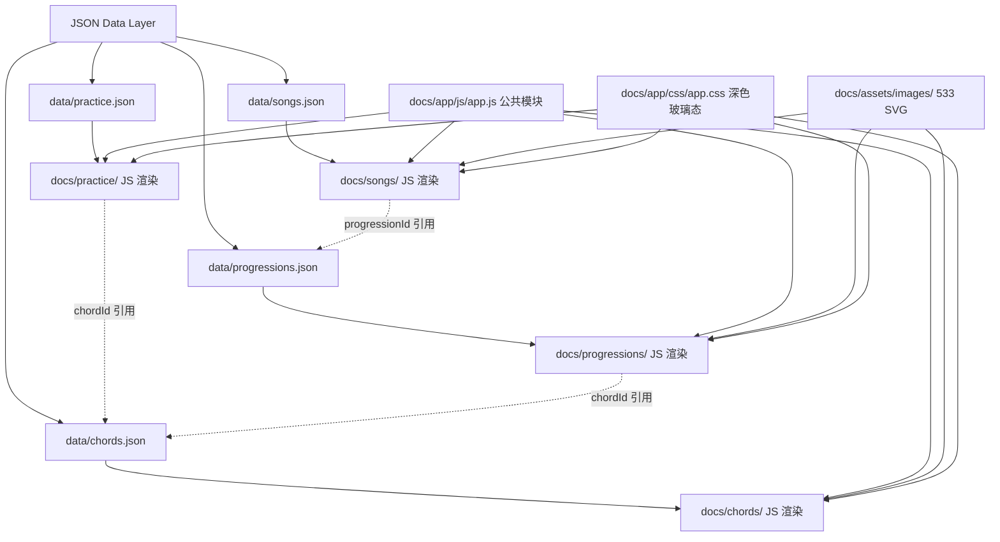

## 产品概述

将现有项目从「Docsify 文档站 + 113 个静态 HTML 和弦页」彻底重构为「JSON 数据驱动 + 原生 JS + Tailwind CDN 的深色玻璃态四模块应用」。移除 Docsify 框架及其所有 Markdown 路由，新应用成为唯一前端入口。4 个模块（和弦库/每日练习/和弦进行/曲目拆解）通过统一的 JSON 数据层和共享 JS 引擎驱动渲染，GitHub Pages 直接托管。

## 现有资产盘点

### 将被移除的资产

- `docs/index.html` — Docsify 入口（含 312 行内联样式 + 自定义插件 + Docsify CDN 脚本）
- `docs/_navbar.md` — Docsify 顶部导航（首页/和弦）
- `docs/_sidebar.md` — Docsify 侧边栏（基础篇~实战篇 34 个 Markdown 链接）
- `docs/chords/` 下 113 个静态 HTML 文件（108 个详情页 + 4 个分类列表页 + 1 个大全首页）
- `docs/chords/site.css` — 378 行浅色极简样式

### 将被保留的资产

- `docs/assets/images/` — 533 张 SVG（216 卡片键盘图 + 240 手型图 + 36 进行图 + 38 节奏型图 + songs/ 预留）
- `scripts/` — 24 个 Python 生成脚本（`gen_chord_pages.py` 的 KINDS 字典是 JSON 提取数据源）

### 理论知识 Markdown 的处理

`docs/1-基础篇/`、`docs/2-进阶篇/`、`docs/3-伴奏篇/` 共 12 个 Markdown 文件包含理论知识（音程/和弦构成/调性/伴奏织体等）。这些内容属于"教程"性质，与 4 个实操模块（和弦/练习/进行/曲目）定位不同。方案采用以下策略：

- **暂不删除，但不再以 Docsify 渲染** — Markdown 文件保留在 `docs/` 下作为内容储备
- **未来可做成第 5 模块（理论库）** — 用同样的 JSON + JS 方式渲染，但不在本次方案范围内
- **当前阶段不暴露入口** — 新应用的导航栏只有 4 个实操模块，不含理论库

## 核心功能

- **和弦知识模块**：9 种和弦类型（大三、小三、属七、小七、大七、sus2、sus4、add9、maj6），每种 12 调 × 1~3 手型，三级路由（大全→分类→详情），SVG 路径从 JSON 动态拼接
- **每日练习模块**：五度圈周维度轮动（周一~周日五组调），每种和弦的练习步骤（纵向→横向→视唱）以可交互面板呈现，通过 chordId 引用和弦定义
- **和弦进行模块**：4 条进行（4566、1maj7→4maj7、1add9→3m7→4sus2→5sus4、Fsus2→Gsus4→C）统一管理，每个进行定义其级数序列、和弦引用、手型表、节奏型 SVG
- **经典曲目拆解模块**：2 首曲目按统一五维度（曲目信息、和弦进行分析、段落拆解、伴奏手法、练习要点）结构化呈现
- **统一 JSON 数据层**：4 个 JSON 静态文件管理所有数据

## 技术栈

- **前端**：原生 HTML5 + JavaScript（ES6+），零依赖零构建
- **样式**：Tailwind CSS CDN（`<script src="https://cdn.tailwindcss.com">`），配合少量自定义 CSS（深色玻璃态）
- **数据层**：4 个 JSON 静态文件，通过 `fetch()` 异步加载
- **部署**：GitHub Pages 直接托管 docs/ 目录，无构建步骤
- **已有资产复用**：533 张 SVG 保持不变，Python 脚本保持不变

## 实现方案

### 核心策略

彻底移除 Docsify，新应用成为唯一前端入口。`docs/index.html` 从 Docsify 入口改为新应用首页（自动跳转 `chords/index.html`）。113 个静态 HTML 和弦页替换为 3 个 HTML 模板 + JS 动态渲染。新建 practice/、progressions/、songs/ 三个模块目录。

### 关键技术决策

1. **移除 Docsify**：删除 `docs/index.html` 的 Docsify 配置、`_navbar.md`、`_sidebar.md`。`docs/index.html` 改为 10 行重定向页（`<meta http-equiv="refresh" content="0;url=chords/">`）。Markdown 理论文件保留但不暴露入口
2. **替代静态 HTML**：删除 113 个静态 HTML，用 `chords/index.html` + `chords/family.html` + `chords/detail.html` 三个模板 + JS 动态渲染。URL 从 `chords/c-major/` 改为 `chords/detail.html?slug=c-major`
3. **深色玻璃态设计**：Tailwind CDN + 自定义 CSS 变量（背景 `#0F0F14`/`#1A1A24`/`#1E1E2E`，主色 `#6366F1`/`#8B5CF6`/`#EC4899`，玻璃态 `backdrop-blur` + 半透明背景）
4. **chordId 引用解耦**：practice.json 和 progressions.json 只存 `"chordId": "major"`，运行时从 chords.json 查找
5. **SVG 路径模板化**：JSON 中存储 `folder` 和手型 `id`，JS 拼接 `{folder}/{tonic}-hand-shape-{id}.svg`
6. **四模块统一导航**：顶部固定导航栏，4 个模块各自独立 HTML 文件，不使用 SPA 路由
7. **共享渲染引擎**：`docs/app/js/app.js` 提供公共函数，各模块 JS 按需引用

### 性能考量

- JSON 文件按模块拆分，每个页面只 fetch 需要的数据
- SVG 按需加载（切换调/手型时才设 ``）
- 无 Docsify 运行时开销，无 JS 框架开销
- Tailwind CDN 约 300KB（gzip ~100KB），浏览器缓存后全局复用

## 实现说明

- JSON 数据从 `scripts/gen_chord_pages.py` 的 KINDS 字典 + FAMILIES 列表提取，确保与 SVG 完全对齐
- KINDS 字典已有：intervals、formula、tone、style、folder、suffix、hands 列表
- TONICS：`['C', 'G', 'D', 'A', 'E', 'B', 'F#', 'Db', 'Ab', 'Eb', 'Bb', 'F']`（五度圈顺序）
- SLUG_TONIC：`{'C': 'c', 'G': 'g', ..., 'F#': 'f-sharp', 'Db': 'd-flat', ...}`
- SVG 命名：`{tonic}-hand-shape-{shapeId}.svg`，F# 在路径中保持原字符
- 理论 Markdown（`docs/1-基础篇/` 等）保留在原位但不暴露入口，未来可做成第 5 模块

## 架构设计



### 模块关系

- **和弦模块**（`data/chords.json` + `docs/chords/`）：数据源，三级路由 `chords/index.html` → `chords/family.html?type=triads` → `chords/detail.html?slug=c-major`
- **练习模块**（`data/practice.json` + `docs/practice/`）：通过 `chordId` 引用和弦定义
- **进行模块**（`data/progressions.json` + `docs/progressions/`）：通过 `chordId` 引用多个和弦
- **曲目模块**（`data/songs.json` + `docs/songs/`）：通过 `progressionId` 引用和弦进行
- **app.js**：公共渲染引擎

## 目录结构

```
chords-keys-cookbook/
├── data/                              # [NEW] 统一 JSON 数据层
│   ├── chords.json                    # [NEW] 9种和弦定义
│   ├── practice.json                  # [NEW] 练习模式
│   ├── progressions.json              # [NEW] 4条和弦进行
│   └── songs.json                     # [NEW] 2首曲目
├── docs/
│   ├── app/                           # [NEW] 公共前端资源
│   │   ├── js/
│   │   │   └── app.js                 # [NEW] 公共逻辑
│   │   └── css/
│   │       └── app.css               # [NEW] 深色玻璃态自定义样式
│   ├── chords/                        # [REPLACE] 和弦模块
│   │   ├── index.html                 # [REPLACE] 和弦大全
│   │   ├── family.html                # [NEW] 分类列表页
│   │   ├── detail.html                # [NEW] 和弦详情页
│   │   ├── js/
│   │   │   └── chords.js              # [NEW] 和弦渲染逻辑
│   │   └── site.css                   # [DELETE] 不再需要，样式统一由 app.css + Tailwind 提供
│   ├── practice/                      # [NEW] 每日练习模块
│   │   ├── index.html
│   │   └── js/
│   │       └── practice.js
│   ├── progressions/                  # [NEW] 和弦进行模块
│   │   ├── index.html
│   │   └── js/
│   │       └── progressions.js
│   ├── songs/                         # [NEW] 曲目拆解模块
│   │   ├── index.html
│   │   └── js/
│   │       └── songs.js
│   ├── index.html                     # [REPLACE] 从 Docsify 入口改为重定向页 → chords/
│   ├── _navbar.md                     # [DELETE] Docsify 导航，不再需要
│   ├── _sidebar.md                    # [DELETE] Docsify 侧栏，不再需要
│   ├── 1-基础篇/ ~ 3-伴奏篇/          # [保留] 理论 Markdown，不暴露入口
│   ├── 4-实战篇/                      # [保留] 实战 Markdown，内容已被 JSON 替代但保留作为参考
│   └── assets/images/                 # [保留] 533张SVG
├── scripts/                           # [保留] Python 脚本
└── README.md                          # [MODIFY]
```

## 关键数据结构

### chords.json（和弦定义）

数据源头：`scripts/gen_chord_pages.py` 的 KINDS 字典 + FAMILIES 列表

```
{
  "families": [
    {"id": "triads", "title": "三和弦", "lead": "共 2 个子类型，24 个和弦。大三与小三是钢琴即兴最常用的基础色彩。", "kinds": ["major", "minor"]},
    {"id": "sevenths", "title": "七和弦", "lead": "共 3 个子类型，36 个和弦。属七负责推动，小七与大七负责色彩。", "kinds": ["dom7", "m7", "maj7"]},
    {"id": "suspended", "title": "挂留和弦", "lead": "共 2 个子类型，24 个和弦。挂二更开放，挂四更倾向于解决。", "kinds": ["sus2", "sus4"]},
    {"id": "added", "title": "加音和弦", "lead": "共 2 个子类型，24 个和弦。加九与六和弦都在三和弦上加一个色彩音。", "kinds": ["add9", "maj6"]}
  ],
  "chords": [
    {
      "id": "major",
      "section": "大三和弦",
      "typeName": "大三和弦",
      "intervals": [0, 4, 7],
      "formula": "1 - 3 - 5",
      "tone": "明亮、开阔、稳定",
      "style": "流行 / 民谣 / 乡村",
      "folder": "major-triads",
      "suffix": "major",
      "familyId": "triads",
      "handShapes": [
        {"id": 1, "label": "手型一 · 紧凑型", "description": "左手 3 指弹根音，右手 1-2-4 指弹三音和弦。"},
        {"id": 2, "label": "手型二 · 丰满型", "description": "左手 5 指与 2 指弹根音和五音，右手 1-2-3-5 指弹四音和弦。"}
      ]
    }
  ],
  "tonics": ["C", "G", "D", "A", "E", "B", "F#", "Db", "Ab", "Eb", "Bb", "F"],
  "tonicSlugMap": {"C": "c", "G": "g", "D": "d", "A": "a", "E": "e", "B": "b", "F#": "f-sharp", "Db": "d-flat", "Ab": "a-flat", "Eb": "e-flat", "Bb": "b-flat", "F": "f"},
  "tonicCn": {"C": "C", "G": "G", "D": "D", "A": "A", "E": "E", "B": "B", "F#": "升F", "Db": "降D", "Ab": "降A", "Eb": "降E", "Bb": "降B", "F": "F"}
}
```

### practice.json（练习模块）

```
{
  "weeklyGroups": [
    {"day": "周一", "tonics": ["F", "C", "G"], "note": "白键友好，建立手型手感"},
    {"day": "周二", "tonics": ["D", "A", "E"], "note": "升号渐多，平移手型"},
    {"day": "周三~周四", "tonics": ["B", "F#", "Db"], "note": "升降号最多，两天分摊巩固"},
    {"day": "周五~周六", "tonics": ["Ab", "Eb", "Bb"], "note": "降号调，两天分摊巩固"},
    {"day": "周日", "tonics": "all", "note": "完整五度圈跑一遍，查漏补缺"}
  ],
  "practices": [
    {
      "chordId": "major",
      "steps": [
        {"phase": "纵向", "name": "手型一三种声部排列", "detail": "第二转位→原位→第一转位", "type": "紧凑型"},
        {"phase": "纵向", "name": "手型二柱式与琶音", "detail": "感受薄→厚的声部加厚", "type": "扩张型"},
        {"phase": "横向", "name": "五度圈移调", "detail": "C→G→D→A→E→B→F#→Db→Ab→Eb→Bb→F", "type": "紧凑型↔扩张型"},
        {"phase": "视唱", "name": "唱级数/唱名", "detail": "边弹边唱1-3-5", "type": "双手"},
        {"phase": "切换", "name": "手型一↔手型二动态切换", "detail": "强化肌肉记忆", "type": "紧凑型↔扩张型"}
      ],
      "progressionId": null
    }
  ]
}
```

### progressions.json（和弦进行）

```
{
  "progressions": [
    {
      "id": "4566",
      "name": "4566 进行",
      "key": "C大调",
      "description": "下属-属-小主，add9 收束情绪",
      "measures": [
        {"degree": "IV", "chordId": "sus2", "tonic": "F", "handShapeId": 2, "leftHand": "F-C-F（5-2-1）", "rightHand": "G-C-G（1-2-5）"},
        {"degree": "V", "chordId": "sus4", "tonic": "G", "handShapeId": 1, "leftHand": "G-D（5-2）", "rightHand": "G-C-D-G（1-2-3-5）"},
        {"degree": "vi", "chordId": "add9", "tonic": "Am", "handShapeId": 2, "leftHand": "A-E-A（5-4-1）", "rightHand": "B-C-E-A（1-2-3-5）"},
        {"degree": "vi", "chordId": "add9", "tonic": "Am", "handShapeId": 2, "leftHand": "A-E-A（5-4-1）", "rightHand": "B-C-E-A（1-2-3-5）"}
      ],
      "rhythmSvg": "assets/images/add9-progressions/4566-rhythm-8beat.svg"
    }
  ]
}
```

### songs.json（曲目拆解）

```
{
  "songs": [
    {
      "id": "moon-represents-my-heart",
      "title": "月亮代表我的心",
      "info": {
        "key": "C大调",
        "timeSignature": "4/4",
        "tempo": "♩= 72（中速抒情）",
        "difficulty": 1,
        "coreTechniques": ["I-IV-V级进行", "柱式与分解伴奏切换"]
      },
      "harmonicAnalysis": [
        {"section": "主歌", "progression": "C→Am→F→G", "degrees": "I→vi→IV→V", "function": "稳定→色彩→下属→属"},
        {"section": "副歌", "progression": "F→G→C→Am→Dm→G→C", "degrees": "IV→V→I→vi→ii→V→I", "function": "下属→属→解决"}
      ],
      "sectionBreakdown": [
        {"section": "主歌", "leftHand": "根音单音或根音+五音框架", "rightHand": "手型一（紧凑型），声部薄、留白多"},
        {"section": "副歌", "leftHand": "根音+五音框架，柱式和弦增厚", "rightHand": "手型二（扩张型），薄→厚推进"}
      ],
      "accompaniment": [
        {"section": "主歌", "texture": "分解/半柱式", "handShape": "紧凑型", "mood": "平稳、叙述"},
        {"section": "副歌", "texture": "柱式/琶音", "handShape": "扩张型", "mood": "饱满、推进"}
      ],
      "practicePoints": [
        "先慢后快，以慢速、均匀、放松为第一原则",
        "边弹边默念I-vi-IV-V，把和声功能与手指落位绑定",
        "重点练习主歌（薄）→副歌（厚）的手型切换",
        "同一套I-vi-IV-V手型可平移到其他调"
      ],
      "chartSvg": null
    }
  ]
}
```

## 设计风格

采用现代深色主题音乐工具风格，以玻璃态（Glassmorphism）面板 + 霓虹强调色营造专业钢琴学习工具的视觉体验。整体氛围参考音乐制作软件（DAW）的深色界面，搭配温暖的木质色调作为背景纹理，呼应钢琴本体。

**色彩系统**：

- 背景：`#0F0F14`（主背景）、`#1A1A24`（次背景）、`#1E1E2E`（卡片背景）
- 主色：`#6366F1`（靛蓝）、`#8B5CF6`（紫）、`#EC4899`（粉）
- 文字：`#F8FAFC`（主）、`#CBD5E1`（次）、`#94A3B8`（辅助）
- 功能色：`#10B981`（绿/成功）、`#F59E0B`（橙/警告）、`#EF4444`（红/错误）

**字体**：Poppins（标题/数字）+ PingFang SC / Noto Sans SC（中文正文）

四个模块共享统一的顶部固定导航栏（和弦/练习/进行/曲目）和底部信息栏，主内容区使用卡片网格 + 可展开面板的布局模式。SVG 键盘图在深色背景上保持白底，形成视觉焦点。

## 页面规划

### 1. 和弦模块（`docs/chords/`）

- **和弦大全**（`chords/index.html`）：三和弦/七和弦/挂留/加音四大分类卡片网格，每分类预览 6 个和弦卡片，点击跳转分类页
- **分类列表页**（`chords/family.html?type=triads`）：按子类型分区展示 12 调和弦卡片，chips 筛选
- **和弦详情页**（`chords/detail.html?slug=c-major`）：hero card（符号+键盘图）+ 和弦信息表（根音/类型/组成音/音程/音色/风格）+ 手型练习区（手型标签+描述+键盘SVG）+ 相关歌曲侧栏
- **五度圈调名选择器**：详情页底部，点击切换预览调

### 2. 每日练习模块（`docs/practice/`）

- **周维度轮动选择器**：横向时间轴（周一~周日），点击切换当日练习组
- **当前调组面板**：展示当日 3 个调的卡片
- **练习步骤面板**：纵向→横向→视唱三步骤折叠面板
- **和弦引用卡片**：嵌入当前练习的和弦定义摘要（引用自 chords.json）

### 3. 和弦进行模块（`docs/progressions/`）

- **进行卡片网格**：展示 4 条和弦进行
- **进行详情面板**：小节网格表（级数/和弦/手型/左手/右手）+ 节奏型 SVG 展示

### 4. 曲目拆解模块（`docs/songs/`）

- **曲目卡片网格**：每首曲目显示曲名、调性、难度星级、核心技术点
- **曲目详情面板**：曲目信息卡 + 弹唱谱 SVG + 段落拆解 Tab + 伴奏手法对比表 + 练习要点清单