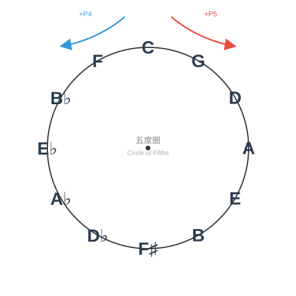

# 每日练习模板

本练习模板以**五度圈（Circle of Fifths）**为调性框架、以**固定手型与肌肉记忆**为驱动引擎，将和弦按类别拆分为每日可执行的练习单元，帮助你系统化地掌握键盘和声，并为即兴伴奏蓄力。

---

## 1.1.1 为什么要按五度圈练习

五度圈是音乐理论的基石，选择以五度圈为练习框架，有三个核心原因：

**1. 覆盖全部 12 个调**

五度圈自然遍历 12 个调性（C → G → D → A → E → B/Cb → F#/Gb → Db → Ab → Eb → Bb → F → C），确保没有调性盲区。很多学习者只习惯于 C 调或少数常用调，五度圈练习能强制补齐短板。

**2. 符合和声进行的内在逻辑**

大多数和弦进行中，根音运动以四度/五度上行为主（如 ii-V-I），五度圈练习让你在调与调之间感受到这种自然的和声张力-解决关系。

**3. 可拆解、可量化**

五度圈将练习内容封装为"每天一组调 × 固定手型"的结构，目标清晰，进度可控，适合每日固定时间的刻意练习。

### 五度圈全景

> **读图指引**：顺时针每走一步上行纯五度，逆时针每走一步上行纯四度。C 大调位于顶部 12 点钟方向。

---

## （二）为什么要固定手型

键盘和声看似纷繁，但 12 个调的大三和弦最终都收敛为**两种固定手型**。固定手型的价值，在于用**重复练习形成肌肉记忆**，最终服务于即兴。

**1. 固定手型，化繁为简**

12 个调的大三和弦，都归结为两种固定手型（详见 [大三和弦练习](2-大三和弦.md)）：

| 手型 | 别称 | 左手 | 右手 | 声部 |
|------|------|------|------|------|
| 手型一 | 紧凑型 | 根音（3 指） | 五音-根音-三音（1-2-4 指） | 薄，适合主歌/分解 |
| 手型二 | 扩张型 | 根音+五音（5、2 指） | 根音-三音-五音-高八度根音（1-2-3-5 指） | 厚，适合副歌/柱式 |

手型关系在所有调之间完全一致，换调只是整体平移：你不需要重新记"每个音在哪"，只需把手型移到新的根音。

**2. 肌肉记忆，跳过思考**

重复练习的目标，是把"看谱 → 想音名 → 找键位"压缩成"看到和弦 / 听到和声 → 手指直接落位"。

- 手型固定 → 手指间距固定 → 掌型与手腕形成稳定框架；
- 反复切换手型一 ↔ 手型二 → 建立"薄 → 厚"的段落条件反射；
- 每个调都用手型过一遍 → 手指不再惧怕黑键，升降号多的调也一视同仁。

**3. 为即兴蓄力**

手型一旦成为肌肉记忆，即兴时你只需判断"此刻要什么色彩、什么功能"，手指会自动就位，把注意力留给旋律、节奏与情绪。

---

## （三）每日练习方法

### 每日练习模块

| 模块 | 章节 | 建议时长 |
|------|------|---------|
| 大三和弦 | [大三和弦练习](2-大三和弦.md) | 10 min |
| 小三和弦 | [小三和弦练习](3-小三和弦.md) | 10 min |
| 色彩和弦 | [挂留二和弦（sus2）](4-挂留二和弦（sus2）.md) | 10 min |
| 色彩和弦 | [挂留四和弦（sus4）](5-挂留四和弦（sus4）.md) | 10 min |
| 色彩和弦 | [加九音和弦](6-加九音和弦.md) | 10 min |
| 色彩和弦 | [六和弦与六九和弦](7-六和弦与六九和弦.md) | 10 min |

### 周维度轮动节奏

按五度圈把 12 个调分成四组，一周七天按组轮动：升降号多的组安排两天，白键友好的组安排一天，周日全量串联复盘。

| 星期 | 练习组 | 包含调 | 说明 |
|------|--------|--------|------|
| 周一 | 第一组（FCG） | F、C、G | 白键友好，建立手型手感 |
| 周二 | 第二组（DAE） | D、A、E | 升号渐多，平移手型 |
| 周三~周四 | 第三组 | B、F#、Db | 升降号最多，两天分摊巩固 |
| 周五~周六 | 第四组 | Ab、Eb、Bb | 降号调，两天分摊巩固 |
| 周日 | 顺序全量 | C→G→D→A→E→B→F#→Db→Ab→Eb→Bb→F | 完整五度圈跑一遍，查漏补缺 |

### 每天练习步骤

每个调沿「纵向（调内声部排列）→ 横向（五度圈移调）→ 视唱（唱级数/唱名）」三轴展开，核心是**反复切换紧凑型 ↔ 扩张型**，强化肌肉记忆：

| 步骤 | 练习内容 | 手型 |
|------|---------|------|
| ① | 纵向：手型一三种声部排列（第二转位 → 原位 → 第一转位） | 紧凑型 |
| ② | 纵向：手型二柱式与琶音 | 扩张型 |
| ③ | 横向：按五度圈移调到下一调 | 紧凑型 ↔ 扩张型 |
| ④ | 视唱练耳：边弹边唱级数 / 唱名 | 双手 |
| ⑤ | 手型一 ↔ 手型二 动态切换 | 紧凑型 ↔ 扩张型 |

### 贯穿原则：视唱练耳（唱级数与唱名）

以下原则适用于**所有和弦模块**（大三、小三、挂留、加九、六和弦等），每次练习都同步"唱 + 默念"，由宏观到微观、由功能到落指：

1. **知道弹的是什么和弦（功能层）**：默念和弦名称与级数，如"这是 C 大三和弦，I 级"。注意别把右手最低音误当根音——根音由低音声部（左手）决定。
2. **知道构成音（相对音高层）**：唱**级数**（大三 1-3-5、小三 1-♭3-5 等），再过渡到**唱名**。任何调的同类和弦都唱同一组，训练相对音高与调性功能。
3. **落到键位（定位层）**：需确认手指位置时，默念具体**音名**，仅作定位辅助，不追求脱离键盘的绝对音高。

> **目标**：把"和弦功能 → 内心听觉 → 手指落位"三者绑定，为即兴时"听到什么就弹出什么"打基础。主线是级数/唱名（相对音高），音名仅作定位辅助。

### 分层建议

- **初学者**：每天只练当天组的 1~3 个调，每个调先练紧凑型、再练扩张型，慢速、均匀、放松。
- **进阶者**：每天完成当天组的全部调，并尝试把当天的手型应用到 [经典曲目拆解](../2-经典曲目拆解.md) 的曲目中。
- 以**慢速、均匀、放松**为第一原则，速度在准确性之后。
