# 大七和弦

## 一、和弦结构

大七和弦（maj7）由**根音 + 大三度 + 纯五度 + 大七度**构成。

以 Cmaj7 为例：**C - E - G - B**

| 构成音 | 唱名 | 与根音的音程 |
| --- | -- | ------ |
| C   | do | 根音     |
| E   | mi | 大三度    |
| G   | so | 纯五度    |
| B   | xi | 大七度    |

> **拆解理解：根音 + 三音上的小三和弦**。把大七和弦的四个音拆成「根音」和「三音 - 五音 - 七音」两层，上面三个音正好是一个**小三和弦**。以 Cmaj7 为例：**Cmaj7 = C + Em**——C 是根音，Em（E-G-B）是三音 E 上的小三和弦。弹唱时左手托根音 C、右手弹 Em 的手型，合起来就是 Cmaj7，不必重新背四个音，直接复用小三和弦的手型。
>
> **大七度的本质**：大七度与纯八度只差 1 个半音（11 个半音 vs 12 个半音），是七和弦里最"贴根音"的音，因此大七和弦的七音带有强烈倾向根音的色彩。

***

## 二、手型与弹奏位置

右手五指编号：**1**（拇指）、**2**（食指）、**3**（中指）、**4**（无名指）、**5**（小指）。左手同理。

大七和弦有三种手型，正好对应「根音 + 小三和弦」的拆解思路：

### 手型一：左手根音 + 右手三音小三和弦第一转位（收缩型）

左手单指弹根音 do，右手 1-2-4 指弹 so-xi-mi（五音-七音-三音）；这三个音正是三音上小三和弦的**第一转位**（以 C 为例即 Em 的 G-B-E，三音 G 在低音）。声部干净，适合伴奏起步。

| 声部        | 左手             | 右手                    |
| --------- | -------------- | --------------------- |
| 指法        | **3 指**（中指）弹根音 | **1-2-4 指** 弹五音-七音-三音 |
| 示例（Cmaj7） | ③ → C（低八度）     | ①-G、②-B、④-E           |

> **练习要点**：左手根音力度稍重，建立低音支撑；右手 ①-② 指（G→B）为大三度、②-④ 指（B→E）为纯四度，保持手指放松、均匀触键。

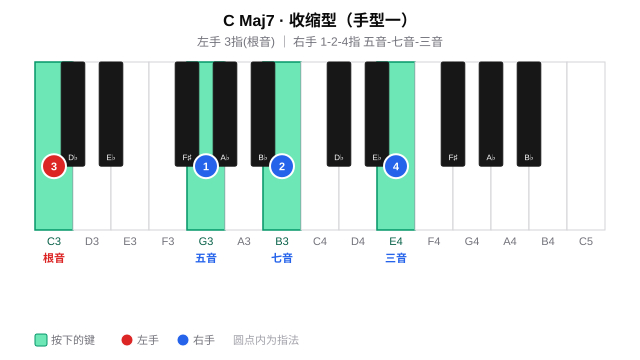

### 手型二：左手根音-高八度根音 + 右手三音小三和弦原位（中间型）

左手 5-1 指弹根音-高八度根音（do-do，跨一个八度），右手 1-2-4 指弹 mi-so-xi（三音-五音-七音）；右手这三个音正是三音上小三和弦的**原位**（以 C 为例即 Em 的 E-G-B）。左手八度加厚低音支撑，右手与手型一同一套指法，是日常弹唱的主力手型。

| 声部        | 左手                | 右手                    |
| --------- | ----------------- | --------------------- |
| 指法        | **5-1 指**         | **1-2-4 指** 弹三音-五音-七音 |
| 示例（Cmaj7） | ⑤-C（低八度）、①-C（高八度） | ①-E、②-G、④-B           |

> **练习要点**：左手 5→1 跨一个八度（C→C），手腕放松不要僵硬；右手 ①-② 指（E→G）为小三度、②-④ 指（G→B）为大三度，与手型一右手指法一致，可直接迁移。

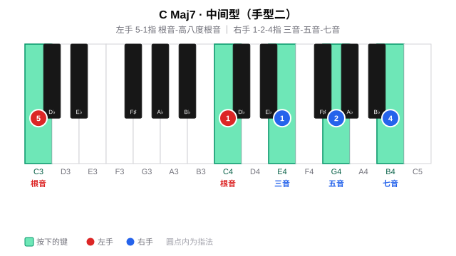

### 手型三：左手根音-五音-高八度根音 + 右手三音小三和弦原位加高八度根音（扩张型）

左手弹 do-so-do（根音-五音-高八度根音，5-2-1 指），右手 1-2-3-5 指弹 mi-so-xi-mi（三音-五音-七音-高八度三音），声部丰满，适合副歌、高潮段落的柱式伴奏。

| 声部        | 左手                  | 右手                   |
| --------- | ------------------- | -------------------- |
| 指法        | **5-2-1 指**         | **1-2-3-5 指**        |
| 示例（Cmaj7） | ⑤-C（低）、②-G、①-C（高八度） | ①-E、②-G、③-B、⑤-E（高八度） |

> **练习要点**：左手 5→1 跨一个八度（C→C）、右手 1→5 跨一个八度（E→E），手腕放松不要僵硬；右手 ③-⑤ 指（B→E）为纯四度，注意均匀触键。

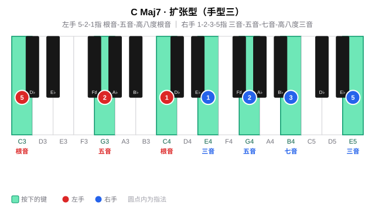

### 三种手型对比

| 维度   | 手型一（收缩型）     | 手型二（中间型）       | 手型三（扩张型）            |
| ---- | ------------ | -------------- | ------------------- |
| 左手   | 单音（根音）       | 八度（根音 + 高八度根音） | 三音（根音 + 五音 + 高八度根音） |
| 右手   | 三音（五音-七音-三音） | 三音（三音-五音-七音）   | 四音（三音-五音-七音-高八度三音）  |
| 左手指法 | 3            | 5-1            | 5-2-1               |
| 右手指法 | 1-2-4        | 1-2-4          | 1-2-3-5             |
| 声部厚度 | 薄，适合主歌       | 适中，弹唱主力        | 厚，适合副歌/高潮           |
| 典型场景 | 分解伴奏、轻弹唱     | 日常弹唱           | 柱式强奏、段落推进           |

***

## 三、练习分组（十二调手型平移）

按五度圈把 12 个大七和弦分成五组，按照节奏练习；每组练三种手型（手型一 → 手型二 → 手型三），换调只是整体平移。

#### 周一 ·（F、C、G）

**Fmaj7**

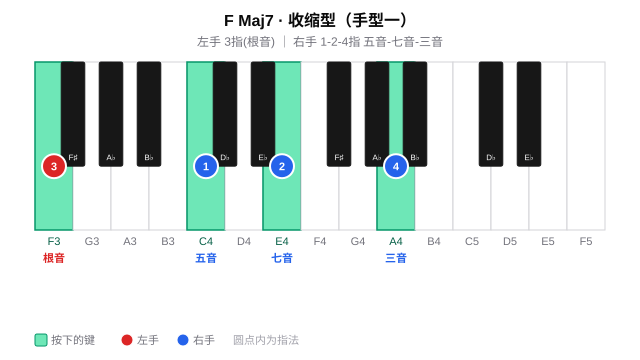

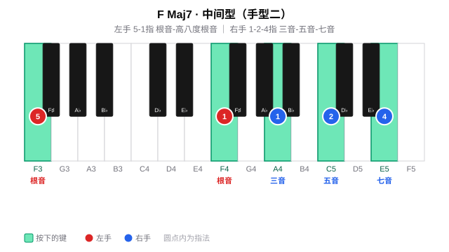

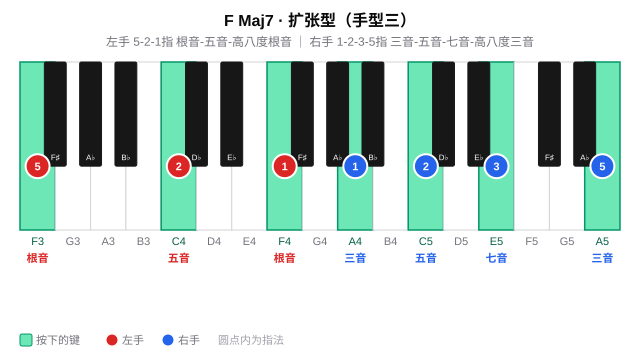

**Cmaj7**

**Gmaj7**

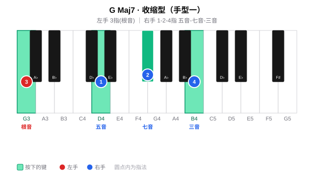

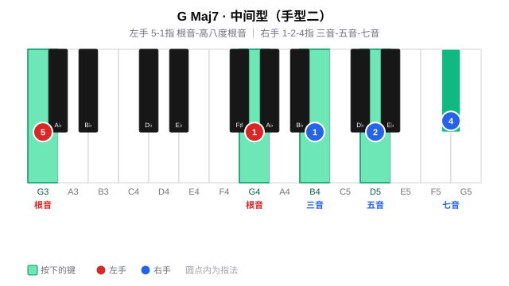

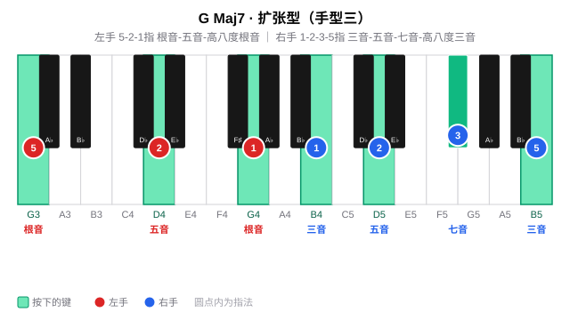

#### 周二 ·（D、A、E）

**Dmaj7**

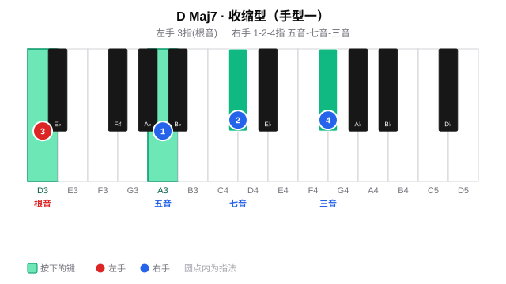

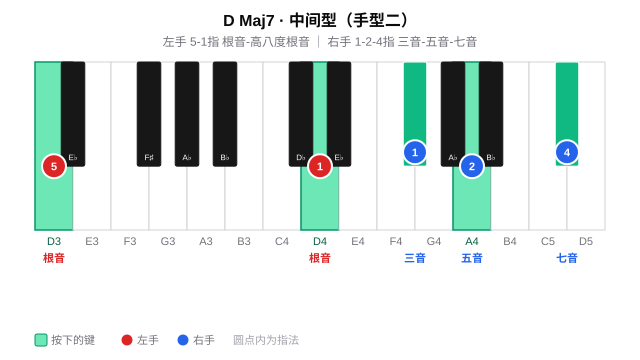

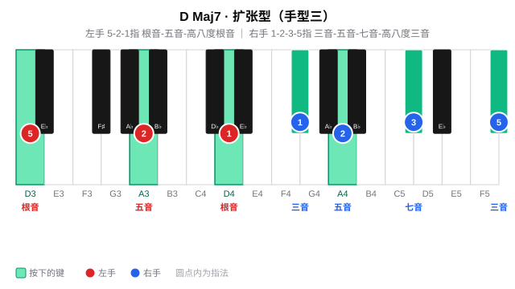

**Amaj7**

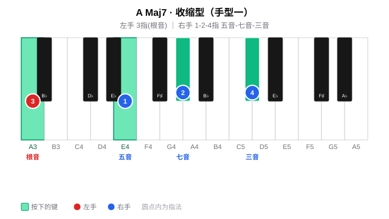

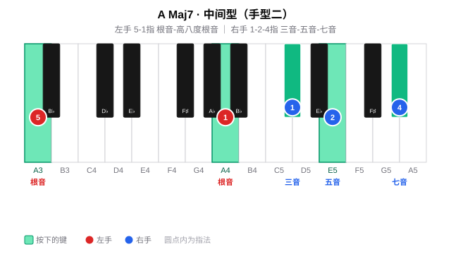

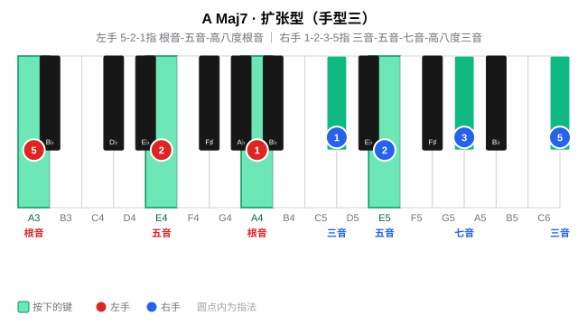

**Emaj7**

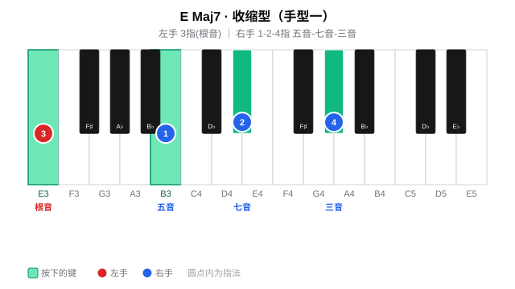

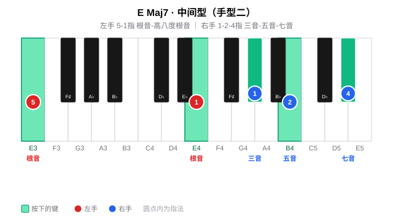

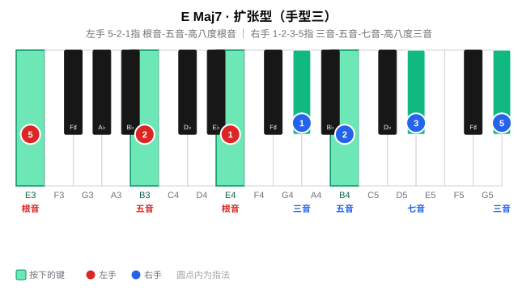

#### 周三\~周四 ·（B、F#、Db）

**Bmaj7**

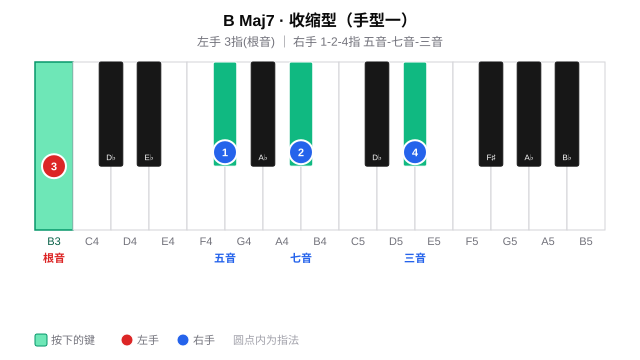

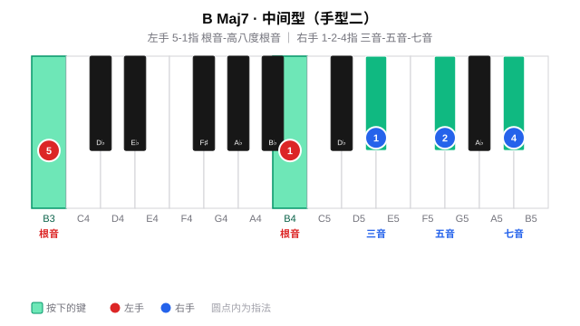

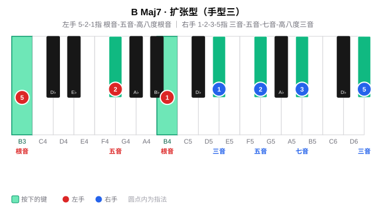

**F#maj7**

**Dbmaj7**

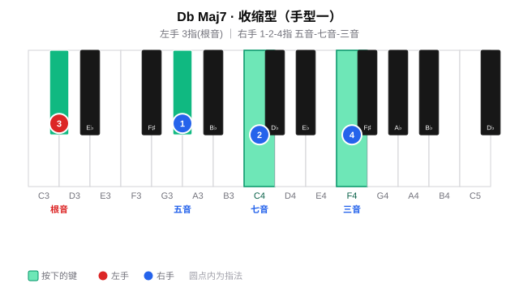

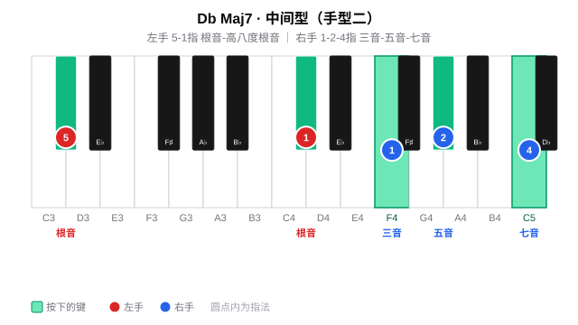

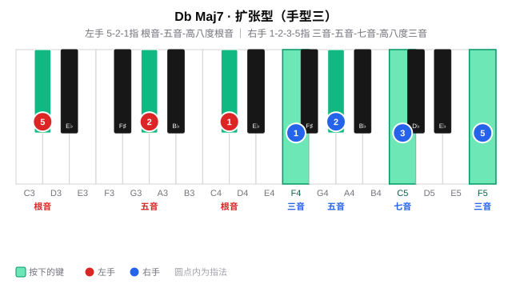

#### 周五\~周六 ·（Ab、Eb、Bb）

**Abmaj7**

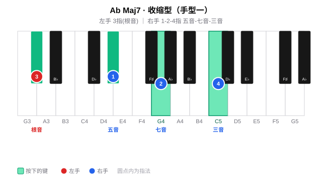

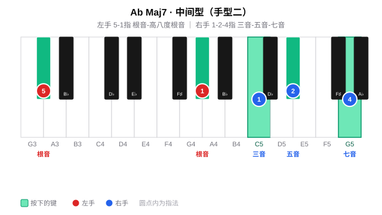

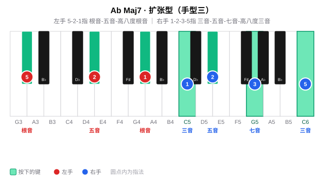

**Ebmaj7**

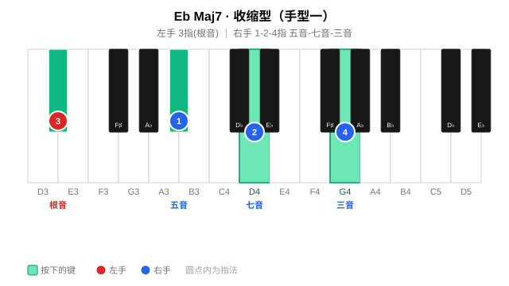

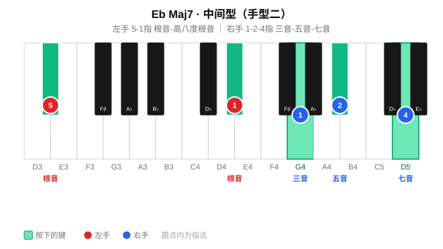

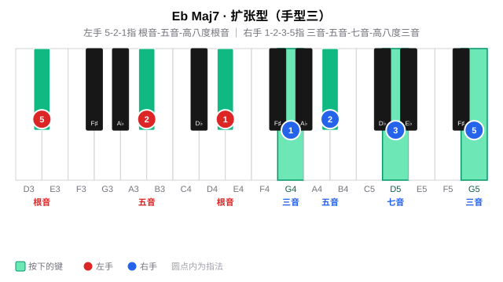

**Bbmaj7**

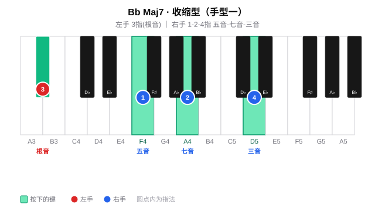

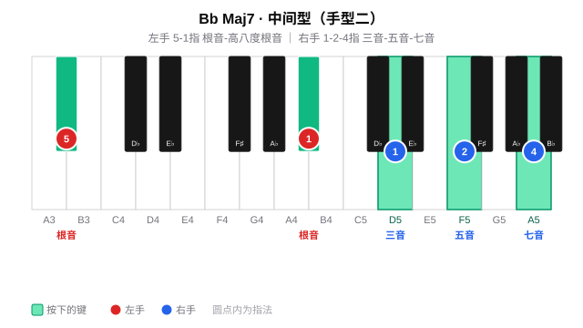

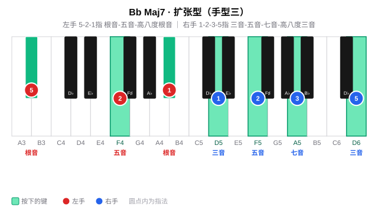

#### 周日 · 全量练习与查漏补缺

周日查漏补缺

***

## 四、练习步骤

大七和弦的练习沿两条线展开：先在 12 个调里把三种手型练熟（**手型平移**），再把大七和弦放进实际和弦进行中弹唱（**和弦进行练习**，核心）。全程同步唱级数/唱名（见 [每日练习模板](../README.md) 的「贯穿原则」）。

### （一）手型平移（每个调）

**纵向：柱式 → 琶音**

先练**柱式和弦**（双手同时按下），再练**琶音分解**（逐音弹出）；左手根音力度稍重，建立低音支撑。

| 手型       | 左手                      | 右手                             |
| -------- | ----------------------- | ------------------------------ |
| 手型一（收缩型） | 3 指：根音                  | 1-2-4 指：五音 - 七音 - 三音           |
| 手型二（中间型） | 5-1 指：根音 - 高八度根音        | 1-2-4 指：三音 - 五音 - 七音           |
| 手型三（扩张型） | 5-2-1 指：根音 - 五音 - 高八度根音 | 1-2-3-5 指：三音 - 五音 - 七音 - 高八度三音 |

> 以 Cmaj7 为例：手型一左手 C（3 指）、右手 G-B-E（1-2-4）；手型二左手 C-C（5-1）、右手 E-G-B（1-2-4）；手型三左手 C-G-C（5-2-1）、右手 E-G-B-E（1-2-3-5）。

**横向：五度圈移调（Transposition）**

把在某个调上练熟的手型**整体平移**到五度圈的下一个调：手型关系完全不变，只有根音位置移动。按 C → G → D → A → E → B → F# → Db → Ab → Eb → Bb → F 逐个平移，每移一调重新执行纵向练习，重点感受黑键七音（如 G 的 F#、D 的 C#）如何随平移出现。

### （二）和弦进行练习：1maj7 → 4maj7 → 1maj7 → 4maj7（核心）

大七和弦最常用的场景，是在**主 - 下属**的进行里铺一层柔和的底色。以 C 大调的 **Cmaj7 → Fmaj7 → Cmaj7 → Fmaj7**（1 → 4 → 1 → 4）为例。

**拆解逻辑**：maj7 = 根音 + 三音上的小三和弦，两层各由一只手负责——左手管「根音」，右手管「三音上的小三和弦」。手型一、手型二的差别，在于：
右手小三和弦用**第一转位**还是**原位**，左手相应是单音还是加八度。

| 小节 | 级数 | 和弦    | 手型  | 左手（低→高）     | 右手（低→高）         | 右手 = 三音上的小三和弦 |
| -- | -- | ----- | --- | ----------- | --------------- | ------------ |
| 1  | 1  | Cmaj7 | 手型一 | C（3）        | G - B - E（1-2-4） | Em **第一转位**  |
| 2  | 4  | Fmaj7 | 手型二 | F - F（5-1）  | A - C - E（1-2-4） | Am **原位**    |
| 3  | 1  | Cmaj7 | 手型一 | C（3）        | G - B - E（1-2-4） | Em **第一转位**  |
| 4  | 4  | Fmaj7 | 手型二 | F - F（5-1）  | A - C - E（1-2-4） | Am **原位**    |

> **平移口诀**：换和弦时根音 C→F 上行纯四度，右手小三和弦（Em→Am）随之整体平移，手型关系完全不变。上面四小节按 1 → 4 → 1 → 4 循环，手型「一、二」交替——Cmaj7 用手型一（第一转位）、Fmaj7 用手型二（原位），体会同一组音在两种转位下的松紧变化；熟练后也可整段固定用某一种手型。
>
> 熟练后可换成**手型三（扩张型）**加厚声部：Cmaj7 左手 C-G-C、右手 E-G-B-E（1-2-3-5）；Fmaj7 左手 F-C-F、右手 A-C-E-A（1-2-3-5）。

**节奏型（4/4 拍，一小节 4 拍）**

整个进行共 4 个小节（1maj7 → 4maj7 → 1maj7 → 4maj7，每个和弦一小节）。下面为 X 节奏谱——**X 表示一次弹奏，下划线表示音值：一道线为八分音符、两道线为十六分音符，无下划线为四分音符**：

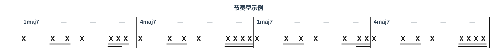

> **四小节的节奏变化**：第 1 小节为基本型 `4 88 4 1616 8`；第 2、4 小节最后一拍换成**四个十六分音符**（`16161616`）；第 3 小节最后一拍为**前八后十六**（`8 1616`）。
>
> **简写 → 音符对照**：`4`＝四分音符（♩，1 拍）、`8`＝八分音符（♪，½ 拍）、`16`＝十六分音符（¼ 拍）。故 `4 88 4 1616 8` 拆成「四分｜两个八分｜四分｜两个十六分｜八分」。
>
> **数拍**：第 1 拍 `1`、第 2 拍 `2 &`、第 3 拍 `3`、第 4 拍 `4 e &`（两个十六分 + 一个八分）。

**练习要点**：

1. 先不挂节奏，把 Cmaj7 与 Fmaj7 两个和弦单独按柱式弹熟；
2. 再套入节奏型，按 Cmaj7 → Fmaj7 → Cmaj7 → Fmaj7 循环，每个和弦一小节；
3. 最后边弹边唱级数（1 - 4 - 1 - 4），重点听右手七音 B 在 Cmaj7 中与根音的大七度关系，以及换到 Fmaj7 时七音 E 的出现。

