# 小七和弦

## 一、和弦结构

小七和弦（m7）由**根音 + 小三度 + 纯五度 + 小七度**构成。

以 Cm7 为例：**C - E♭ - G - B♭**

| 构成音 | 唱名 | 与根音的音程 |
|--------|------|------------|
| C | do | 根音 |
| E♭ | 降mi | 小三度 |
| G | so | 纯五度 |
| B♭ | 降xi | 小七度 |

> **拆解理解：根音 + 三音上的大三和弦**。把小七和弦的四个音拆成「根音」和「三音 - 五音 - 七音」两层，上面三个音正好是一个**大三和弦**。以 Cm7 为例：**Cm7 = C + E♭**——C 是根音，E♭（E♭-G-B♭）是三音 E♭ 上的大三和弦。弹唱时左手托根音 C、右手弹 E♭ 的手型，合起来就是 Cm7，不必重新背四个音，直接复用小三和弦的手型。
>
> **与大七的对称**：大七和弦 = 根音 + 三音上的**小三和弦**（Cmaj7 = C + Em）；小七和弦 = 根音 + 三音上的**大三和弦**（Cm7 = C + E♭）。两者的差别只在三音与七音各降半音。
>
> **小七度的本质**：小七度与纯八度差 2 个半音（10 个半音 vs 12 个半音），比大七度的"贴根音"再多退 1 个半音，因此小七和弦的七音倾向根音的程度弱于大七，色彩更松弛、内敛。

---

## 二、手型与弹奏位置

右手五指编号：**1**（拇指）、**2**（食指）、**3**（中指）、**4**（无名指）、**5**（小指）。左手同理。

小七和弦有两种手型，正好对应「根音 + 三音上大三和弦」的拆解思路：

### 手型一：左手根音-五音 + 右手三音上大三和弦第二转位（收缩型）

左手 3-1 指弹根音-五音（do-so），右手 1-2-4 指弹七音-三音-五音（降xi-降mi-so）；右手这三个音正是三音上大三和弦的**第二转位**（以 C 为例即 E♭ 的 B♭-E♭-G，五音 B♭ 在低音）。声部干净，适合伴奏起步。

| 声部 | 左手 | 右手 |
|------|------|------|
| 指法 | **3-1 指** 弹根音-五音 | **1-2-4 指** 弹七音-三音-五音 |
| 示例（Cm7） | ③-C、①-G | ①-B♭、②-E♭、④-G |

> **练习要点**：左手根音-五音纯五度（C→G）力度稍重，建立低音支撑；右手 ①-② 指（B♭→E♭）为纯四度、②-④ 指（E♭→G）为大三度，保持手指放松、均匀触键。

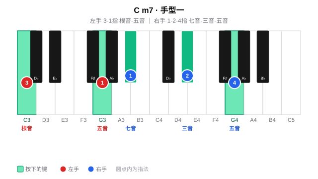

### 手型二：左手根音-五音-高八度根音 + 右手三音上大三和弦原位加高八度根音（扩张型）

左手 5-2-1 指弹根音-五音-高八度根音（do-so-do），右手 1-2-3-5 指弹三音-五音-七音-高八度三音（降mi-so-降xi-高八度降mi）；右手这四个音正是三音上大三和弦的**原位加高八度根音**（以 C 为例即 E♭-G-B♭-E♭）。声部丰满，适合副歌、高潮段落的柱式伴奏。

| 声部 | 左手 | 右手 |
|------|------|------|
| 指法 | **5-2-1 指** | **1-2-3-5 指** |
| 示例（Cm7） | ⑤-C（低）、②-G、①-C（高八度） | ①-E♭、②-G、③-B♭、⑤-E♭（高八度） |

> **练习要点**：左手 5→1 跨一个八度（C→C）、右手 1→5 跨一个八度（E♭→E♭），手腕放松不要僵硬；右手 ③-⑤ 指（B♭→E♭）为纯四度，注意均匀触键。

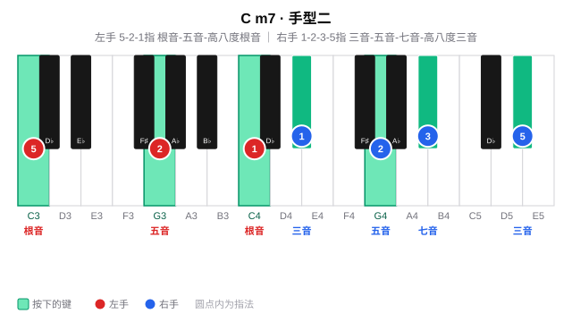

### 两种手型对比

| 维度 | 手型一（收缩型） | 手型二（扩张型） |
|------|------------------|------------------|
| 左手 | 两音（根音 + 五音） | 三音（根音 + 五音 + 高八度根音） |
| 右手 | 三音（七音-三音-五音） | 四音（三音-五音-七音-高八度三音） |
| 左手指法 | 3-1 | 5-2-1 |
| 右手指法 | 1-2-4 | 1-2-3-5 |
| 声部厚度 | 薄，适合主歌 | 厚，适合副歌/高潮 |
| 典型场景 | 分解伴奏、轻弹唱 | 柱式强奏、段落推进 |

---

## 三、练习分组（十二调手型平移）

按五度圈把 12 个小七和弦分成五组，按照节奏练习；每组练两种手型（手型一 → 手型二），换调只是整体平移。

#### 周一 ·（F、C、G）

**Fm7**

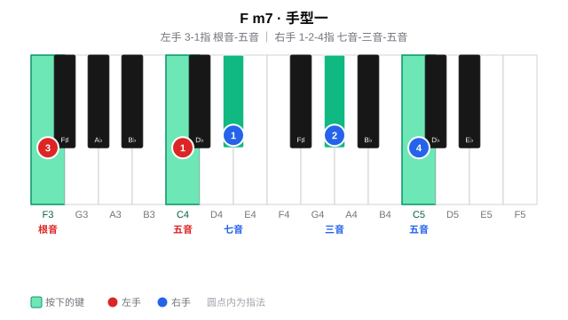

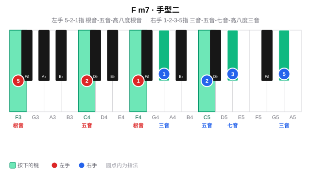

**Cm7**

**Gm7**

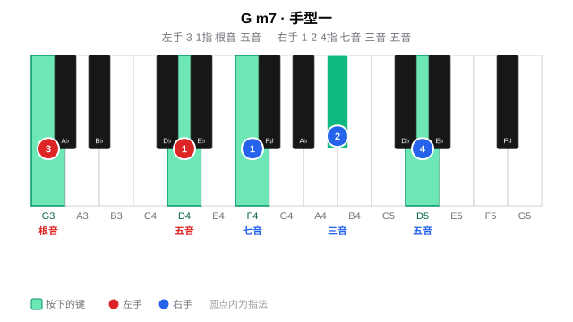

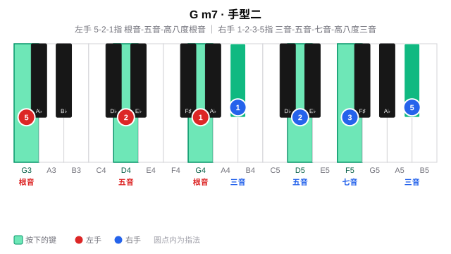

#### 周二 ·（D、A、E）

**Dm7**

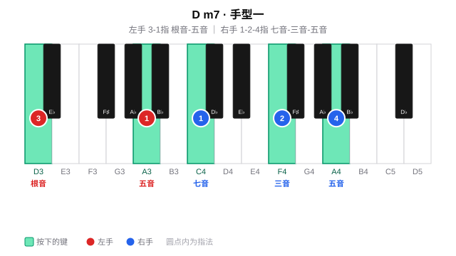

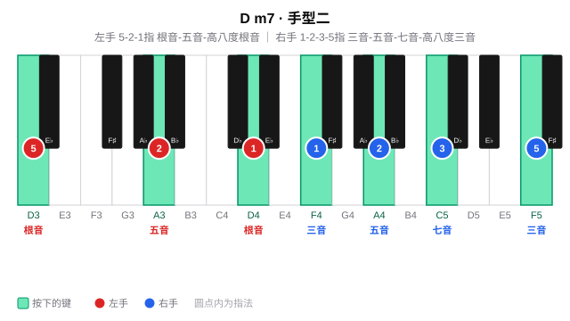

**Am7**

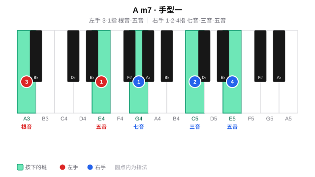

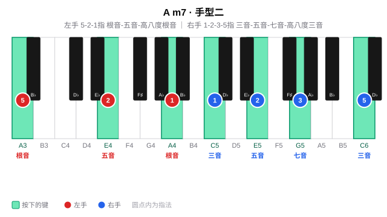

**Em7**

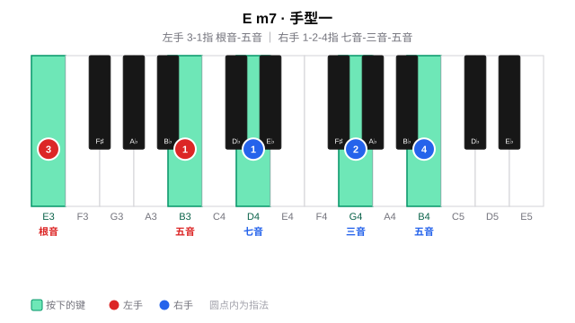

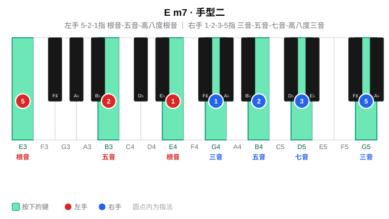

#### 周三~周四 ·（B、F#、Db）

**Bm7**

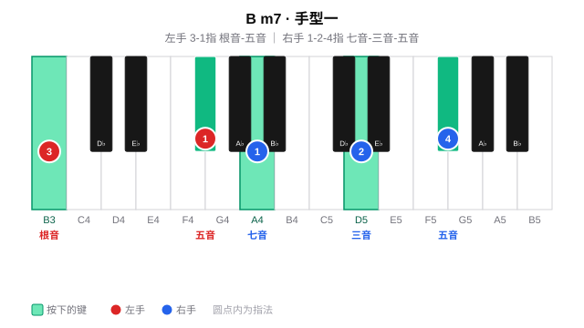

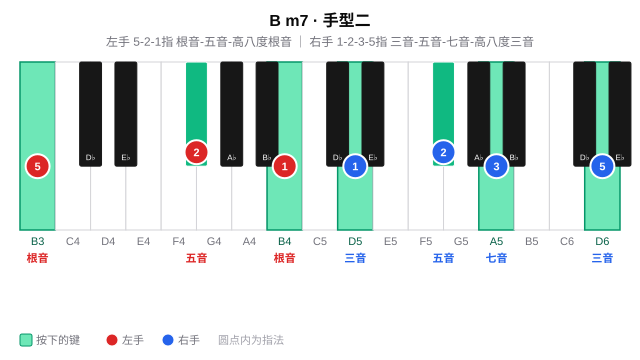

**F#m7**

**Dbm7**

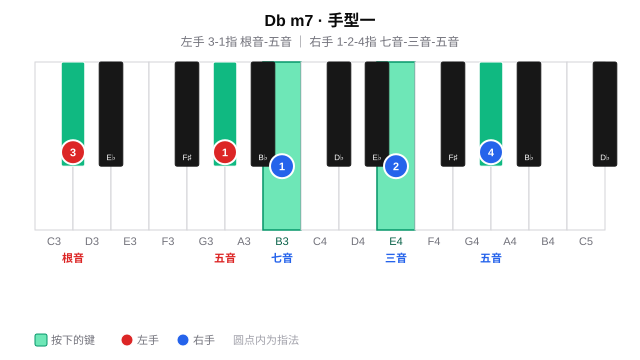

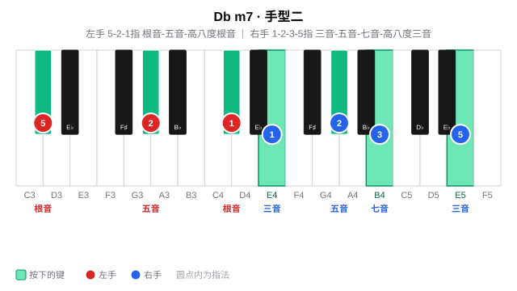

#### 周五~周六 ·（Ab、Eb、Bb）

**Abm7**

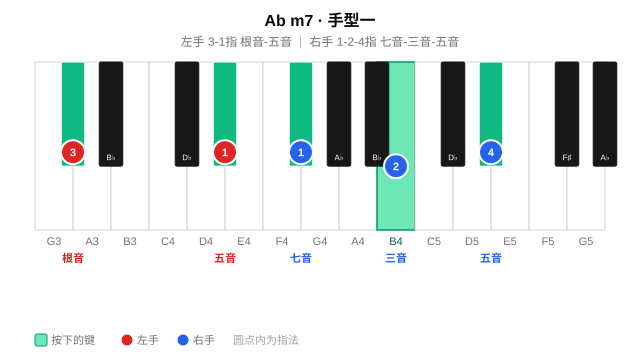

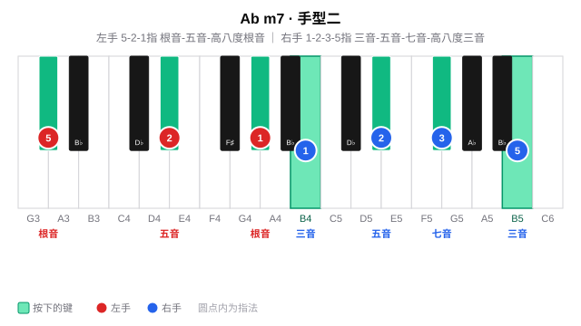

**Ebm7**

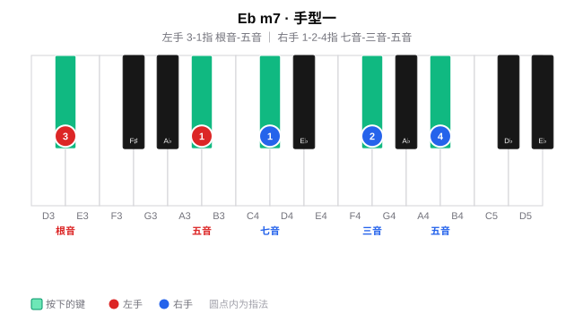

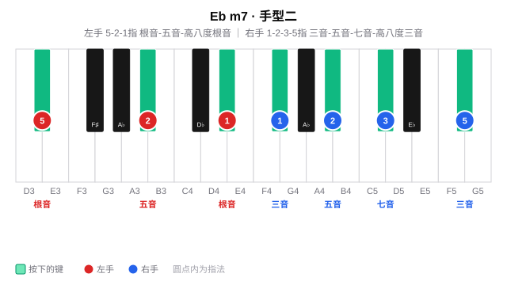

**Bbm7**

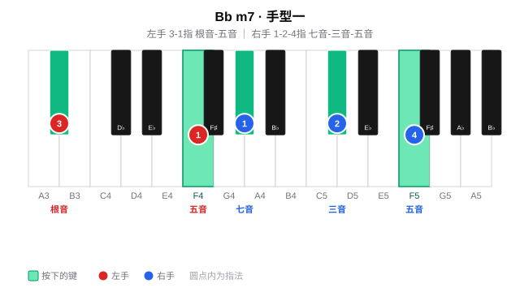

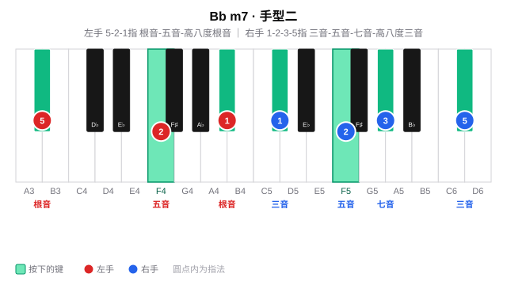

#### 周日 · 全量练习与查漏补缺

周日查漏补缺

---

## 四、练习步骤

小七和弦的练习沿两条线展开：先在 12 个调里把两种手型练熟（**手型平移**），再把小七和弦放进实际和弦进行中弹唱（**和弦进行练习**，核心）。全程同步唱级数/唱名（见 [每日练习模板](../README.md) 的「贯穿原则」）。

### （一）手型平移（每个调）

**纵向：柱式 → 琶音**

先练**柱式和弦**（双手同时按下），再练**琶音分解**（逐音弹出）；左手根音力度稍重，建立低音支撑。

| 手型 | 左手 | 右手 |
|------|------|------|
| 手型一（收缩型） | 3-1 指：根音 - 五音 | 1-2-4 指：七音 - 三音 - 五音 |
| 手型二（扩张型） | 5-2-1 指：根音 - 五音 - 高八度根音 | 1-2-3-5 指：三音 - 五音 - 七音 - 高八度三音 |

> 以 Cm7 为例：手型一左手 C-G（3-1 指）、右手 B♭-E♭-G（1-2-4 指）；手型二左手 C-G-C（5-2-1）、右手 E♭-G-B♭-E♭（1-2-3-5）。

**横向：五度圈移调（Transposition）**

把在某个调上练熟的手型**整体平移**到五度圈的下一个调：手型关系完全不变，只有根音位置移动。按 C → G → D → A → E → B → F# → Db → Ab → Eb → Bb → F 逐个平移，每移一调重新执行纵向练习，重点感受黑键三音/七音（如 C 的 E♭、B♭，F 的 A♭、E♭）如何随平移出现。

### （二）和弦进行练习：1add9 → 3m7 → 4sus2 → 5sus4（核心）

这条进行把小七和弦放在**三级**（Em7），用 **1-3-4-5** 的级数串联，色彩柔和、层层递进。以 C 大调为例，四个和弦都用「左手根音+五音 / 右手三个音」的同一套骨架，右手全部用 **1-2-4 指**：

| 级数 | 和弦 | 左手（低→高） | 右手（低→高，1-2-4 指） | 右手三个音 = 什么和弦 |
|------|------|--------------|--------------------------|------------------------|
| 1 | Cadd9 | C - G（3-1） | D - E - G | 九音-三音-五音（Em 第一转位） |
| 3m7 | Em7 | E - B（3-1） | G - B - D | G 大三和弦**原位** |
| 4sus2 | Fsus2 | F - C（3-1） | G - C - D | Gm 小三和弦**第二转位** |
| 5sus4 | Gsus4 | G - D（3-1） | C - D - E | C 大三和弦**第二转位** |

> **拆解对照**：小七和弦 Em7 = E + **G**（三音上的大三和弦，右手 G-B-D 即 G 原位）；整条进行左手都是「根音 + 五音」，右手都是 1-2-4 指弹一个三和弦，换和弦时只需整体平移。
>
> **三级小七的作用**：Em7 是从主（Cadd9）走向下属（Fsus2）之间的过渡，小七度的 D 让它比纯小三和弦 Em 更松弛，衔接更自然。

**节奏型（4/4 拍，一小节 4 拍）**

整个进行共 4 个小节（1add9 → 3m7 → 4sus2 → 5sus4，每个和弦一小节），每小节弹 **8 个八分音符**（一拍一个，两两共用下划线）。下面为 X 节奏谱——**X 表示一次弹奏，一道下划线 = 八分音符；红色弧线为跨拍连音线**：

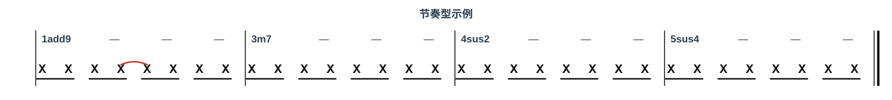

> **连音线**：第 2 拍的第 3 个八分音符与第 3 拍的第 4 个八分音符用弧线连在一起——第 3 个音按住不松手，时值延长到第 4 个音的位置再抬起，制造一个跨拍的小切分，让均匀的八分分解在推进中有一个「钩子」。
>
> **数拍**：第 1 拍 `1 &`、第 2 拍 `2 &`（第 2 个 & 与第 3 拍的 3 相连）、第 3 拍 `3 &`、第 4 拍 `4 &`。

**练习要点**：

1. 先不挂节奏，把 Cadd9、Em7、Fsus2、Gsus4 四个和弦单独按柱式弹熟；
2. 再套入节奏型，按 1add9 → 3m7 → 4sus2 → 5sus4 循环，每个和弦一小节，注意第 3、4 个八分音符的连音；
3. 最后边弹边唱级数（1 - 3 - 4 - 5），重点听 Em7 里七音 D 与根音的小七度关系，以及换到 Fsus2 时 Gm 小三和弦的出现。
