# 小七和弦

## 一、和弦结构

小七和弦（m7）由**根音 + 小三度 + 纯五度 + 小七度**构成。

以 Cm7 为例：**C - E♭ - G - B♭**

| 构成音 | 唱名 | 与根音的音程 |
|--------|------|------------|
| C | do | 根音 |
| E♭ | 降mi | 小三度 |
| G | so | 纯五度 |
| B♭ | 降xi | 小七度 |

> **拆解理解：根音 + 三音上的大三和弦**。把小七和弦的四个音拆成「根音」和「三音 - 五音 - 七音」两层，上面三个音正好是一个**大三和弦**。以 Cm7 为例：**Cm7 = C + E♭**——C 是根音，E♭（E♭-G-B♭）是三音 E♭ 上的大三和弦。弹唱时左手托根音 C、右手弹 E♭ 的手型，合起来就是 Cm7，不必重新背四个音，直接复用小三和弦的手型。
>
> **与大七的对称**：大七和弦 = 根音 + 三音上的**小三和弦**（Cmaj7 = C + Em）；小七和弦 = 根音 + 三音上的**大三和弦**（Cm7 = C + E♭）。两者的差别只在三音与七音各降半音。
>
> **小七度的本质**：小七度与纯八度差 2 个半音（10 个半音 vs 12 个半音），比大七度的"贴根音"再多退 1 个半音，因此小七和弦的七音倾向根音的程度弱于大七，色彩更松弛、内敛。

---

## 二、手型与弹奏位置

右手五指编号：**1**（拇指）、**2**（食指）、**3**（中指）、**4**（无名指）、**5**（小指）。左手同理。

小七和弦有两种手型，正好对应「根音 + 三音上大三和弦」的拆解思路：

### 手型一：左手根音-五音 + 右手三音上大三和弦第二转位（收缩型）

左手 3-1 指弹根音-五音（do-so），右手 1-2-4 指弹七音-三音-五音（降xi-降mi-so）；右手这三个音正是三音上大三和弦的**第二转位**（以 C 为例即 E♭ 的 B♭-E♭-G，五音 B♭ 在低音）。声部干净，适合伴奏起步。

| 声部 | 左手 | 右手 |
|------|------|------|
| 指法 | **3-1 指** 弹根音-五音 | **1-2-4 指** 弹七音-三音-五音 |
| 示例（Cm7） | ③-C、①-G | ①-B♭、②-E♭、④-G |

> **练习要点**：左手根音-五音纯五度（C→G）力度稍重，建立低音支撑；右手 ①-② 指（B♭→E♭）为纯四度、②-④ 指（E♭→G）为大三度，保持手指放松、均匀触键。

### 手型二：左手根音-五音-高八度根音 + 右手三音上大三和弦原位加高八度根音（扩张型）

左手 5-2-1 指弹根音-五音-高八度根音（do-so-do），右手 1-2-3-5 指弹三音-五音-七音-高八度三音（降mi-so-降xi-高八度降mi）；右手这四个音正是三音上大三和弦的**原位加高八度根音**（以 C 为例即 E♭-G-B♭-E♭）。声部丰满，适合副歌、高潮段落的柱式伴奏。

| 声部 | 左手 | 右手 |
|------|------|------|
| 指法 | **5-2-1 指** | **1-2-3-5 指** |
| 示例（Cm7） | ⑤-C（低）、②-G、①-C（高八度） | ①-E♭、②-G、③-B♭、⑤-E♭（高八度） |

> **练习要点**：左手 5→1 跨一个八度（C→C）、右手 1→5 跨一个八度（E♭→E♭），手腕放松不要僵硬；右手 ③-⑤ 指（B♭→E♭）为纯四度，注意均匀触键。

### 两种手型对比

| 维度 | 手型一（收缩型） | 手型二（扩张型） |
|------|------------------|------------------|
| 左手 | 两音（根音 + 五音） | 三音（根音 + 五音 + 高八度根音） |
| 右手 | 三音（七音-三音-五音） | 四音（三音-五音-七音-高八度三音） |
| 左手指法 | 3-1 | 5-2-1 |
| 右手指法 | 1-2-4 | 1-2-3-5 |
| 声部厚度 | 薄，适合主歌 | 厚，适合副歌/高潮 |
| 典型场景 | 分解伴奏、轻弹唱 | 柱式强奏、段落推进 |

---

## 三、练习方法

每天的练习沿两条线展开：**手型平移**（把每个小七的两种手型练熟）与**和弦进行**（把该小七作为三级放进实战进行）。先掌握下面三套方法，再到第四章按天练习。

### （一）手型平移法

**纵向：柱式 → 琶音**

先练**柱式和弦**（双手同时按下），再练**琶音分解**（逐音弹出）；左手根音力度稍重，建立低音支撑。

| 手型 | 左手 | 右手 |
|------|------|------|
| 手型一（收缩型） | 3-1 指：根音 - 五音 | 1-2-4 指：七音 - 三音 - 五音 |
| 手型二（扩张型） | 5-2-1 指：根音 - 五音 - 高八度根音 | 1-2-3-5 指：三音 - 五音 - 七音 - 高八度三音 |

> 以 Cm7 为例：手型一左手 C-G（3-1 指）、右手 B♭-E♭-G（1-2-4 指）；手型二左手 C-G-C（5-2-1）、右手 E♭-G-B♭-E♭（1-2-3-5）。

**横向：五度圈移调（Transposition）**

把在某个小七上练熟的手型**整体平移**到五度圈的下一个小七：手型关系完全不变，只有根音位置移动。按 Cm7 → Gm7 → Dm7 → Am7 → Em7 → Bm7 → F♯m7 → D♭m7 → A♭m7 → E♭m7 → B♭m7 → Fm7 逐个平移，每移一个重新执行纵向练习，重点感受黑键三音/七音（如 Cm7 的 E♭、B♭，Fm7 的 A♭、E♭）如何随平移出现。

### （二）和弦进行骨架

进行级数固定为 **1add9 → 3m7 → 4sus2 → 5sus4**（1 - 3 - 4 - 5），小七和弦固定落在**三级（3m7）**。四个和弦共用同一套手型骨架：**左手 3-1 指弹根音-五音，右手 1-2-4 指弹三个音**，换和弦只需整体平移。

以 Em7（C 大调三级）为例，四个和弦的右手三音分别是：

| 级数 | 和弦 | 左手（低→高） | 右手（低→高，1-2-4 指） | 右手三个音 |
|------|------|--------------|--------------------------|------------|
| 1 | Cadd9 | C - G | D - E - G | 九音-三音-五音 |
| 3m7 | Em7 | E - B | G - B - D | 三音-五音-七音（= G 大三和弦原位） |
| 4sus2 | Fsus2 | F - C | G - C - D | 二音-五音-六音 |
| 5sus4 | Gsus4 | G - D | C - D - E | 四音-五音-六音 |

> **三级小七的作用**：Em7 是从主（Cadd9）走向下属（Fsus2）之间的过渡，小七度让色彩更松弛、衔接更自然。其余小七同理，只是根音整体平移。
>
> **等音命名**：教程里小七和弦沿用固定命名——升号调的小七用升号（F♯m7）、降号调的小七用降号（D♭m7）。因此 A 大调的三级严格记作 C♯m7，这里按小七视角记为 **D♭m7**（与 C♯m7 等音、同一琴键）；同理 E 大调三级记 A♭m7（=G♯m7）、B 大调记 E♭m7（=D♯m7）、F♯ 大调记 B♭m7（=A♯m7）。

**练习三步**：

1. 先不挂节奏，把当天小七所属调的 1add9、3m7、4sus2、5sus4 四个和弦单独按柱式弹熟（3m7 就是当天练的小七）；
2. 再套入下面的节奏型，按 1add9 → 3m7 → 4sus2 → 5sus4 循环，每个和弦一小节，注意第 3、4 个八分音符的连音；
3. 最后边弹边唱级数（1 - 3 - 4 - 5），重点听三级小七里七音与根音的小七度关系，以及换到 4sus2 时二音替代三音带来的悬置感。

### （三）节奏型

整个进行共 4 个小节（每个和弦一小节），每小节弹 **8 个八分音符**（一拍一个，两两共用下划线）。下面为 X 节奏谱——**X 表示一次弹奏，一道下划线 = 八分音符；红色弧线为跨拍连音线**。**每个小七的节奏谱上直接标注具体和弦名**（如 Cadd9 / Em7 / Fsus2 / Gsus4），方便代入式练习：

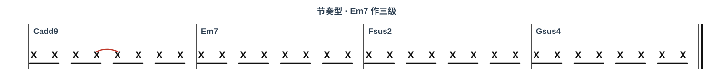

> **连音线**：第 2 拍的第 3 个八分音符与第 3 拍的第 4 个八分音符用弧线连在一起——第 3 个音按住不松手，时值延长到第 4 个音的位置再抬起，制造一个跨拍的小切分。
>
> **数拍**：第 1 拍 `1 &`、第 2 拍 `2 &`（第 2 个 & 与第 3 拍的 3 相连）、第 3 拍 `3 &`、第 4 拍 `4 &`。

---

## 四、每日练习

以下按周一到周日，12 个小七逐个练。每个小七独立成单元，含**（1）手型平移练习**与**（2）和弦进行练习**（该小七固定当三级）。方法见第三章，此处是每日清单。

### 周一 · Fm7、Cm7、Gm7

#### Fm7

##### （1）手型平移练习

> Fm7 的四个音是 **F - A♭ - C - E♭**（根 - 三 - 五 - 七），黑键在三音 A♭、七音 E♭。
> 手型一：左手 F-C（3-1 指）、右手 E♭-A♭-C（1-2-4 指）；手型二：左手 F-C-F（5-2-1）、右手 A♭-C-E♭-A♭（1-2-3-5，末音高八度）。
> 先柱式后琶音，黑键用指腹均匀下键。

##### （2）和弦进行练习

> Fm7 是 **D♭ 大调三级**，进行为 D♭add9 → Fm7 → G♭sus2 → A♭sus4。
> 四个和弦右手都是 1-2-4 指弹「三音上的大三和弦」，主角 Fm7 的右手是 A♭-C-E♭；小七度让主 → 下属的过渡更松弛。

| 级数 | 和弦 | 左手（根音-五音） | 右手（1-2-4指） |
|------|------|------------------|-----------------|
| 1 | D♭add9 | D♭ - A♭ | E♭ - F - A♭ |
| 3 | Fm7 | F - C | A♭ - C - E♭ |
| 4 | G♭sus2 | G♭ - D♭ | A♭ - D♭ - E♭ |
| 5 | A♭sus4 | A♭ - E♭ | D♭ - E♭ - F |

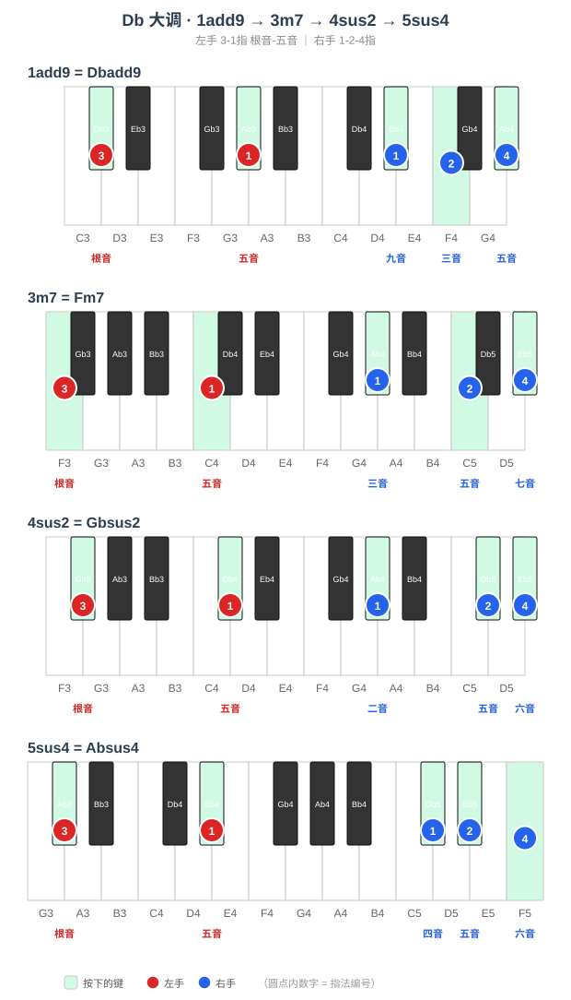

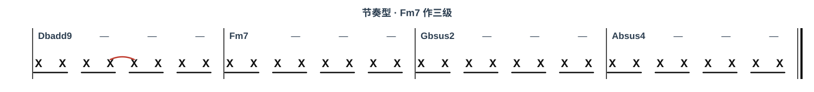

#### Cm7

##### （1）手型平移练习

> Cm7 的四个音是 **C - E♭ - G - B♭**（根 - 三 - 五 - 七），黑键在三音 E♭、七音 B♭。
> 手型一：左手 C-G（3-1 指）、右手 B♭-E♭-G（1-2-4 指）；手型二：左手 C-G-C（5-2-1）、右手 E♭-G-B♭-E♭（1-2-3-5，末音高八度）。
> 先柱式后琶音，黑键用指腹均匀下键。

##### （2）和弦进行练习

> Cm7 是 **A♭ 大调三级**，进行为 A♭add9 → Cm7 → D♭sus2 → E♭sus4。
> 四个和弦右手都是 1-2-4 指弹「三音上的大三和弦」，主角 Cm7 的右手是 E♭-G-B♭；小七度让主 → 下属的过渡更松弛。

| 级数 | 和弦 | 左手（根音-五音） | 右手（1-2-4指） |
|------|------|------------------|-----------------|
| 1 | A♭add9 | A♭ - E♭ | B♭ - C - E♭ |
| 3 | Cm7 | C - G | E♭ - G - B♭ |
| 4 | D♭sus2 | D♭ - A♭ | E♭ - A♭ - B♭ |
| 5 | E♭sus4 | E♭ - B♭ | A♭ - B♭ - C |

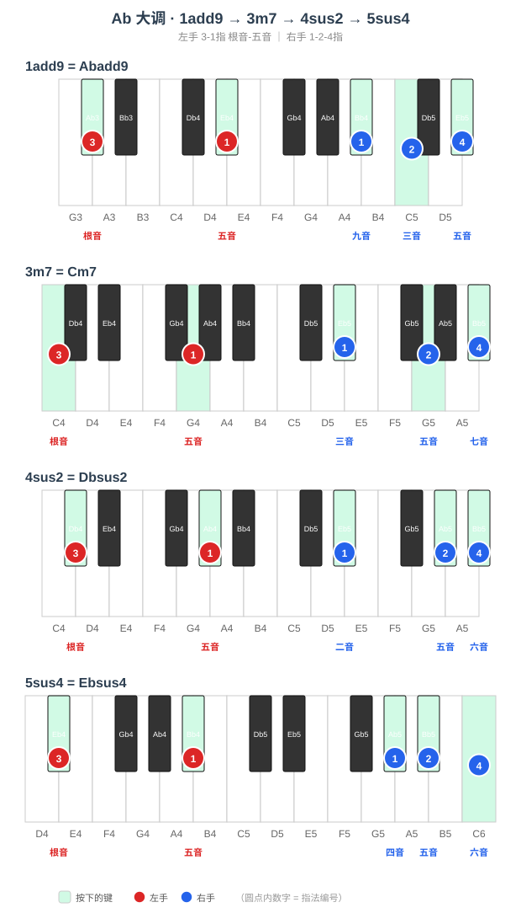

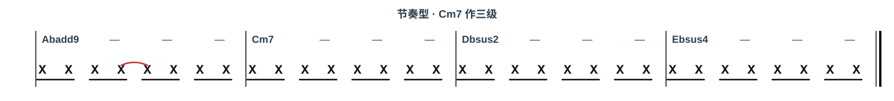

#### Gm7

##### （1）手型平移练习

> Gm7 的四个音是 **G - B♭ - D - F**（根 - 三 - 五 - 七），黑键在三音 B♭。
> 手型一：左手 G-D（3-1 指）、右手 F-B♭-D（1-2-4 指）；手型二：左手 G-D-G（5-2-1）、右手 B♭-D-F-B♭（1-2-3-5，末音高八度）。
> 先柱式后琶音，黑键用指腹均匀下键。

##### （2）和弦进行练习

> Gm7 是 **E♭ 大调三级**，进行为 E♭add9 → Gm7 → A♭sus2 → B♭sus4。
> 四个和弦右手都是 1-2-4 指弹「三音上的大三和弦」，主角 Gm7 的右手是 B♭-D-F；小七度让主 → 下属的过渡更松弛。

| 级数 | 和弦 | 左手（根音-五音） | 右手（1-2-4指） |
|------|------|------------------|-----------------|
| 1 | E♭add9 | E♭ - B♭ | F - G - B♭ |
| 3 | Gm7 | G - D | B♭ - D - F |
| 4 | A♭sus2 | A♭ - E♭ | B♭ - E♭ - F |
| 5 | B♭sus4 | B♭ - F | E♭ - F - G |

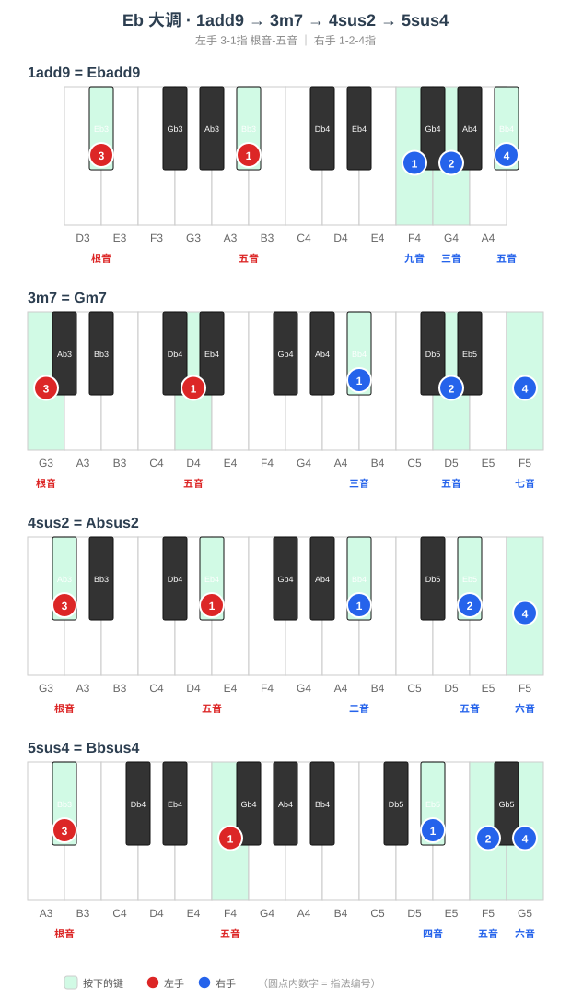

> **周一要点**：Fm7、Cm7、Gm7 分别落在 D♭、A♭、E♭ 大调的三级，都是降号调。右手「三音上的大三和弦」分别是 A♭-C-E♭、E♭-G-B♭、B♭-D-F，整体平移关系完全一致，注意三音 E♭、B♭ 黑键的均匀触键。

---

### 周二 · Dm7、Am7、Em7

#### Dm7

##### （1）手型平移练习

> Dm7 的四个音是 **D - F - A - C**（根 - 三 - 五 - 七），全白键，无黑键。
> 手型一：左手 D-A（3-1 指）、右手 C-F-A（1-2-4 指）；手型二：左手 D-A-D（5-2-1）、右手 F-A-C-F（1-2-3-5，末音高八度）。
> 先柱式后琶音，重点保持手指放松、均匀触键。

##### （2）和弦进行练习

> Dm7 是 **B♭ 大调三级**，进行为 B♭add9 → Dm7 → E♭sus2 → Fsus4。
> 四个和弦右手都是 1-2-4 指弹「三音上的大三和弦」，主角 Dm7 的右手是 F-A-C；小七度让主 → 下属的过渡更松弛。

| 级数 | 和弦 | 左手（根音-五音） | 右手（1-2-4指） |
|------|------|------------------|-----------------|
| 1 | B♭add9 | B♭ - F | C - D - F |
| 3 | Dm7 | D - A | F - A - C |
| 4 | E♭sus2 | E♭ - B♭ | F - B♭ - C |
| 5 | Fsus4 | F - C | B♭ - C - D |

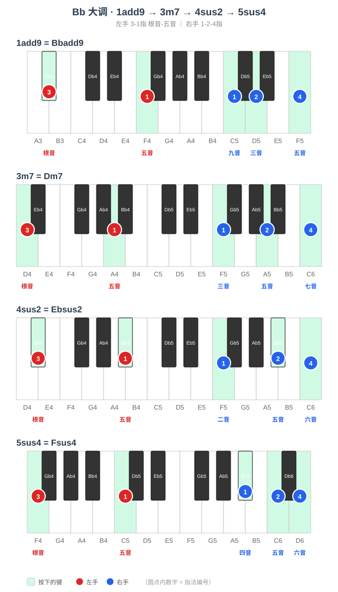

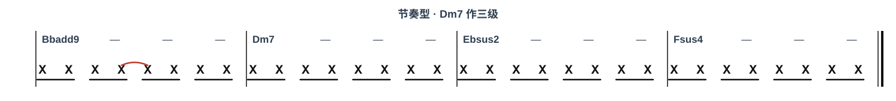

#### Am7

##### （1）手型平移练习

> Am7 的四个音是 **A - C - E - G**（根 - 三 - 五 - 七），全白键，无黑键。
> 手型一：左手 A-E（3-1 指）、右手 G-C-E（1-2-4 指）；手型二：左手 A-E-A（5-2-1）、右手 C-E-G-C（1-2-3-5，末音高八度）。
> 先柱式后琶音，重点保持手指放松、均匀触键。

##### （2）和弦进行练习

> Am7 是 **F 大调三级**，进行为 Fadd9 → Am7 → B♭sus2 → Csus4。
> 四个和弦右手都是 1-2-4 指弹「三音上的大三和弦」，主角 Am7 的右手是 C-E-G；小七度让主 → 下属的过渡更松弛。

| 级数 | 和弦 | 左手（根音-五音） | 右手（1-2-4指） |
|------|------|------------------|-----------------|
| 1 | Fadd9 | F - C | G - A - C |
| 3 | Am7 | A - E | C - E - G |
| 4 | B♭sus2 | B♭ - F | C - F - G |
| 5 | Csus4 | C - G | F - G - A |

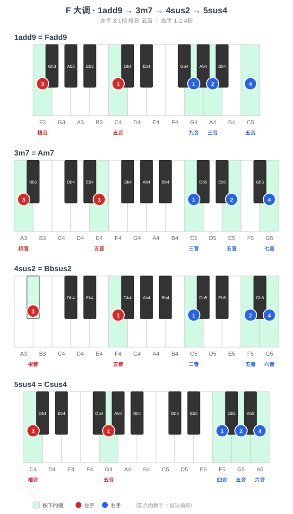

#### Em7

##### （1）手型平移练习

> Em7 的四个音是 **E - G - B - D**（根 - 三 - 五 - 七），全白键，无黑键。
> 手型一：左手 E-B（3-1 指）、右手 D-G-B（1-2-4 指）；手型二：左手 E-B-E（5-2-1）、右手 G-B-D-G（1-2-3-5，末音高八度）。
> 先柱式后琶音，重点保持手指放松、均匀触键。

##### （2）和弦进行练习

> Em7 是 **C 大调三级**，进行为 Cadd9 → Em7 → Fsus2 → Gsus4。
> 四个和弦右手都是 1-2-4 指弹「三音上的大三和弦」，主角 Em7 的右手是 G-B-D；小七度让主 → 下属的过渡更松弛。

| 级数 | 和弦 | 左手（根音-五音） | 右手（1-2-4指） |
|------|------|------------------|-----------------|
| 1 | Cadd9 | C - G | D - E - G |
| 3 | Em7 | E - B | G - B - D |
| 4 | Fsus2 | F - C | G - C - D |
| 5 | Gsus4 | G - D | C - D - E |

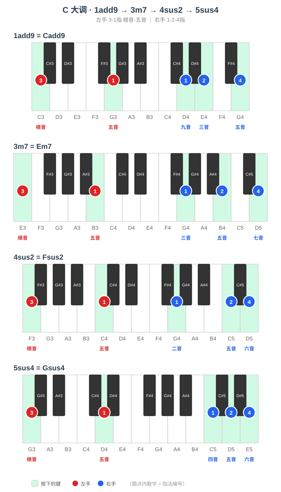

> **周二要点**：Dm7、Am7、Em7 落在 B♭、F、C 大调的三级。三级小七 F-A-C、C-E-G、G-B-D 全白键友好，重点体会「根音 + 三音上大三和弦」骨架在无黑键时的手感，再把这份手感带到黑键调。

---

### 周三~周四 · Bm7、F♯m7、D♭m7

#### Bm7

##### （1）手型平移练习

> Bm7 的四个音是 **B - D - F♯ - A**（根 - 三 - 五 - 七），黑键在五音 F♯。
> 手型一：左手 B-F♯（3-1 指）、右手 A-D-F♯（1-2-4 指）；手型二：左手 B-F♯-B（5-2-1）、右手 D-F♯-A-D（1-2-3-5，末音高八度）。
> 先柱式后琶音，黑键用指腹均匀下键。

##### （2）和弦进行练习

> Bm7 是 **G 大调三级**，进行为 Gadd9 → Bm7 → Csus2 → Dsus4。
> 四个和弦右手都是 1-2-4 指弹「三音上的大三和弦」，主角 Bm7 的右手是 D-F♯-A；小七度让主 → 下属的过渡更松弛。

| 级数 | 和弦 | 左手（根音-五音） | 右手（1-2-4指） |
|------|------|------------------|-----------------|
| 1 | Gadd9 | G - D | A - B - D |
| 3 | Bm7 | B - F♯ | D - F♯ - A |
| 4 | Csus2 | C - G | D - G - A |
| 5 | Dsus4 | D - A | G - A - B |

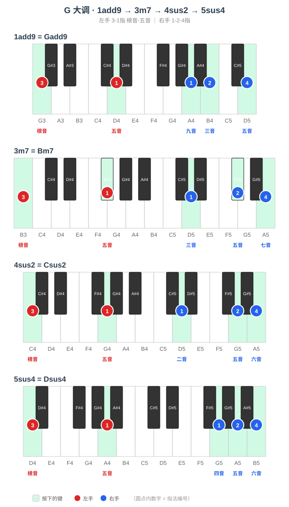

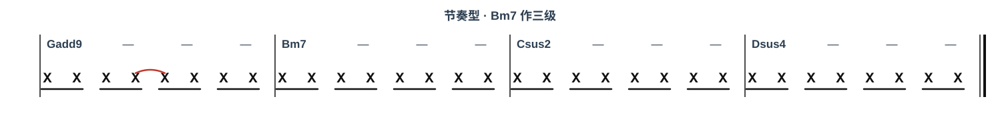

#### F♯m7

##### （1）手型平移练习

> F♯m7 的四个音是 **F♯ - A - C♯ - E**（根 - 三 - 五 - 七），黑键在根音 F♯、五音 C♯。
> 手型一：左手 F♯-C♯（3-1 指）、右手 E-A-C♯（1-2-4 指）；手型二：左手 F♯-C♯-F♯（5-2-1）、右手 A-C♯-E-A（1-2-3-5，末音高八度）。
> 先柱式后琶音，黑键用指腹均匀下键。

##### （2）和弦进行练习

> F♯m7 是 **D 大调三级**，进行为 Dadd9 → F♯m7 → Gsus2 → Asus4。
> 四个和弦右手都是 1-2-4 指弹「三音上的大三和弦」，主角 F♯m7 的右手是 A-C♯-E；小七度让主 → 下属的过渡更松弛。

| 级数 | 和弦 | 左手（根音-五音） | 右手（1-2-4指） |
|------|------|------------------|-----------------|
| 1 | Dadd9 | D - A | E - F♯ - A |
| 3 | F♯m7 | F♯ - C♯ | A - C♯ - E |
| 4 | Gsus2 | G - D | A - D - E |
| 5 | Asus4 | A - E | D - E - F♯ |

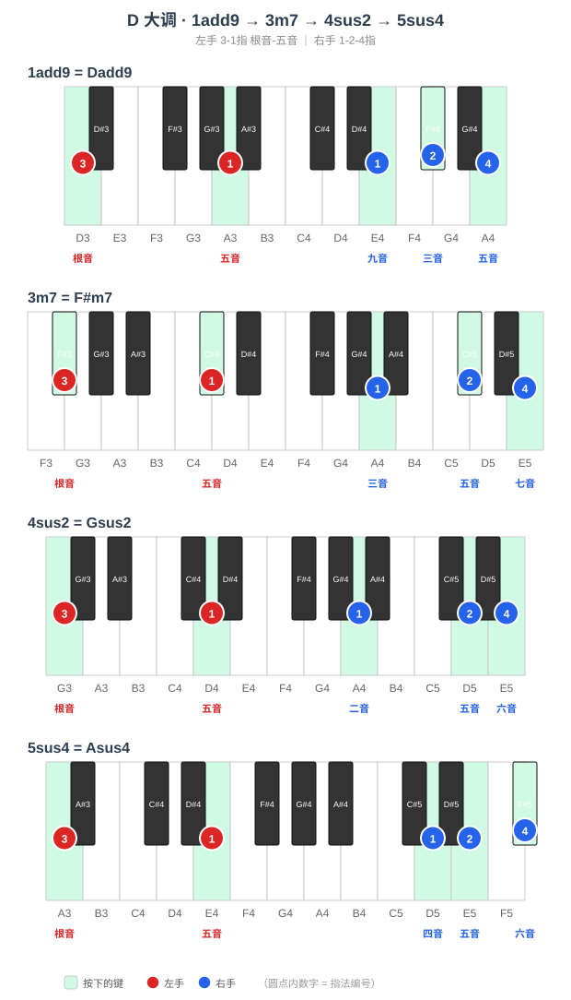

#### D♭m7

##### （1）手型平移练习

> D♭m7 的四个音是 **D♭ - E - A♭ - B**（根 - 三 - 五 - 七），黑键在根音 D♭、五音 A♭（三音 E、七音 B 键盘上即 F♭、C♭）。
> 手型一：左手 D♭-A♭（3-1 指）、右手 B-E-A♭（1-2-4 指）；手型二：左手 D♭-A♭-D♭（5-2-1）、右手 E-A♭-B-E（1-2-3-5，末音高八度）。
> 先柱式后琶音，黑键用指腹均匀下键。

##### （2）和弦进行练习

> D♭m7 是 **A 大调三级**（等音 C♯m7），进行为 Aadd9 → D♭m7 → Dsus2 → Esus4。
> 四个和弦右手都是 1-2-4 指弹「三音上的大三和弦」，主角 D♭m7 的右手是 E-A♭-B；小七度让主 → 下属的过渡更松弛。

| 级数 | 和弦 | 左手（根音-五音） | 右手（1-2-4指） |
|------|------|------------------|-----------------|
| 1 | Aadd9 | A - E | B - C♯ - E |
| 3 | D♭m7 | D♭ - A♭ | E - A♭ - B |
| 4 | Dsus2 | D - A | E - A - B |
| 5 | Esus4 | E - B | A - B - C♯ |

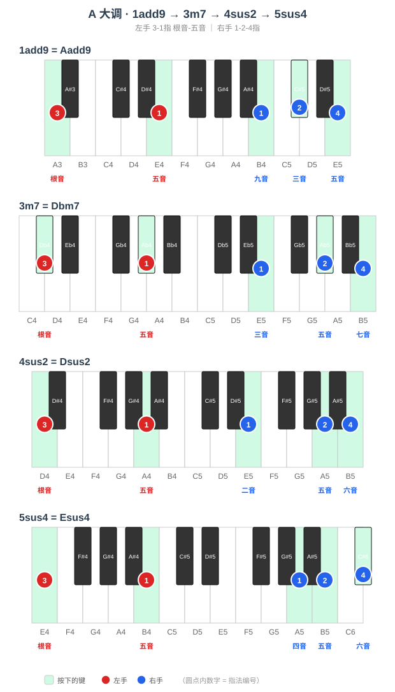

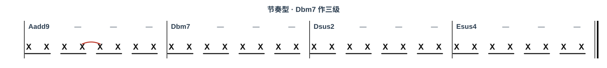

> **周三~周四要点**：升号渐多。Bm7、F♯m7 落在 G、D 大调三级，D♭m7 落在 A 大调三级（等音 C♯m7，键盘上按 D♭-E-A♭-B 就是 C♯-E-G♯-B）。手型关系与其他调完全一致，重点感受右手三音在黑键上的整体平移。

---

### 周五~周六 · A♭m7、E♭m7、B♭m7

#### A♭m7

##### （1）手型平移练习

> A♭m7 的四个音是 **A♭ - B - E♭ - G♭**（根 - 三 - 五 - 七），黑键在根音 A♭、五音 E♭、七音 G♭（三音 B 键盘上即 C♭）。
> 手型一：左手 A♭-E♭（3-1 指）、右手 G♭-B-E♭（1-2-4 指）；手型二：左手 A♭-E♭-A♭（5-2-1）、右手 B-E♭-G♭-B（1-2-3-5，末音高八度）。
> 先柱式后琶音，黑键用指腹均匀下键。

##### （2）和弦进行练习

> A♭m7 是 **E 大调三级**（等音 G♯m7），进行为 Eadd9 → A♭m7 → Asus2 → Bsus4。
> 四个和弦右手都是 1-2-4 指弹「三音上的大三和弦」，主角 A♭m7 的右手是 B-E♭-G♭；小七度让主 → 下属的过渡更松弛。

| 级数 | 和弦 | 左手（根音-五音） | 右手（1-2-4指） |
|------|------|------------------|-----------------|
| 1 | Eadd9 | E - B | F♯ - G♯ - B |
| 3 | A♭m7 | A♭ - E♭ | B - E♭ - G♭ |
| 4 | Asus2 | A - E | B - E - F♯ |
| 5 | Bsus4 | B - F♯ | E - F♯ - G♯ |

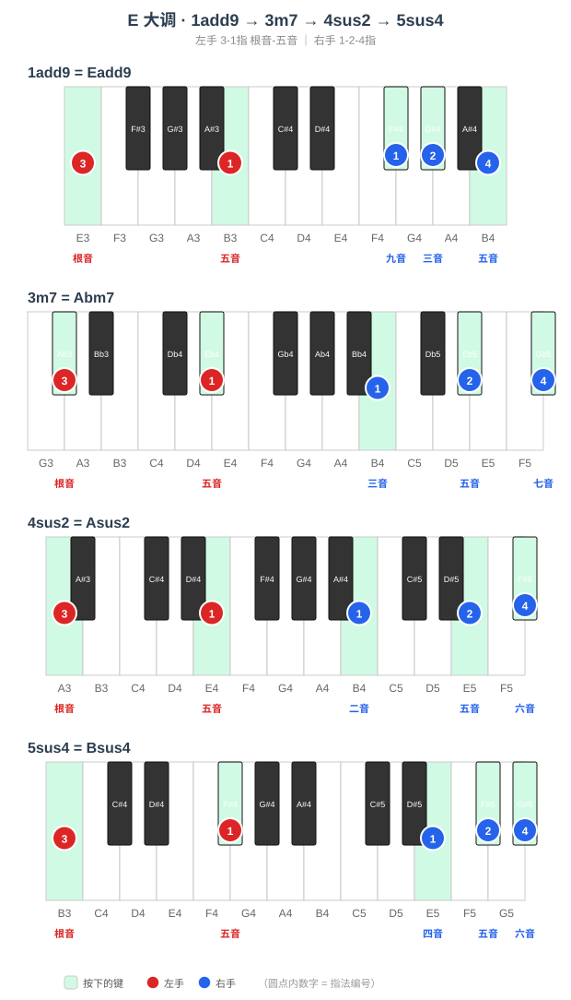

#### E♭m7

##### （1）手型平移练习

> E♭m7 的四个音是 **E♭ - G♭ - B♭ - D♭**（根 - 三 - 五 - 七），黑键在根音 E♭、三音 G♭、五音 B♭、七音 D♭（全黑键）。
> 手型一：左手 E♭-B♭（3-1 指）、右手 D♭-G♭-B♭（1-2-4 指）；手型二：左手 E♭-B♭-E♭（5-2-1）、右手 G♭-B♭-D♭-G♭（1-2-3-5，末音高八度）。
> 先柱式后琶音，黑键用指腹均匀下键。

##### （2）和弦进行练习

> E♭m7 是 **B 大调三级**（等音 D♯m7），进行为 Badd9 → E♭m7 → Esus2 → F♯sus4。
> 四个和弦右手都是 1-2-4 指弹「三音上的大三和弦」，主角 E♭m7 的右手是 G♭-B♭-D♭；小七度让主 → 下属的过渡更松弛。

| 级数 | 和弦 | 左手（根音-五音） | 右手（1-2-4指） |
|------|------|------------------|-----------------|
| 1 | Badd9 | B - F♯ | C♯ - D♯ - F♯ |
| 3 | E♭m7 | E♭ - B♭ | G♭ - B♭ - D♭ |
| 4 | Esus2 | E - B | F♯ - B - C♯ |
| 5 | F♯sus4 | F♯ - C♯ | B - C♯ - D♯ |

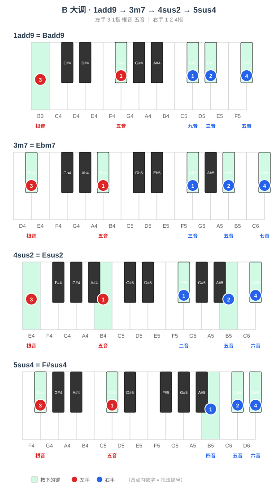

#### B♭m7

##### （1）手型平移练习

> B♭m7 的四个音是 **B♭ - D♭ - F - A♭**（根 - 三 - 五 - 七），黑键在根音 B♭、三音 D♭、七音 A♭。
> 手型一：左手 B♭-F（3-1 指）、右手 A♭-D♭-F（1-2-4 指）；手型二：左手 B♭-F-B♭（5-2-1）、右手 D♭-F-A♭-D♭（1-2-3-5，末音高八度）。
> 先柱式后琶音，黑键用指腹均匀下键。

##### （2）和弦进行练习

> B♭m7 是 **F♯ 大调三级**（等音 A♯m7），进行为 F♯add9 → B♭m7 → Bsus2 → C♯sus4。
> 四个和弦右手都是 1-2-4 指弹「三音上的大三和弦」，主角 B♭m7 的右手是 D♭-F-A♭；小七度让主 → 下属的过渡更松弛。

| 级数 | 和弦 | 左手（根音-五音） | 右手（1-2-4指） |
|------|------|------------------|-----------------|
| 1 | F♯add9 | F♯ - C♯ | G♯ - A♯ - C♯ |
| 3 | B♭m7 | B♭ - F | D♭ - F - A♭ |
| 4 | Bsus2 | B - F♯ | C♯ - F♯ - G♯ |
| 5 | C♯sus4 | C♯ - G♯ | F♯ - G♯ - A♯ |

> **周五~周六要点**：降号命名的小七落在升号调。A♭m7、E♭m7、B♭m7 分别是 E、B、F♯ 大调的三级（等音 G♯m7、D♯m7、A♯m7）。这是全篇最考验「等音」的一组——记住键盘位置不变，只是书面记谱换了个名字，把 A♭m7 按 E 大调三级弹奏即可。

---

### 周日 · 全量练习与查漏补缺

**手型平移**：按五度圈顺序 C → G → D → A → E → B → F♯ → D♭ → A♭ → E♭ → B♭ → F 完整跑一遍每个小七的两种手型，标记还不熟的调。

**和弦进行练习**：把 12 个小七作为三级各弹一遍，重点查漏补缺——哪个小七落在黑键调里定位还不稳，就单独回炉。12 个小七的总表如下：

| 小七（三级） | 所属大调 | 进行（1 → 3 → 4 → 5） |
|------|------|------|
| Fm7 | D♭ | D♭add9 → Fm7 → G♭sus2 → A♭sus4 |
| Cm7 | A♭ | A♭add9 → Cm7 → D♭sus2 → E♭sus4 |
| Gm7 | E♭ | E♭add9 → Gm7 → A♭sus2 → B♭sus4 |
| Dm7 | B♭ | B♭add9 → Dm7 → E♭sus2 → Fsus4 |
| Am7 | F | Fadd9 → Am7 → B♭sus2 → Csus4 |
| Em7 | C | Cadd9 → Em7 → Fsus2 → Gsus4 |
| Bm7 | G | Gadd9 → Bm7 → Csus2 → Dsus4 |
| F♯m7 | D | Dadd9 → F♯m7 → Gsus2 → Asus4 |
| D♭m7 | A | Aadd9 → D♭m7 → Dsus2 → Esus4 |
| A♭m7 | E | Eadd9 → A♭m7 → Asus2 → Bsus4 |
| E♭m7 | B | Badd9 → E♭m7 → Esus2 → F♯sus4 |
| B♭m7 | F♯ | F♯add9 → B♭m7 → Bsus2 → C♯sus4 |
