# 挂留四和弦（sus4）

## 一、和弦结构

挂留四和弦（sus4）由**根音 + 纯四度 + 纯五度**构成。

以 Csus4 为例：**C - F - G**

| 构成音 | 唱名 | 与根音的音程 |
|--------|------|------------|
| C | do | 根音 |
| F | fa | 纯四度 |
| G | so | 纯五度 |

> **拆解理解：用四音替代三音**。sus4 里没有三音，因此不分大三/小三。四音比三音高半音，与根音形成纯四度，音色比大小三和弦更"紧张、待解决"。
>
> **四音的下行解决**：四音（fa）强烈倾向**下行半音解决到三音**（F → E）。这一"悬挂—解决"是 sus4 的灵魂——它天然带着往主/往属三音走的冲动，因此最适合放在**终止式（V → I）里做最后的蓄势**，把"回主"的落地感放大。

---

## 二、手型与弹奏位置（扩张型）

右手五指编号：**1**（拇指）、**2**（食指）、**3**（中指）、**4**（无名指）、**5**（小指）。左手同理。

sus4 **只需掌握一种手型——扩张型**，直接参考 C 大三和弦的扩张位置：左手不变，右手只把大三扩张型的**三音（mi）换成四音（fa）**。

### 扩张型：左手 do-so + 右手 do-fa-so-do

左手弹 do-so（根音-五音，5-2 指，与大三扩张型完全一致），右手 1-2-3-5 指完成 do-fa-so-do（根音-四音-五音-高八度根音），声部丰满，适合柱式伴奏。

| 声部 | 左手 | 右手 |
|------|------|------|
| 指法 | **5 指**弹根音 + **2 指**弹五音 | **1-2-3-5 指** |
| 示例（Csus4） | ⑤-C（低）、②-G | ①-C、②-F、③-G、⑤-C（高八度） |

> **练习要点**：左手纯五度跨度（C→G）与大三扩张型一致，手腕放松不要僵硬；右手 1-2-3-5 跨度也为纯八度（C→C），唯一变化是 ② 指从大三的 E 移到 F，注意 ② 指（fa）与 ③ 指（so）之间的大二度间距。

---

## 三、练习方法

每天的练习沿两条线展开：**手型平移**（把每个 sus4 的扩张型手型练熟）与**和弦进行**（把该 sus4 作为五级放进实战终止式）。先掌握下面三套方法，再到第四章按天练习。

### （一）手型平移法

**纵向：柱式 → 琶音**

先练**柱式和弦**（双手同时按下），再练**琶音分解**（逐音弹出）；左手根音力度稍重，建立低音支撑。

| 声部 | 左手 | 右手 |
|------|------|------|
| 扩张型 | 5-2 指：根音 - 五音 | 1-2-3-5 指：根音 - 四音 - 五音 - 高八度根音 |

> 以 Csus4 为例：左手 C-G（5-2 指）、右手 C-F-G-C（1-2-3-5，末音高八度）。

**横向：五度圈移调（Transposition）**

把在某个 sus4 上练熟的手型**整体平移**到五度圈的下一个 sus4：手型关系完全不变，只有根音位置移动。按 Csus4 → Gsus4 → Dsus4 → Asus4 → Esus4 → Bsus4 → F♯sus4 → D♭sus4 → A♭sus4 → E♭sus4 → B♭sus4 → Fsus4 逐个平移，每移一个重新执行纵向练习，重点感受黑键四音（如 Fsus4 的 B♭、D♭sus4 的 G♭）如何随平移出现。

### （二）和弦进行骨架

进行级数固定为 **4sus2 → 5sus4 → 1**（IV → V → I），sus4 固定落在**五级（5sus4）**。下属用 sus2 舒展、属用 sus4 蓄势、主回到收缩的大三，三者层层推进。

以 Gsus4（C 大调五级）为例，三个和弦的手型分别是：

| 级数 | 和弦 | 手型 | 左手（低→高） | 右手（低→高） |
|------|------|------|--------------|--------------|
| 4 | Fsus2 | 扩张型 | F - C - F（5-2-1） | G - C - G（1-2-5） |
| 5 | Gsus4 | 扩张型 | G - D（5-2） | G - C - D - G（1-2-3-5） |
| 1 | C | 紧凑型（收缩） | C（3） | G - C - E（1-2-4） |

> **五级 sus4 的作用**：属和弦（V）本就有"回主"的强烈倾向，把三音换成四音后，四音比三音再高半音、更"悬"，回到主和弦时四音**下行半音解决到三音**（Gsus4 的 C → 下一和弦 C 的三音 E 之前的张力），落地感被放大，最适合做终止式的最后蓄势。
>
> **挂留音的共同音衔接**：Fsus2 的二音 G 恰是下一个和弦 G 的根音；Gsus4 的四音 C 恰是最终主和弦 C 的根音。挂留音并非凭空消失，而是作为**共同音平滑过渡**到下一个和弦，这正是挂留和弦让声部进行更连贯的原因。

**练习三步**：

1. 先不挂节奏，把当天 sus4 所属调的 4sus2、5sus4、1 三个和弦单独按柱式弹熟（5sus4 就是当天练的 sus4）；
2. 再套入下面的节奏型，按 4sus2 → 5sus4 → 1 循环，每个和弦一小节，注意连音线；
3. 最后边弹边唱级数（4 - 5 - 1），重点听五级 sus4 的四音往下行半音解决、回到主三音时的「属回主」落地感。

### （三）节奏型

整个进行共 3 个小节（每个和弦一小节），每小节弹 **8 个八分音符**（一拍一个，两两共用下划线）。下面为 X 节奏谱——**X 表示一次弹奏，一道下划线 = 八分音符；红色弧线为跨拍连音线**。**每个 sus4 的节奏谱上直接标注具体和弦名**（如 Fsus2 / Gsus4 / C），方便代入式练习：

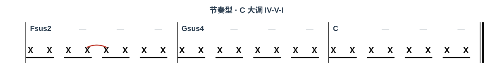

> **连音线**：第 2 拍的第 3 个八分音符与第 3 拍的第 4 个八分音符用弧线连在一起——第 3 个音按住不松手，时值延长到第 4 个音的位置再抬起，制造一个跨拍的小切分。
>
> **数拍**：第 1 拍 `1 &`、第 2 拍 `2 &`（第 2 个 & 与第 3 拍的 3 相连）、第 3 拍 `3 &`、第 4 拍 `4 &`。

---

## 四、每日练习

以下按周一到周日，12 个 sus4 逐个练。每个 sus4 独立成单元，含**（1）手型平移练习**与**（2）和弦进行练习**（该 sus4 固定当五级）。方法见第三章，此处是每日清单。

### 周一 · Fsus4、Csus4、Gsus4

#### Fsus4

##### （1）手型平移练习

> Fsus4 的三个音是 **F - B♭ - C**（根 - 四 - 五），黑键在四音 B♭。
> 扩张型：左手 F-C（5-2 指）、右手 F-B♭-C-F（1-2-3-5，末音高八度）。
> 先柱式后琶音，黑键用指腹均匀下键。

##### （2）和弦进行练习

> Fsus4 是 **B♭ 大调的 V 级（属）**，进行为 E♭sus2 → Fsus4 → B♭。
> 四音 B♭ 强烈倾向下行解决到三音，制造「属回主」的落地感。

| 级数 | 和弦 | 左手 | 右手 |
|------|------|------|------|
| IV | E♭sus2 | E♭ - B♭ - E♭（5-2-1） | F - B♭ - F（1-2-5） |
| V | Fsus4 | F - C（5-2） | F - B♭ - C - F（1-2-3-5） |
| I | B♭ | B♭（3） | F - B♭ - D（1-2-4） |

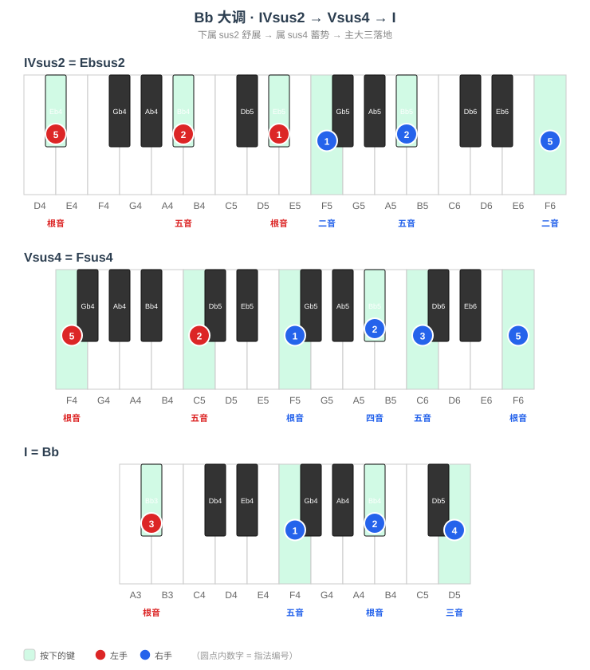

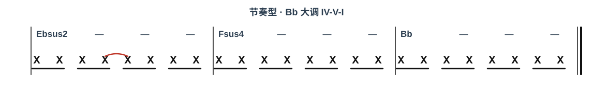

#### Csus4

##### （1）手型平移练习

> Csus4 的三个音是 **C - F - G**（根 - 四 - 五），全白键，无黑键。
> 扩张型：左手 C-G（5-2 指）、右手 C-F-G-C（1-2-3-5，末音高八度）。
> 先柱式后琶音，重点保持手指放松、均匀触键。

##### （2）和弦进行练习

> Csus4 是 **F 大调的 V 级（属）**，进行为 B♭sus2 → Csus4 → F。
> 四音 F 强烈倾向下行解决到三音，制造「属回主」的落地感。

| 级数 | 和弦 | 左手 | 右手 |
|------|------|------|------|
| IV | B♭sus2 | B♭ - F - B♭（5-2-1） | C - F - C（1-2-5） |
| V | Csus4 | C - G（5-2） | C - F - G - C（1-2-3-5） |
| I | F | F（3） | C - F - A（1-2-4） |

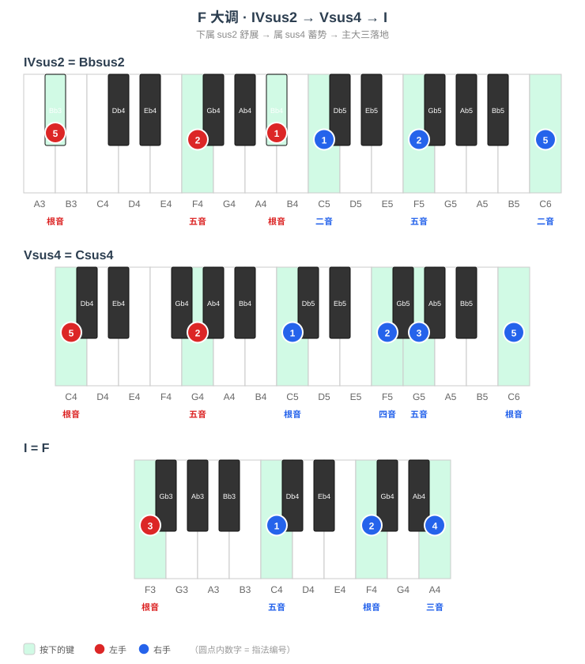

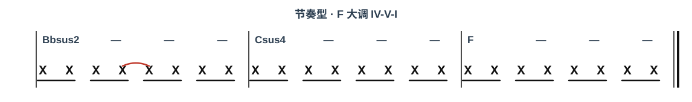

#### Gsus4

##### （1）手型平移练习

> Gsus4 的三个音是 **G - C - D**（根 - 四 - 五），全白键，无黑键。
> 扩张型：左手 G-D（5-2 指）、右手 G-C-D-G（1-2-3-5，末音高八度）。
> 先柱式后琶音，重点保持手指放松、均匀触键。

##### （2）和弦进行练习

> Gsus4 是 **C 大调的 V 级（属）**，进行为 Fsus2 → Gsus4 → C。
> 四音 C 强烈倾向下行解决到三音，制造「属回主」的落地感。

| 级数 | 和弦 | 左手 | 右手 |
|------|------|------|------|
| IV | Fsus2 | F - C - F（5-2-1） | G - C - G（1-2-5） |
| V | Gsus4 | G - D（5-2） | G - C - D - G（1-2-3-5） |
| I | C | C（3） | G - C - E（1-2-4） |

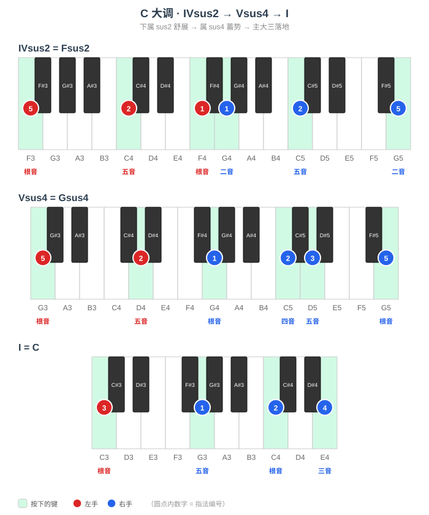

> **周一要点**：Fsus4 的四音 B♭ 是黑键，Csus4、Gsus4 全白键。sus4 只有一个扩张型手型，换调只是整体平移，重点感受四音（右手 ② 指）落在黑键时的指腹下键。

---

### 周二 · Dsus4、Asus4、Esus4

#### Dsus4

##### （1）手型平移练习

> Dsus4 的三个音是 **D - G - A**（根 - 四 - 五），全白键，无黑键。
> 扩张型：左手 D-A（5-2 指）、右手 D-G-A-D（1-2-3-5，末音高八度）。
> 先柱式后琶音，重点保持手指放松、均匀触键。

##### （2）和弦进行练习

> Dsus4 是 **G 大调的 V 级（属）**，进行为 Csus2 → Dsus4 → G。
> 四音 G 强烈倾向下行解决到三音，制造「属回主」的落地感。

| 级数 | 和弦 | 左手 | 右手 |
|------|------|------|------|
| IV | Csus2 | C - G - C（5-2-1） | D - G - D（1-2-5） |
| V | Dsus4 | D - A（5-2） | D - G - A - D（1-2-3-5） |
| I | G | G（3） | D - G - B（1-2-4） |

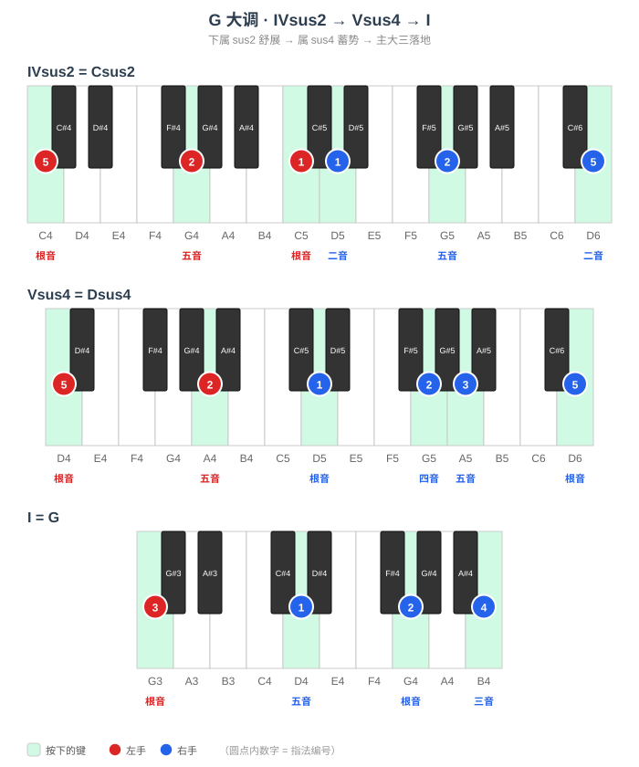

#### Asus4

##### （1）手型平移练习

> Asus4 的三个音是 **A - D - E**（根 - 四 - 五），全白键，无黑键。
> 扩张型：左手 A-E（5-2 指）、右手 A-D-E-A（1-2-3-5，末音高八度）。
> 先柱式后琶音，重点保持手指放松、均匀触键。

##### （2）和弦进行练习

> Asus4 是 **D 大调的 V 级（属）**，进行为 Gsus2 → Asus4 → D。
> 四音 D 强烈倾向下行解决到三音，制造「属回主」的落地感。

| 级数 | 和弦 | 左手 | 右手 |
|------|------|------|------|
| IV | Gsus2 | G - D - G（5-2-1） | A - D - A（1-2-5） |
| V | Asus4 | A - E（5-2） | A - D - E - A（1-2-3-5） |
| I | D | D（3） | A - D - F♯（1-2-4） |

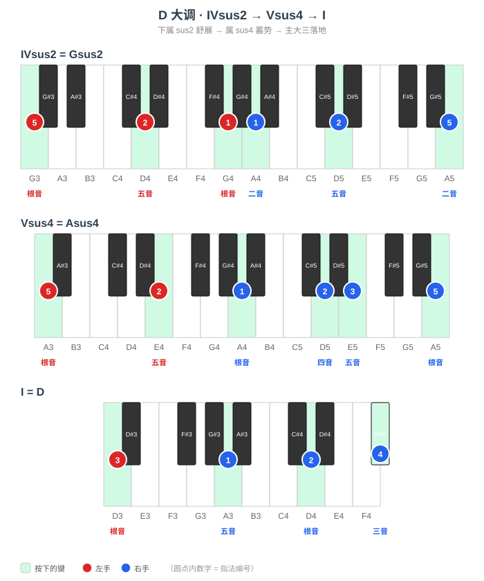

#### Esus4

##### （1）手型平移练习

> Esus4 的三个音是 **E - A - B**（根 - 四 - 五），全白键，无黑键。
> 扩张型：左手 E-B（5-2 指）、右手 E-A-B-E（1-2-3-5，末音高八度）。
> 先柱式后琶音，重点保持手指放松、均匀触键。

##### （2）和弦进行练习

> Esus4 是 **A 大调的 V 级（属）**，进行为 Dsus2 → Esus4 → A。
> 四音 A 强烈倾向下行解决到三音，制造「属回主」的落地感。

| 级数 | 和弦 | 左手 | 右手 |
|------|------|------|------|
| IV | Dsus2 | D - A - D（5-2-1） | E - A - E（1-2-5） |
| V | Esus4 | E - B（5-2） | E - A - B - E（1-2-3-5） |
| I | A | A（3） | E - A - C♯（1-2-4） |

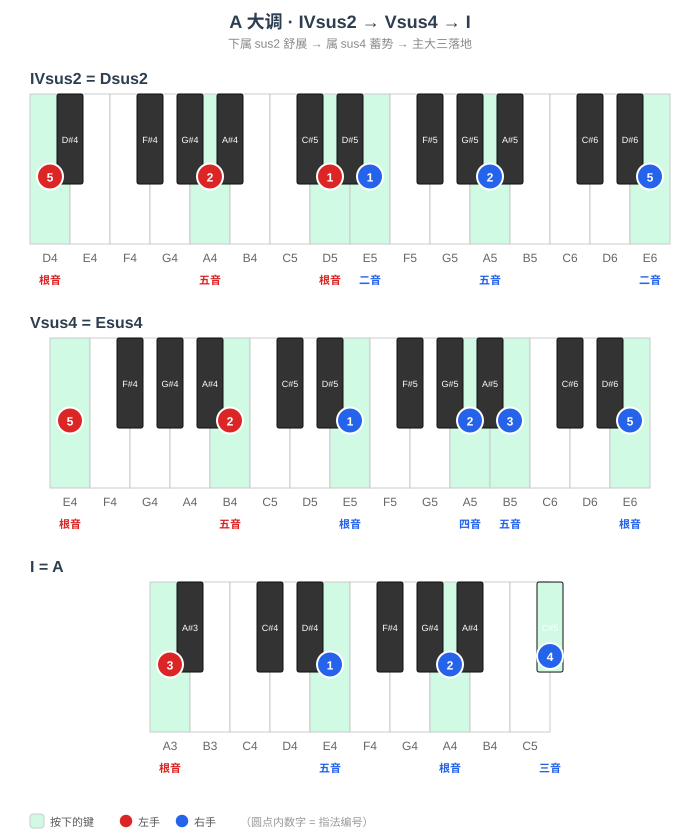

> **周二要点**：Dsus4、Asus4、Esus4 全白键，手感友好。三级 D-G-A、A-D-E、E-A-B 全白，重点体会「根-四-五-高八度根」骨架在无黑键时的手型，再把这份手感带到黑键调。

---

### 周三~周四 · Bsus4、F♯sus4、D♭sus4

#### Bsus4

##### （1）手型平移练习

> Bsus4 的三个音是 **B - E - F♯**（根 - 四 - 五），黑键在五音 F♯。
> 扩张型：左手 B-F♯（5-2 指）、右手 B-E-F♯-B（1-2-3-5，末音高八度）。
> 先柱式后琶音，黑键用指腹均匀下键。

##### （2）和弦进行练习

> Bsus4 是 **E 大调的 V 级（属）**，进行为 Asus2 → Bsus4 → E。
> 四音 E 强烈倾向下行解决到三音，制造「属回主」的落地感。

| 级数 | 和弦 | 左手 | 右手 |
|------|------|------|------|
| IV | Asus2 | A - E - A（5-2-1） | B - E - B（1-2-5） |
| V | Bsus4 | B - F♯（5-2） | B - E - F♯ - B（1-2-3-5） |
| I | E | E（3） | B - E - G♯（1-2-4） |

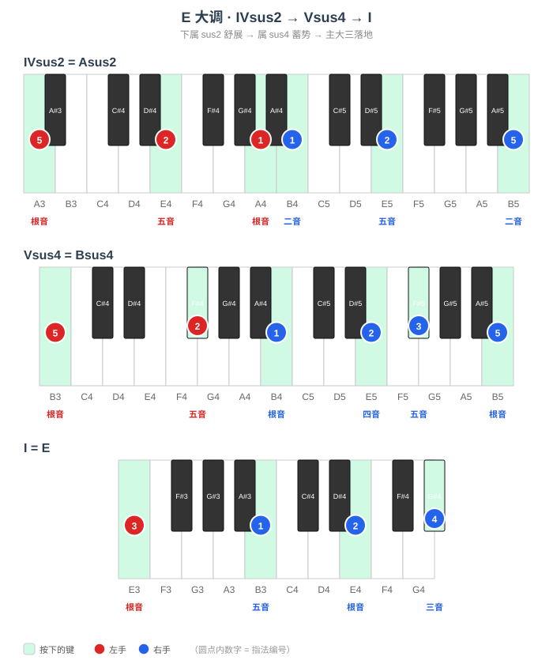

#### F♯sus4

##### （1）手型平移练习

> F♯sus4 的三个音是 **F♯ - B - C♯**（根 - 四 - 五），黑键在根音 F♯、五音 C♯。
> 扩张型：左手 F♯-C♯（5-2 指）、右手 F♯-B-C♯-F♯（1-2-3-5，末音高八度）。
> 先柱式后琶音，黑键用指腹均匀下键。

##### （2）和弦进行练习

> F♯sus4 是 **B 大调的 V 级（属）**，进行为 Esus2 → F♯sus4 → B。
> 四音 B 强烈倾向下行解决到三音，制造「属回主」的落地感。

| 级数 | 和弦 | 左手 | 右手 |
|------|------|------|------|
| IV | Esus2 | E - B - E（5-2-1） | F♯ - B - F♯（1-2-5） |
| V | F♯sus4 | F♯ - C♯（5-2） | F♯ - B - C♯ - F♯（1-2-3-5） |
| I | B | B（3） | F♯ - B - D♯（1-2-4） |

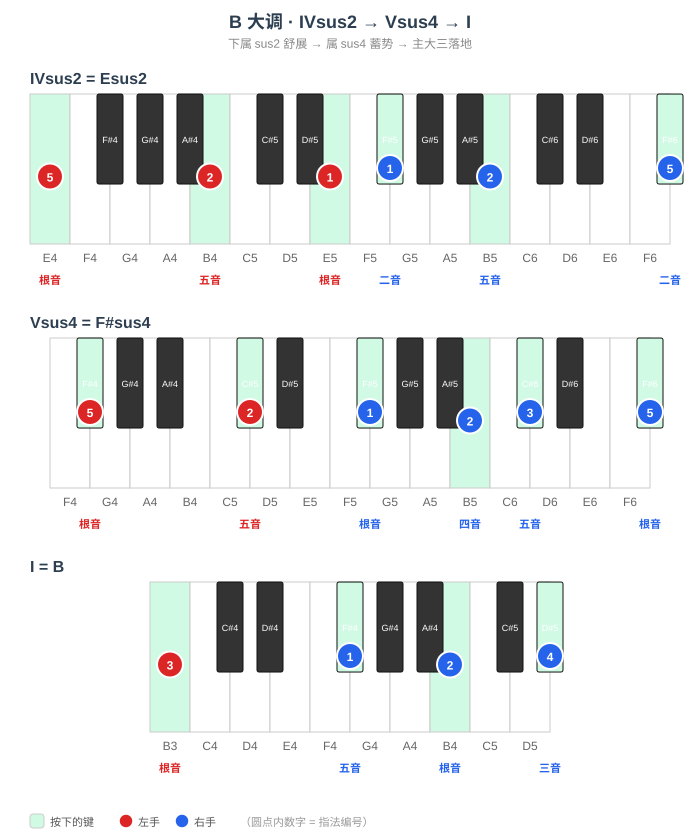

#### D♭sus4

##### （1）手型平移练习

> D♭sus4 的三个音是 **D♭ - G♭ - A♭**（根 - 四 - 五），黑键在根音 D♭、四音 G♭、五音 A♭。
> 扩张型：左手 D♭-A♭（5-2 指）、右手 D♭-G♭-A♭-D♭（1-2-3-5，末音高八度）。
> 先柱式后琶音，黑键用指腹均匀下键。

##### （2）和弦进行练习

> D♭sus4 是 **G♭ 大调的 V 级（属）**（等音 F♯ 大调），进行为 C♭sus2 → D♭sus4 → G♭。
> 四音 G♭ 强烈倾向下行解决到三音，制造「属回主」的落地感。

| 级数 | 和弦 | 左手 | 右手 |
|------|------|------|------|
| IV | C♭sus2 | C♭ - G♭ - C♭（5-2-1） | D♭ - G♭ - D♭（1-2-5） |
| V | D♭sus4 | D♭ - A♭（5-2） | D♭ - G♭ - A♭ - D♭（1-2-3-5） |
| I | G♭ | G♭（3） | D♭ - G♭ - B♭（1-2-4） |

> **周三~周四要点**：升号渐多。Bsus4、F♯sus4 落在 E、B 大调五级，D♭sus4 落在 G♭ 大调五级（等音 F♯ 大调，IV 记作 C♭sus2）。手型关系与其他调完全一致，重点感受右手四音在黑键上的整体平移。

---

### 周五~周六 · A♭sus4、E♭sus4、B♭sus4

#### A♭sus4

##### （1）手型平移练习

> A♭sus4 的三个音是 **A♭ - D♭ - E♭**（根 - 四 - 五），黑键在根音 A♭、四音 D♭、五音 E♭。
> 扩张型：左手 A♭-E♭（5-2 指）、右手 A♭-D♭-E♭-A♭（1-2-3-5，末音高八度）。
> 先柱式后琶音，黑键用指腹均匀下键。

##### （2）和弦进行练习

> A♭sus4 是 **D♭ 大调的 V 级（属）**，进行为 G♭sus2 → A♭sus4 → D♭。
> 四音 D♭ 强烈倾向下行解决到三音，制造「属回主」的落地感。

| 级数 | 和弦 | 左手 | 右手 |
|------|------|------|------|
| IV | G♭sus2 | G♭ - D♭ - G♭（5-2-1） | A♭ - D♭ - A♭（1-2-5） |
| V | A♭sus4 | A♭ - E♭（5-2） | A♭ - D♭ - E♭ - A♭（1-2-3-5） |
| I | D♭ | D♭（3） | A♭ - D♭ - F（1-2-4） |

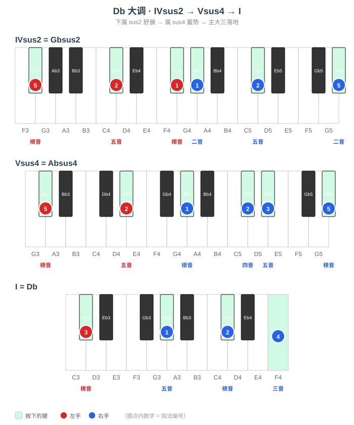

#### E♭sus4

##### （1）手型平移练习

> E♭sus4 的三个音是 **E♭ - A♭ - B♭**（根 - 四 - 五），黑键在根音 E♭、四音 A♭、五音 B♭。
> 扩张型：左手 E♭-B♭（5-2 指）、右手 E♭-A♭-B♭-E♭（1-2-3-5，末音高八度）。
> 先柱式后琶音，黑键用指腹均匀下键。

##### （2）和弦进行练习

> E♭sus4 是 **A♭ 大调的 V 级（属）**，进行为 D♭sus2 → E♭sus4 → A♭。
> 四音 A♭ 强烈倾向下行解决到三音，制造「属回主」的落地感。

| 级数 | 和弦 | 左手 | 右手 |
|------|------|------|------|
| IV | D♭sus2 | D♭ - A♭ - D♭（5-2-1） | E♭ - A♭ - E♭（1-2-5） |
| V | E♭sus4 | E♭ - B♭（5-2） | E♭ - A♭ - B♭ - E♭（1-2-3-5） |
| I | A♭ | A♭（3） | E♭ - A♭ - C（1-2-4） |

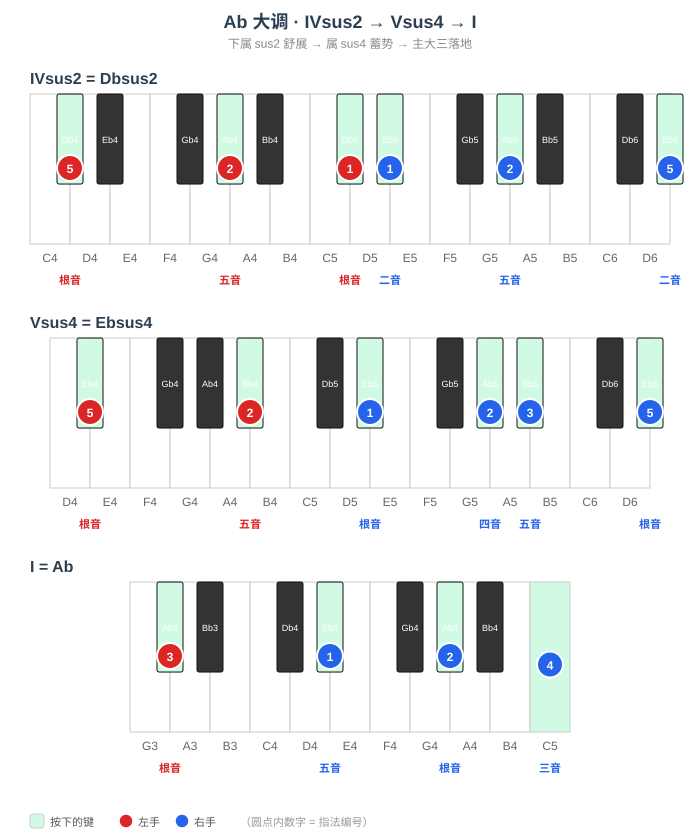

#### B♭sus4

##### （1）手型平移练习

> B♭sus4 的三个音是 **B♭ - E♭ - F**（根 - 四 - 五），黑键在根音 B♭、四音 E♭。
> 扩张型：左手 B♭-F（5-2 指）、右手 B♭-E♭-F-B♭（1-2-3-5，末音高八度）。
> 先柱式后琶音，黑键用指腹均匀下键。

##### （2）和弦进行练习

> B♭sus4 是 **E♭ 大调的 V 级（属）**，进行为 A♭sus2 → B♭sus4 → E♭。
> 四音 E♭ 强烈倾向下行解决到三音，制造「属回主」的落地感。

| 级数 | 和弦 | 左手 | 右手 |
|------|------|------|------|
| IV | A♭sus2 | A♭ - E♭ - A♭（5-2-1） | B♭ - E♭ - B♭（1-2-5） |
| V | B♭sus4 | B♭ - F（5-2） | B♭ - E♭ - F - B♭（1-2-3-5） |
| I | E♭ | E♭（3） | B♭ - E♭ - G（1-2-4） |

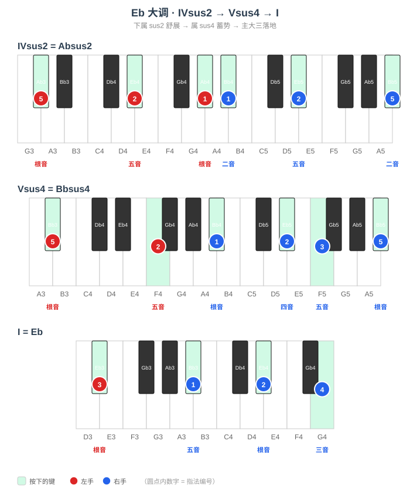

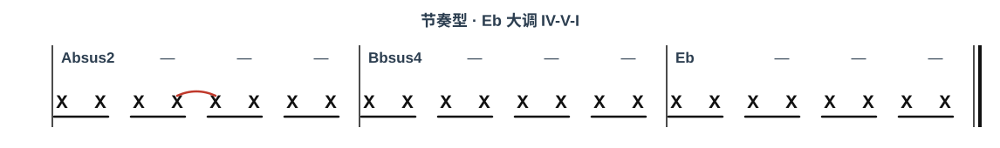

> **周五~周六要点**：降号命名的 sus4。A♭sus4、E♭sus4、B♭sus4 分别是 D♭、A♭、E♭ 大调的五级。这是全篇黑键最多的一组，四音基本都落在黑键（A♭sus4 的 D♭、E♭sus4 的 A♭、B♭sus4 的 E♭），右手 ② 指（四音）务必用指腹均匀下键，保持「根-四-五-高八度根」骨架不变。

---

### 周日 · 全量练习与查漏补缺

**手型平移**：按五度圈顺序 C → G → D → A → E → B → F♯ → D♭ → A♭ → E♭ → B♭ → F 完整跑一遍每个 sus4 的扩张型手型，标记还不熟的调。

**和弦进行练习**：把 12 个 sus4 作为五级各弹一遍，重点查漏补缺——哪个 sus4 落在黑键调里定位还不稳，就单独回炉。12 个 sus4 的总表如下：

| sus4（五级） | 所属大调 | 进行（IV → V → I） |
|------|------|------|
| Fsus4 | B♭ | E♭sus2 → Fsus4 → B♭ |
| Csus4 | F | B♭sus2 → Csus4 → F |
| Gsus4 | C | Fsus2 → Gsus4 → C |
| Dsus4 | G | Csus2 → Dsus4 → G |
| Asus4 | D | Gsus2 → Asus4 → D |
| Esus4 | A | Dsus2 → Esus4 → A |
| Bsus4 | E | Asus2 → Bsus4 → E |
| F♯sus4 | B | Esus2 → F♯sus4 → B |
| D♭sus4 | G♭ | C♭sus2 → D♭sus4 → G♭ |
| A♭sus4 | D♭ | G♭sus2 → A♭sus4 → D♭ |
| E♭sus4 | A♭ | D♭sus2 → E♭sus4 → A♭ |
| B♭sus4 | E♭ | A♭sus2 → B♭sus4 → E♭ |
