# 加九音和弦

## 一、和弦结构

加九音和弦（add9）由**大三和弦 + 大九度**构成，即在根音、大三度、纯五度之外，再叠加一个**根音上方的大九度**（大二度的高八度）。

以 Cadd9 为例：**C - E - G - D**

| 构成音 | 唱名 | 与根音的音程 |
|--------|------|------------|
| C | do | 根音 |
| E | mi | 大三度 |
| G | so | 纯五度 |
| D | re | 大九度 |

> **拆解理解：大三和弦再多叠一个九音**。add9 本质上还是大三和弦（有完整的三音），只是额外加了九音（re）增色。九音与三音（mi）只隔一个大二度，紧挨着夹在中声部，因此 add9 既有大三的明亮、又多一层"雾面"的柔光。
>
> **add9 与 sus2 的区别**：两者都带二度色彩，但 sus2 **没有三音**（悬空、无大小），add9 **保留三音**（明亮、大小明确）。所以 add9 比 sus2 更"实"、更稳定，常用在段落收尾，让九音在中声部持续回荡、沉淀情绪。

---

## 二、手型与弹奏位置

右手五指编号：**1**（拇指）、**2**（食指）、**3**（中指）、**4**（无名指）、**5**（小指）。左手同理。

add9 有两种基本手型，覆盖从简约到丰满的弹奏场景：

### 手型一：左手根音 + 右手 so-do-re-mi（收缩型）

左手单指弹根音，右手 1-2-3-4 指完成 so-do-re-mi（五音-根音-九音-三音），九音（re）夹在根音（do）与三音（mi）之间，声部干净，适合伴奏起步。

| 声部 | 左手 | 右手 |
|------|------|------|
| 指法 | **3 指**（中指）弹根音 | **1-2-3-4 指** |
| 示例（Cadd9） | ③ → C（低八度） | ①-G、②-C、③-D、④-E |

> **练习要点**：左手根音力度稍重，建立低音支撑感；右手 ②-③-④ 指（C-D-E）是连续的大二度叠置，指间间距较近，注意保持手指圆拱、均匀触键。

### 手型二：左手 do-so-do + 右手 re-mi-so-do（扩张型）

左手弹 do-so-do（根音-五音-高八度根音，5-4-1 指），右手弹 re-mi-so-do（九音-三音-五音-高八度根音，1-2-3-5 指），声部丰满，适合副歌、高潮段落的柱式伴奏。

| 声部 | 左手 | 右手 |
|------|------|------|
| 指法 | **5-4-1 指** | **1-2-3-5 指** |
| 示例（Cadd9） | ⑤-C、④-G、①-C（高八度） | ①-D、②-E、③-G、⑤-C（高八度） |

> **练习要点**：左手 5 指（C）到 1 指（高八度 C）跨一个八度，手腕放松不要僵硬；右手 ①-② 指（D-E）为大二度、③-⑤ 指（G-C）为纯四度，注意各音均匀触键。

### 两种手型对比

| 维度 | 手型一（收缩型） | 手型二（扩张型） |
|------|------|------|
| 左手 | 单音（根音） | 三音（根音 + 五音 + 高八度根音） |
| 右手 | 四音（五音-根音-九音-三音） | 四音（九音-三音-五音-高八度根音） |
| 声部厚度 | 薄，适合主歌 | 厚，适合副歌/高潮 |
| 右手指法 | 1-2-3-4 | 1-2-3-5 |
| 典型场景 | 分解伴奏、轻弹唱 | 柱式强奏、段落推进 |

---

## 三、练习方法

每天的练习沿两条线展开：**手型平移**（把每个大 add9 的两种手型练熟）与**和弦进行**（把 add9 作为六级小主放进实战进行）。先掌握下面三套方法，再到第四章按天练习。

### （一）手型平移法

**纵向：柱式 → 琶音**

先练**柱式和弦**（双手同时按下），再练**琶音分解**（逐音弹出）；左手根音力度稍重，建立低音支撑。

| 手型 | 左手 | 右手 |
|------|------|------|
| 手型一（收缩型） | 3 指：根音 | 1-2-3-4 指：五音 - 根音 - 九音 - 三音 |
| 手型二（扩张型） | 5-4-1 指：根音 - 五音 - 高八度根音 | 1-2-3-5 指：九音 - 三音 - 五音 - 高八度根音 |

> 以 Cadd9 为例：手型一左手 C（3 指）、右手 G-C-D-E（1-2-3-4）；手型二左手 C-G-C（5-4-1）、右手 D-E-G-C（1-2-3-5，末音高八度）。

**横向：五度圈移调（Transposition）**

把在某个 add9 上练熟的手型**整体平移**到五度圈的下一个 add9：手型关系完全不变，只有根音位置移动。按 Cadd9 → Gadd9 → Dadd9 → Aadd9 → Eadd9 → Badd9 → F♯add9 → D♭add9 → A♭add9 → E♭add9 → B♭add9 → Fadd9 逐个平移，每移一个重新执行纵向练习，重点感受黑键九音（如 Fadd9 的 G、D♭add9 的 E♭）如何随平移出现。

### （二）和弦进行骨架

进行级数固定为 **4sus2 → 5sus4 → 6add9 → 6add9**（IV → V → vi → vi），add9 固定落在**六级小主（6add9）**。下属用 sus2 舒展、属用 sus4 蓄势，最后落到六级小主 add9 的九音上并重复一次，让九音色彩延续、沉淀。

以 Amadd9（C 大调六级）为例，四个和弦的手型分别是：

| 级数 | 和弦 | 手型 | 左手（低→高） | 右手（低→高） |
|------|------|------|--------------|--------------|
| 4 | Fsus2 | 扩张型 | F - C - F（5-2-1） | G - C - G（1-2-5） |
| 5 | Gsus4 | 扩张型 | G - D（5-2） | G - C - D - G（1-2-3-5） |
| 6 | Amadd9 | 扩张型 | A - E - A（5-4-1） | B - C - E - A（1-2-3-5） |
| 6 | Amadd9 | 扩张型 | A - E - A（5-4-1） | B - C - E - A（1-2-3-5） |

> **六级小主 add9 的作用**：六级（vi）本就是大调里"小调感"的来源，落在六级的小主 add9 用九音柔化小三和弦的暗色，让结尾既有收束又不失一抹亮色。注意这里的 add9 是**小三和弦加九音**（Amadd9 = A-C-E-B），三音为小三度，与手型平移里的大三 add9 不同。
>
> **共同音衔接**：Fsus2 的二音 G 恰是下一个和弦 G 的根音；Gsus4 的四音 C 恰是 Am 的三音。挂留音并非凭空消失，而是作为**共同音平滑过渡**到下一个和弦；最后的 Amadd9 重复一次，让九音 B 的色彩停留、沉淀下来。

**练习三步**：

1. 先不挂节奏，把当天 add9 所属调的 4sus2、5sus4、6add9 三个和弦单独按柱式弹熟（6add9 就是当天练的小主 add9）；
2. 再套入下面的节奏型，按 4sus2 → 5sus4 → 6add9 → 6add9 循环，每个和弦一小节，注意连音线；
3. 最后边弹边唱级数（4 - 5 - 6 - 6），重点听六级小主 add9 的九音在中声部持续回荡，感受 add9 与普通小三和弦的色彩差异。

### （三）节奏型

整个进行共 4 个小节（每个和弦一小节），每小节弹 **8 个八分音符**（一拍一个，两两共用下划线）。下面为 X 节奏谱——**X 表示一次弹奏，一道下划线 = 八分音符；红色弧线为跨拍连音线**。**每个 add9 的节奏谱上直接标注具体和弦名**（如 Fsus2 / Gsus4 / Amadd9 / Amadd9），方便代入式练习：

> **连音线**：第 2 拍的第 3 个八分音符与第 3 拍的第 4 个八分音符用弧线连在一起——第 3 个音按住不松手，时值延长到第 4 个音的位置再抬起，制造一个跨拍的小切分。
>
> **数拍**：第 1 拍 `1 &`、第 2 拍 `2 &`（第 2 个 & 与第 3 拍的 3 相连）、第 3 拍 `3 &`、第 4 拍 `4 &`。

---

## 四、每日练习

以下按周一到周日，12 个 add9 逐个练。每个 add9 独立成单元，含**（1）手型平移练习**（练大 add9 的两种手型）与**（2）和弦进行练习**（add9 固定当六级小主）。方法见第三章，此处是每日清单。

### 周一 · Fadd9、Cadd9、Gadd9

#### Fadd9

##### （1）手型平移练习

> Fadd9 的四个音是 **F - A - C - G**（根 - 三 - 五 - 九），全白键，无黑键。
> 手型一：左手 F（3 指）、右手 C-F-G-A（1-2-3-4 指）；手型二：左手 F-C-F（5-4-1）、右手 G-A-C-F（1-2-3-5，末音高八度）。
> 先柱式后琶音，重点保持手指放松、均匀触键。

##### （2）和弦进行练习

> F 大调 IV→V→vi：B♭sus2 → Csus4 → Dmadd9 → Dmadd9（add9 落在 vi 小主，三音为小三度）。
> 六级小主 Dmadd9 的九音 E 让结尾既有收束又带亮色。

| 级数 | 和弦 | 左手 | 右手 |
|------|------|------|------|
| IV | B♭sus2 | B♭ - F - B♭（5-2-1） | C - F - C（1-2-5） |
| V | Csus4 | C - G（5-2） | C - F - G - C（1-2-3-5） |
| vi | Dmadd9 | D - A - D（5-4-1） | E - F - A - D（1-2-3-5） |
| vi | Dmadd9 | D - A - D（5-4-1） | E - F - A - D（1-2-3-5） |

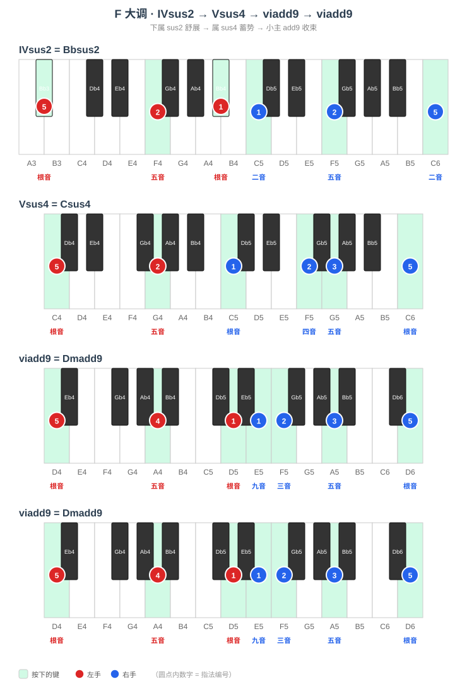

#### Cadd9

##### （1）手型平移练习

> Cadd9 的四个音是 **C - E - G - D**（根 - 三 - 五 - 九），全白键，无黑键。
> 手型一：左手 C（3 指）、右手 G-C-D-E（1-2-3-4 指）；手型二：左手 C-G-C（5-4-1）、右手 D-E-G-C（1-2-3-5，末音高八度）。
> 先柱式后琶音，重点保持手指放松、均匀触键。

##### （2）和弦进行练习

> C 大调 IV→V→vi：Fsus2 → Gsus4 → Amadd9 → Amadd9（add9 落在 vi 小主，三音为小三度）。
> 六级小主 Amadd9 的九音 B 让结尾既有收束又带亮色。

| 级数 | 和弦 | 左手 | 右手 |
|------|------|------|------|
| IV | Fsus2 | F - C - F（5-2-1） | G - C - G（1-2-5） |
| V | Gsus4 | G - D（5-2） | G - C - D - G（1-2-3-5） |
| vi | Amadd9 | A - E - A（5-4-1） | B - C - E - A（1-2-3-5） |
| vi | Amadd9 | A - E - A（5-4-1） | B - C - E - A（1-2-3-5） |

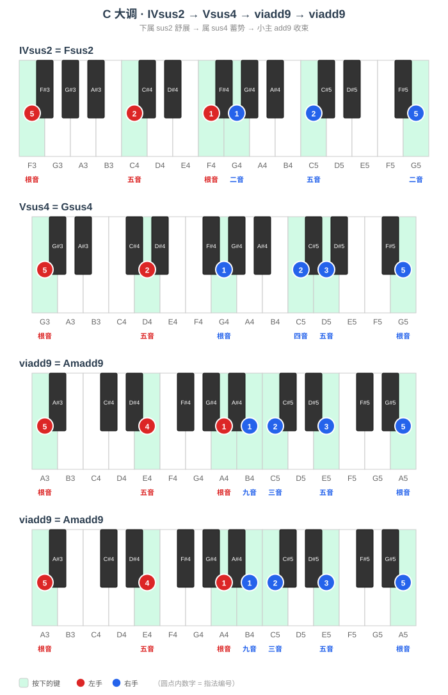

#### Gadd9

##### （1）手型平移练习

> Gadd9 的四个音是 **G - B - D - A**（根 - 三 - 五 - 九），全白键，无黑键。
> 手型一：左手 G（3 指）、右手 D-G-A-B（1-2-3-4 指）；手型二：左手 G-D-G（5-4-1）、右手 A-B-D-G（1-2-3-5，末音高八度）。
> 先柱式后琶音，重点保持手指放松、均匀触键。

##### （2）和弦进行练习

> G 大调 IV→V→vi：Csus2 → Dsus4 → Emadd9 → Emadd9（add9 落在 vi 小主，三音为小三度）。
> 六级小主 Emadd9 的九音 F♯ 让结尾既有收束又带亮色。

| 级数 | 和弦 | 左手 | 右手 |
|------|------|------|------|
| IV | Csus2 | C - G - C（5-2-1） | D - G - D（1-2-5） |
| V | Dsus4 | D - A（5-2） | D - G - A - D（1-2-3-5） |
| vi | Emadd9 | E - B - E（5-4-1） | F♯ - G - B - E（1-2-3-5） |
| vi | Emadd9 | E - B - E（5-4-1） | F♯ - G - B - E（1-2-3-5） |

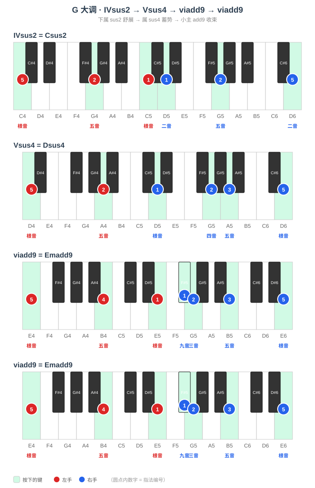

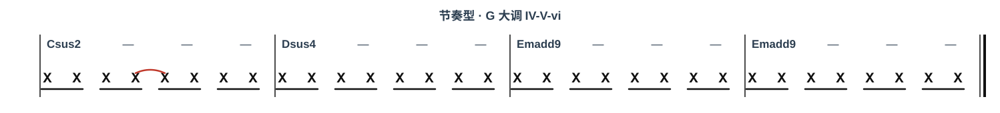

> **周一要点**：Fadd9、Cadd9、Gadd9 全白键、无黑键，手感友好。重点体会「五音-根音-九音-三音」骨架在无黑键时的手型，以及进行里六级小主 add9（Dmadd9、Amadd9、Emadd9）的三音为小三度——这是 add9 篇唯一与"大三 add9"不同的地方。

---

### 周二 · Dadd9、Aadd9、Eadd9

#### Dadd9

##### （1）手型平移练习

> Dadd9 的四个音是 **D - F♯ - A - E**（根 - 三 - 五 - 九），黑键在三音 F♯。
> 手型一：左手 D（3 指）、右手 A-D-E-F♯（1-2-3-4 指）；手型二：左手 D-A-D（5-4-1）、右手 E-F♯-A-D（1-2-3-5，末音高八度）。
> 先柱式后琶音，黑键用指腹均匀下键。

##### （2）和弦进行练习

> D 大调 IV→V→vi：Gsus2 → Asus4 → Bmadd9 → Bmadd9（add9 落在 vi 小主，三音为小三度）。
> 六级小主 Bmadd9 的九音 C♯ 让结尾既有收束又带亮色。

| 级数 | 和弦 | 左手 | 右手 |
|------|------|------|------|
| IV | Gsus2 | G - D - G（5-2-1） | A - D - A（1-2-5） |
| V | Asus4 | A - E（5-2） | A - D - E - A（1-2-3-5） |
| vi | Bmadd9 | B - F♯ - B（5-4-1） | C♯ - D - F♯ - B（1-2-3-5） |
| vi | Bmadd9 | B - F♯ - B（5-4-1） | C♯ - D - F♯ - B（1-2-3-5） |

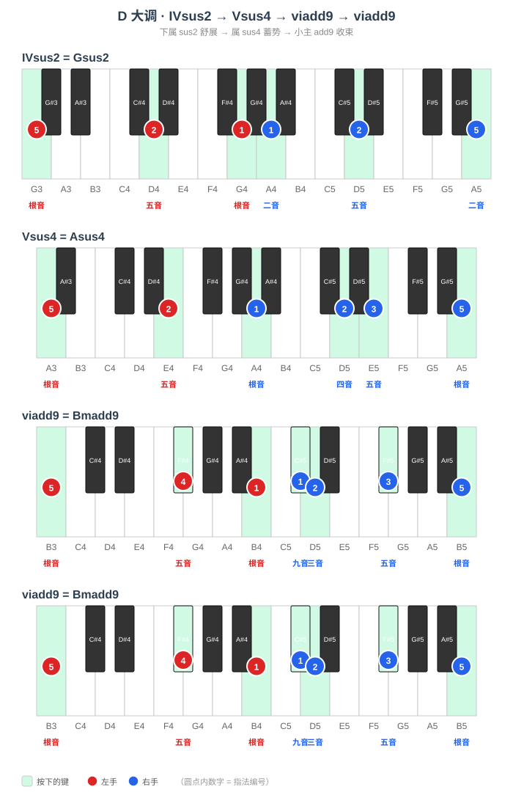

#### Aadd9

##### （1）手型平移练习

> Aadd9 的四个音是 **A - C♯ - E - B**（根 - 三 - 五 - 九），黑键在三音 C♯。
> 手型一：左手 A（3 指）、右手 E-A-B-C♯（1-2-3-4 指）；手型二：左手 A-E-A（5-4-1）、右手 B-C♯-E-A（1-2-3-5，末音高八度）。
> 先柱式后琶音，黑键用指腹均匀下键。

##### （2）和弦进行练习

> A 大调 IV→V→vi：Dsus2 → Esus4 → F♯madd9 → F♯madd9（add9 落在 vi 小主，三音为小三度）。
> 六级小主 F♯madd9 的九音 G♯ 让结尾既有收束又带亮色。

| 级数 | 和弦 | 左手 | 右手 |
|------|------|------|------|
| IV | Dsus2 | D - A - D（5-2-1） | E - A - E（1-2-5） |
| V | Esus4 | E - B（5-2） | E - A - B - E（1-2-3-5） |
| vi | F♯madd9 | F♯ - C♯ - F♯（5-4-1） | G♯ - A - C♯ - F♯（1-2-3-5） |
| vi | F♯madd9 | F♯ - C♯ - F♯（5-4-1） | G♯ - A - C♯ - F♯（1-2-3-5） |

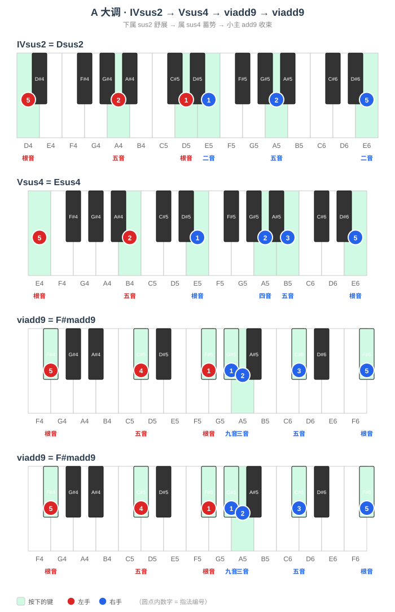

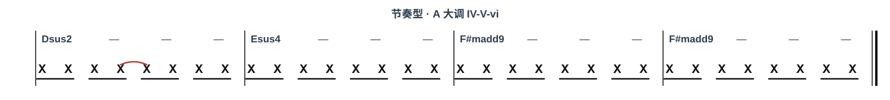

#### Eadd9

##### （1）手型平移练习

> Eadd9 的四个音是 **E - G♯ - B - F♯**（根 - 三 - 五 - 九），黑键在三音 G♯、九音 F♯。
> 手型一：左手 E（3 指）、右手 B-E-F♯-G♯（1-2-3-4 指）；手型二：左手 E-B-E（5-4-1）、右手 F♯-G♯-B-E（1-2-3-5，末音高八度）。
> 先柱式后琶音，黑键用指腹均匀下键。

##### （2）和弦进行练习

> E 大调 IV→V→vi：Asus2 → Bsus4 → C♯madd9 → C♯madd9（add9 落在 vi 小主，三音为小三度）。
> 六级小主 C♯madd9 的九音 D♯ 让结尾既有收束又带亮色。

| 级数 | 和弦 | 左手 | 右手 |
|------|------|------|------|
| IV | Asus2 | A - E - A（5-2-1） | B - E - B（1-2-5） |
| V | Bsus4 | B - F♯（5-2） | B - E - F♯ - B（1-2-3-5） |
| vi | C♯madd9 | C♯ - G♯ - C♯（5-4-1） | D♯ - E - G♯ - C♯（1-2-3-5） |
| vi | C♯madd9 | C♯ - G♯ - C♯（5-4-1） | D♯ - E - G♯ - C♯（1-2-3-5） |

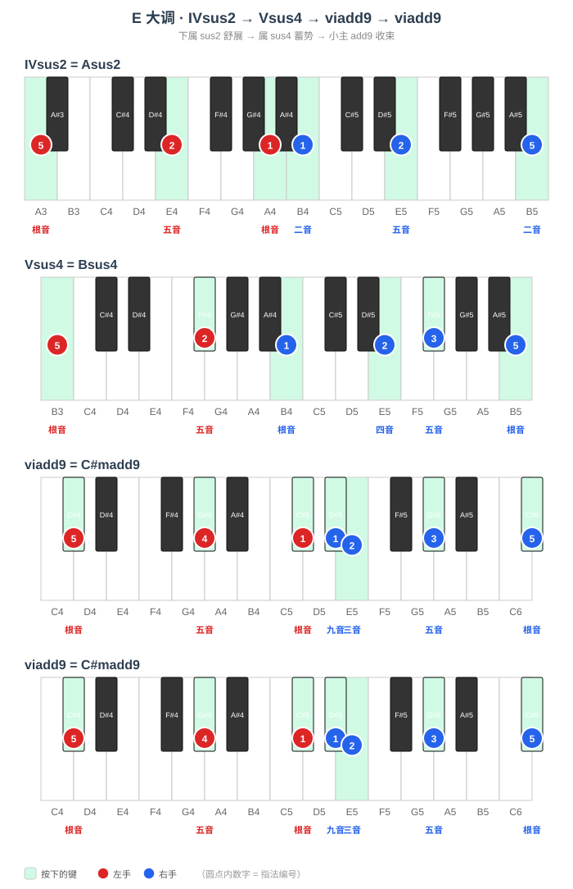

> **周二要点**：Dadd9、Aadd9、Eadd9 的三音开始落在黑键（F♯、C♯、G♯），Eadd9 的九音 F♯ 也是黑键。手型平移时重点感受三音/九音黑键的指腹下键；进行里六级小主 add9（Bmadd9、F♯madd9、C♯madd9）同样小三度。

---

### 周三~周四 · Badd9、F♯add9、D♭add9

#### Badd9

##### （1）手型平移练习

> Badd9 的四个音是 **B - D♯ - F♯ - C♯**（根 - 三 - 五 - 九），黑键在三音 D♯、五音 F♯、九音 C♯。
> 手型一：左手 B（3 指）、右手 F♯-B-C♯-D♯（1-2-3-4 指）；手型二：左手 B-F♯-B（5-4-1）、右手 C♯-D♯-F♯-B（1-2-3-5，末音高八度）。
> 先柱式后琶音，黑键用指腹均匀下键。

##### （2）和弦进行练习

> B 大调 IV→V→vi：Esus2 → F♯sus4 → G♯madd9 → G♯madd9（add9 落在 vi 小主，三音为小三度）。
> 六级小主 G♯madd9 的九音 A♯ 让结尾既有收束又带亮色。

| 级数 | 和弦 | 左手 | 右手 |
|------|------|------|------|
| IV | Esus2 | E - B - E（5-2-1） | F♯ - B - F♯（1-2-5） |
| V | F♯sus4 | F♯ - C♯（5-2） | F♯ - B - C♯ - F♯（1-2-3-5） |
| vi | G♯madd9 | G♯ - D♯ - G♯（5-4-1） | A♯ - B - D♯ - G♯（1-2-3-5） |
| vi | G♯madd9 | G♯ - D♯ - G♯（5-4-1） | A♯ - B - D♯ - G♯（1-2-3-5） |

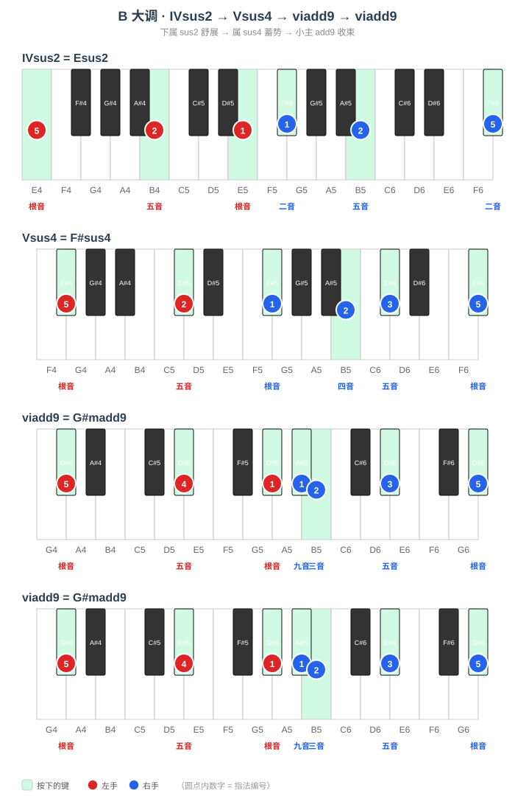

#### F♯add9

##### （1）手型平移练习

> F♯add9 的四个音是 **F♯ - A♯ - C♯ - G♯**（根 - 三 - 五 - 九），黑键在根音 F♯、三音 A♯、五音 C♯、九音 G♯。
> 手型一：左手 F♯（3 指）、右手 C♯-F♯-G♯-A♯（1-2-3-4 指）；手型二：左手 F♯-C♯-F♯（5-4-1）、右手 G♯-A♯-C♯-F♯（1-2-3-5，末音高八度）。
> 先柱式后琶音，黑键用指腹均匀下键。

##### （2）和弦进行练习

> F♯ 大调 IV→V→vi：Bsus2 → C♯sus4 → D♯madd9 → D♯madd9（add9 落在 vi 小主，三音为小三度）。
> 六级小主 D♯madd9 的九音 F（等音 E♯）让结尾既有收束又带亮色。

| 级数 | 和弦 | 左手 | 右手 |
|------|------|------|------|
| IV | Bsus2 | B - F♯ - B（5-2-1） | C♯ - F♯ - C♯（1-2-5） |
| V | C♯sus4 | C♯ - G♯（5-2） | C♯ - F♯ - G♯ - C♯（1-2-3-5） |
| vi | D♯madd9 | D♯ - A♯ - D♯（5-4-1） | F - F♯ - A♯ - D♯（1-2-3-5） |
| vi | D♯madd9 | D♯ - A♯ - D♯（5-4-1） | F - F♯ - A♯ - D♯（1-2-3-5） |

#### D♭add9

##### （1）手型平移练习

> D♭add9 的四个音是 **D♭ - F - A♭ - E♭**（根 - 三 - 五 - 九），黑键在根音 D♭、五音 A♭、九音 E♭。
> 手型一：左手 D♭（3 指）、右手 A♭-D♭-E♭-F（1-2-3-4 指）；手型二：左手 D♭-A♭-D♭（5-4-1）、右手 E♭-F-A♭-D♭（1-2-3-5，末音高八度）。
> 先柱式后琶音，黑键用指腹均匀下键。

##### （2）和弦进行练习

> D♭ 大调 IV→V→vi：G♭sus2 → A♭sus4 → B♭madd9 → B♭madd9（add9 落在 vi 小主，三音为小三度）。
> 六级小主 B♭madd9 的九音 C 让结尾既有收束又带亮色。

| 级数 | 和弦 | 左手 | 右手 |
|------|------|------|------|
| IV | G♭sus2 | G♭ - D♭ - G♭（5-2-1） | A♭ - D♭ - A♭（1-2-5） |
| V | A♭sus4 | A♭ - E♭（5-2） | A♭ - D♭ - E♭ - A♭（1-2-3-5） |
| vi | B♭madd9 | B♭ - F - B♭（5-4-1） | C - D♭ - F - B♭（1-2-3-5） |
| vi | B♭madd9 | B♭ - F - B♭（5-4-1） | C - D♭ - F - B♭（1-2-3-5） |

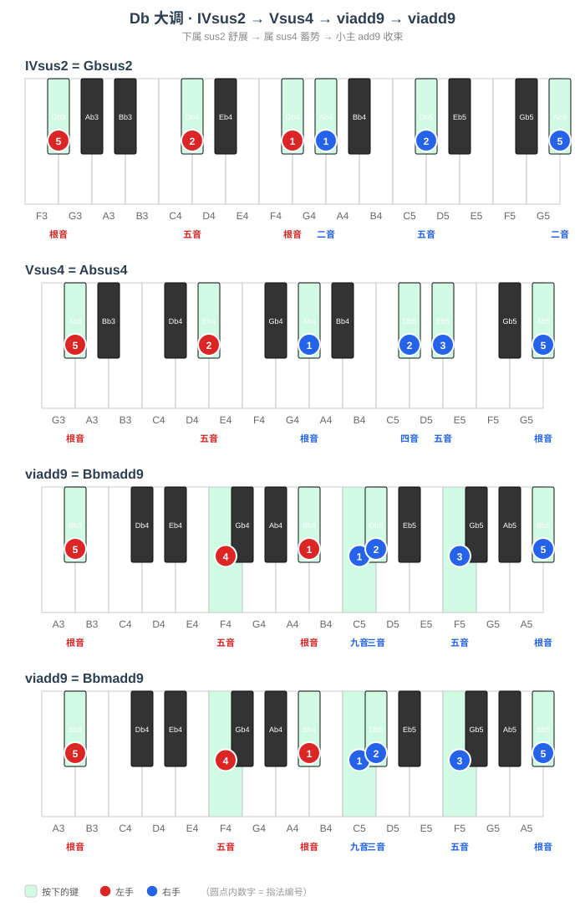

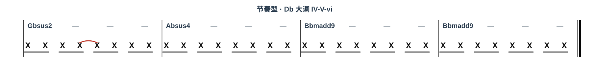

> **周三~周四要点**：升号渐多。Badd9、F♯add9 黑键密集（F♯add9 四音全黑），D♭add9 转到降号。手型平移重点感受根音/三音/五音/九音整体落在黑键时的平移；进行里六级小主 add9 的三音一律小三度。

---

### 周五~周六 · A♭add9、E♭add9、B♭add9

#### A♭add9

##### （1）手型平移练习

> A♭add9 的四个音是 **A♭ - C - E♭ - B♭**（根 - 三 - 五 - 九），黑键在根音 A♭、五音 E♭、九音 B♭。
> 手型一：左手 A♭（3 指）、右手 E♭-A♭-B♭-C（1-2-3-4 指）；手型二：左手 A♭-E♭-A♭（5-4-1）、右手 B♭-C-E♭-A♭（1-2-3-5，末音高八度）。
> 先柱式后琶音，黑键用指腹均匀下键。

##### （2）和弦进行练习

> A♭ 大调 IV→V→vi：D♭sus2 → E♭sus4 → Fmadd9 → Fmadd9（add9 落在 vi 小主，三音为小三度）。
> 六级小主 Fmadd9 的九音 G 让结尾既有收束又带亮色。

| 级数 | 和弦 | 左手 | 右手 |
|------|------|------|------|
| IV | D♭sus2 | D♭ - A♭ - D♭（5-2-1） | E♭ - A♭ - E♭（1-2-5） |
| V | E♭sus4 | E♭ - B♭（5-2） | E♭ - A♭ - B♭ - E♭（1-2-3-5） |
| vi | Fmadd9 | F - C - F（5-4-1） | G - A♭ - C - F（1-2-3-5） |
| vi | Fmadd9 | F - C - F（5-4-1） | G - A♭ - C - F（1-2-3-5） |

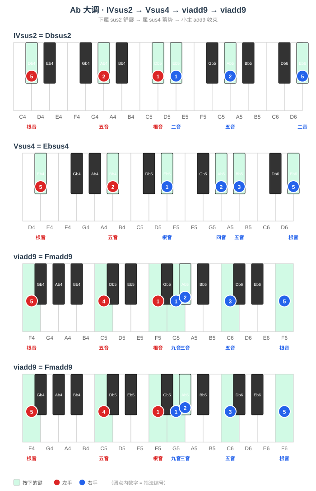

#### E♭add9

##### （1）手型平移练习

> E♭add9 的四个音是 **E♭ - G - B♭ - F**（根 - 三 - 五 - 九），黑键在根音 E♭、五音 B♭。
> 手型一：左手 E♭（3 指）、右手 B♭-E♭-F-G（1-2-3-4 指）；手型二：左手 E♭-B♭-E♭（5-4-1）、右手 F-G-B♭-E♭（1-2-3-5，末音高八度）。
> 先柱式后琶音，黑键用指腹均匀下键。

##### （2）和弦进行练习

> E♭ 大调 IV→V→vi：A♭sus2 → B♭sus4 → Cmadd9 → Cmadd9（add9 落在 vi 小主，三音为小三度）。
> 六级小主 Cmadd9 的九音 D 让结尾既有收束又带亮色。

| 级数 | 和弦 | 左手 | 右手 |
|------|------|------|------|
| IV | A♭sus2 | A♭ - E♭ - A♭（5-2-1） | B♭ - E♭ - B♭（1-2-5） |
| V | B♭sus4 | B♭ - F（5-2） | B♭ - E♭ - F - B♭（1-2-3-5） |
| vi | Cmadd9 | C - G - C（5-4-1） | D - E♭ - G - C（1-2-3-5） |
| vi | Cmadd9 | C - G - C（5-4-1） | D - E♭ - G - C（1-2-3-5） |

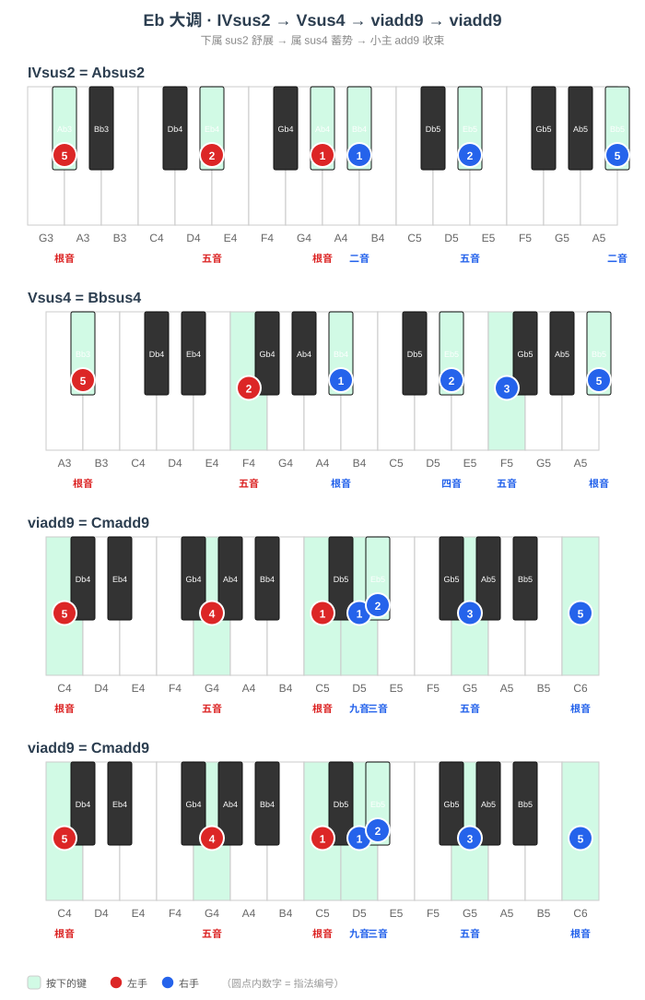

#### B♭add9

##### （1）手型平移练习

> B♭add9 的四个音是 **B♭ - D - F - C**（根 - 三 - 五 - 九），黑键在根音 B♭。
> 手型一：左手 B♭（3 指）、右手 F-B♭-C-D（1-2-3-4 指）；手型二：左手 B♭-F-B♭（5-4-1）、右手 C-D-F-B♭（1-2-3-5，末音高八度）。
> 先柱式后琶音，黑键用指腹均匀下键。

##### （2）和弦进行练习

> B♭ 大调 IV→V→vi：E♭sus2 → Fsus4 → Gmadd9 → Gmadd9（add9 落在 vi 小主，三音为小三度）。
> 六级小主 Gmadd9 的九音 A 让结尾既有收束又带亮色。

| 级数 | 和弦 | 左手 | 右手 |
|------|------|------|------|
| IV | E♭sus2 | E♭ - B♭ - E♭（5-2-1） | F - B♭ - F（1-2-5） |
| V | Fsus4 | F - C（5-2） | F - B♭ - C - F（1-2-3-5） |
| vi | Gmadd9 | G - D - G（5-4-1） | A - B♭ - D - G（1-2-3-5） |
| vi | Gmadd9 | G - D - G（5-4-1） | A - B♭ - D - G（1-2-3-5） |

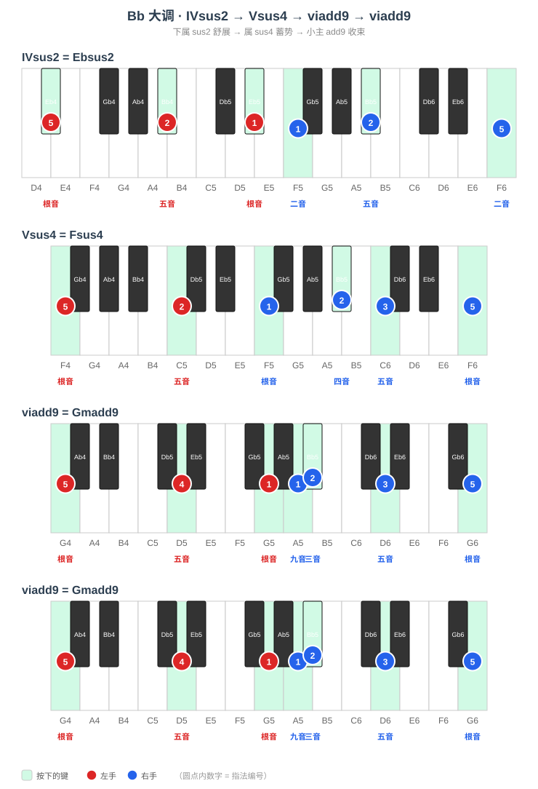

> **周五~周六要点**：降号命名。A♭add9、E♭add9、B♭add9 的根音都是黑键，五音/九音也多为黑键。手型平移重点感受降号调里「根-三-五-九」关系不变、只是记谱换名；进行里六级小主 add9（Fmadd9、Cmadd9、Gmadd9）的三音一律小三度。

---

### 周日 · 全量练习与查漏补缺

**手型平移**：按五度圈顺序 C → G → D → A → E → B → F♯ → D♭ → A♭ → E♭ → B♭ → F 完整跑一遍每个大 add9 的两种手型，标记还不熟的调。

**和弦进行练习**：把 12 个调的四级→五级→六级小主 add9 各弹一遍，重点查漏补缺。12 个调的总表如下：

| add9（六级小主） | 所属大调 | 进行（IV → V → vi → vi） |
|------|------|------|
| Dmadd9 | F | B♭sus2 → Csus4 → Dmadd9 → Dmadd9 |
| Amadd9 | C | Fsus2 → Gsus4 → Amadd9 → Amadd9 |
| Emadd9 | G | Csus2 → Dsus4 → Emadd9 → Emadd9 |
| Bmadd9 | D | Gsus2 → Asus4 → Bmadd9 → Bmadd9 |
| F♯madd9 | A | Dsus2 → Esus4 → F♯madd9 → F♯madd9 |
| C♯madd9 | E | Asus2 → Bsus4 → C♯madd9 → C♯madd9 |
| G♯madd9 | B | Esus2 → F♯sus4 → G♯madd9 → G♯madd9 |
| D♯madd9 | F♯ | Bsus2 → C♯sus4 → D♯madd9 → D♯madd9 |
| B♭madd9 | D♭ | G♭sus2 → A♭sus4 → B♭madd9 → B♭madd9 |
| Fmadd9 | A♭ | D♭sus2 → E♭sus4 → Fmadd9 → Fmadd9 |
| Cmadd9 | E♭ | A♭sus2 → B♭sus4 → Cmadd9 → Cmadd9 |
| Gmadd9 | B♭ | E♭sus2 → Fsus4 → Gmadd9 → Gmadd9 |
