# 加九音和弦

## 一、和弦结构

加九音和弦（add9）由**大三和弦 + 大九度**构成，即在根音、大三度、纯五度之外，再叠加一个**根音上方的大九度**（大二度的高八度）。

以 Cadd9 为例：**C - E - G - D**

| 构成音 | 唱名 | 与根音的音程 |
|--------|------|------------|
| C | do | 根音 |
| E | mi | 大三度 |
| G | so | 纯五度 |
| D | re | 大九度 |

---

## 二、手型与弹奏位置

右手五指编号：**1**（拇指）、**2**（食指）、**3**（中指）、**4**（无名指）、**5**（小指）。左手同理。

add9 有两种基本手型，覆盖从简约到丰满的弹奏场景：

### 手型一：左手根音 + 右手 so-do-re-mi（收缩型）

左手单指弹根音，右手 1-2-3-4 指完成 so-do-re-mi（五音-根音-九音-三音），九音（re）夹在根音（do）与三音（mi）之间，声部干净，适合伴奏起步。

| 声部 | 左手 | 右手 |
|------|------|------|
| 指法 | **3 指**（中指）弹根音 | **1-2-3-4 指** |
| 示例（Cadd9） | ③ → C（低八度） | ①-G、②-C、③-D、④-E |

> **练习要点**：左手根音力度稍重，建立低音支撑感；右手 ②-③-④ 指（C-D-E）是连续的大二度叠置，指间间距较近，注意保持手指圆拱、均匀触键。

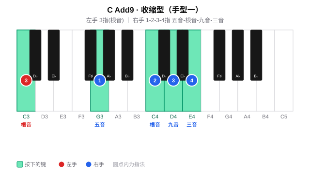

### 手型二：左手 do-so-do + 右手 re-mi-so-do（扩张型）

左手弹 do-so-do（根音-五音-高八度根音，5-4-1 指），右手弹 re-mi-so-do（九音-三音-五音-高八度根音，1-2-3-5 指），声部丰满，适合副歌、高潮段落的柱式伴奏。

| 声部 | 左手 | 右手 |
|------|------|------|
| 指法 | **5-4-1 指** | **1-2-3-5 指** |
| 示例（Cadd9） | ⑤-C、④-G、①-C（高八度） | ①-D、②-E、③-G、⑤-C（高八度） |

> **练习要点**：左手 5 指（C）到 1 指（高八度 C）跨一个八度，手腕放松不要僵硬；右手 ①-② 指（D-E）为大二度、③-⑤ 指（G-C）为纯四度，注意各音均匀触键。

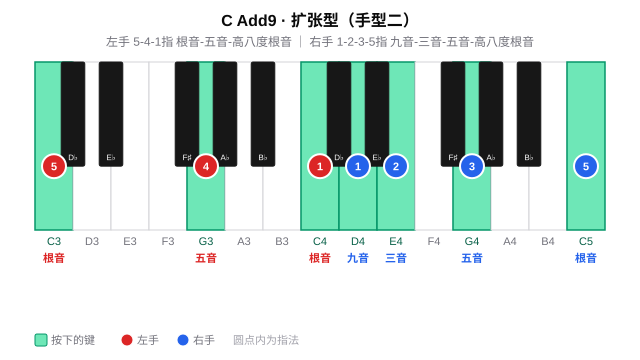

### 两种手型对比

| 维度 | 手型一（收缩型） | 手型二（扩张型） |
|------|------|------|
| 左手 | 单音（根音） | 三音（根音 + 五音 + 高八度根音） |
| 右手 | 四音（五音-根音-九音-三音） | 四音（九音-三音-五音-高八度根音） |
| 声部厚度 | 薄，适合主歌 | 厚，适合副歌/高潮 |
| 右手指法 | 1-2-3-4 | 1-2-3-5 |
| 典型场景 | 分解伴奏、轻弹唱 | 柱式强奏、段落推进 |

---

## 三、练习分组（十二调手型平移）

按五度圈把 12 个调分成五组，按照节奏练习；每组练两种手型（先收缩型、再扩张型），换调只是整体平移。

> **每组从右往左练**：下方标题按五度圈从左往右书写（如周一「F、C、G」），练习时请**从右往左**推进（周一即 G → C → F）。
>
> **底层逻辑**：每组是「下属（左）— 主（中）— 属（右）」的三角关系。从右往左即「属 → 主 → 下属」的**下行五度**进行，正贴合和声解决的自然重力——属回主是"落地"、主到下属是"舒展"。

#### 周一 ·（F、C、G）

**Fadd9**

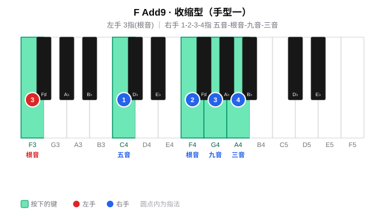

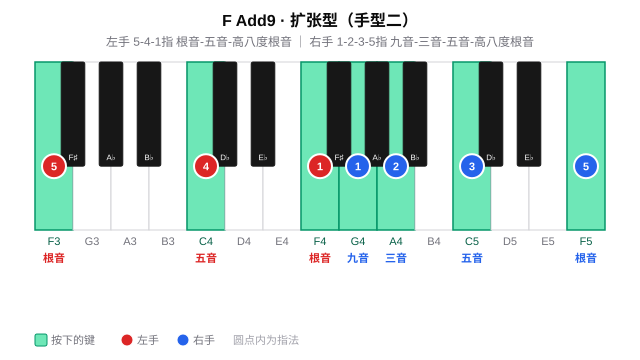

**Cadd9**

**Gadd9**

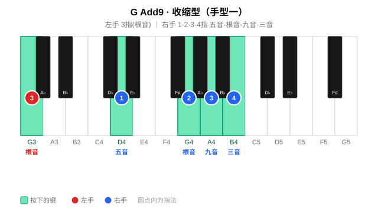

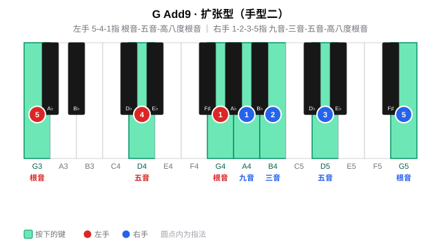

#### 周二 ·（D、A、E）

**Dadd9**

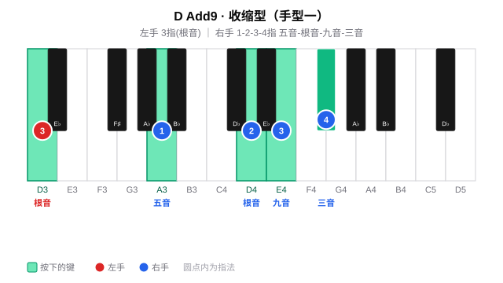

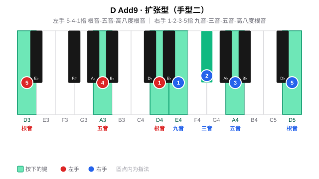

**Aadd9**

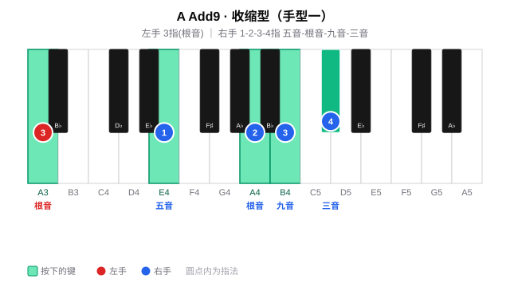

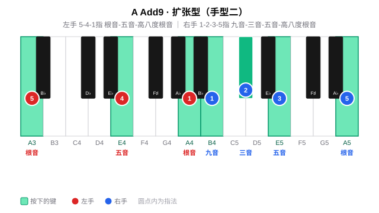

**Eadd9**

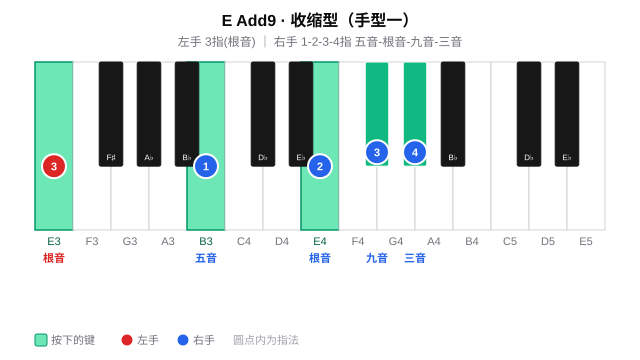

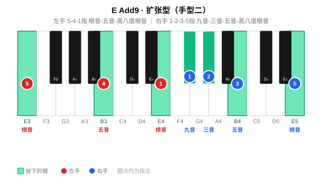

#### 周三~周四 ·（B、F#、Db）

**Badd9**

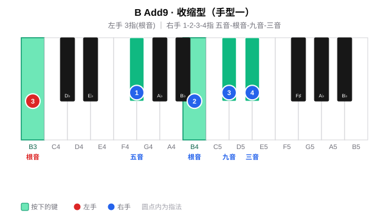

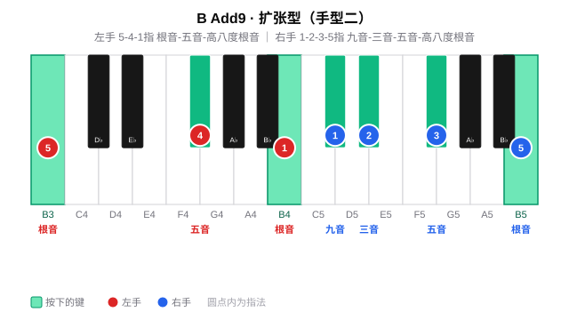

**F#add9**

**Dbadd9**

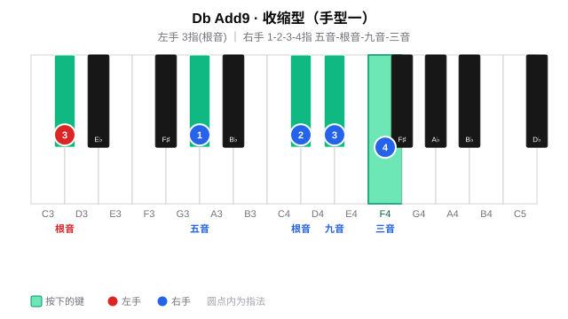

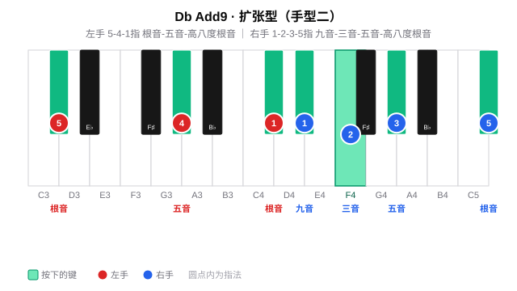

#### 周五~周六 ·（Ab、Eb、Bb）

**Abadd9**

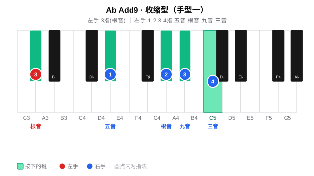

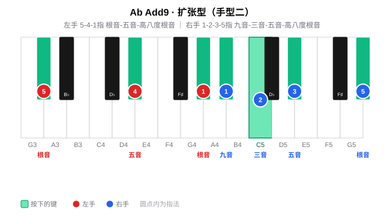

**Ebadd9**

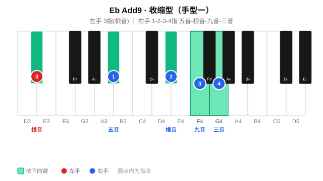

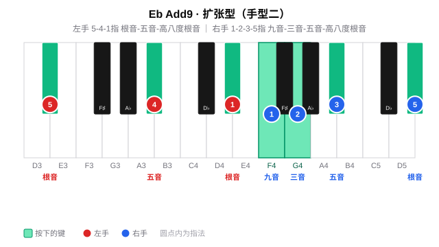

**Bbadd9**

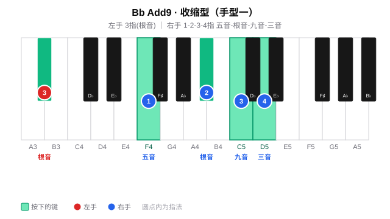

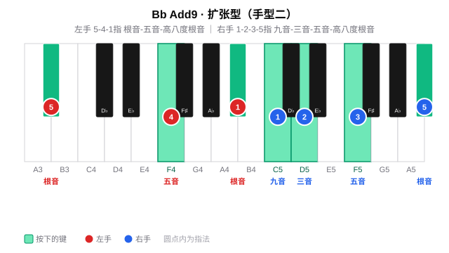

#### 周日 · 全量练习与查漏补缺

周日查漏补缺

---

## 四、练习步骤

add9 的练习沿两条线展开：先在 12 个调里把两种手型练熟（**手型平移**），再把 add9 放进实际和弦进行中体会它的色彩（**和弦进行练习**，核心）。全程同步唱级数/唱名（见 [每日练习模板](../README.md) 的「贯穿原则」）。

### （一）手型平移（每个调）

**纵向：柱式 → 琶音**

先练**柱式和弦**（双手同时按下），再练**琶音分解**（逐音弹出）；左手根音力度稍重，建立低音支撑。

| 手型 | 左手 | 右手 |
|------|------|------|
| 收缩型 | 3 指：根音 | 1-2-3-4 指：五音 - 根音 - 九音 - 三音 |
| 扩张型 | 5-4-1 指：根音 - 五音 - 高八度根音 | 1-2-3-5 指：九音 - 三音 - 五音 - 高八度根音 |

> 以 Cadd9 为例：收缩型右手 G - C - D - E（1-2-3-4）；扩张型左手 C - G - C（5-4-1）、右手 D - E - G - C（1-2-3-5）。

**横向：五度圈移调（Transposition）**

把在某个调上练熟的手型**整体平移**到五度圈的下一个调：手型关系完全不变，只有根音位置移动。按 C → G → D → A → E → B → F# → Db → Ab → Eb → Bb → F 逐个平移，每移一调重新执行纵向练习，重点感受黑键九音（如 F 的 G、Db 的 Eb）如何随平移出现。

### （二）和弦进行练习：Fsus2 → Gsus4 → Amadd9 → Amadd9（核心）

add9 最有用的场景是在**下属-属-小主**的进行里收束情绪：下属用 sus2 舒展、属用 sus4 蓄势、最后落到小主 add9 的九音上并重复一次，让九音色彩得以延续、沉淀。

以 C 大调的进行 **Fsus2 → Gsus4 → Amadd9 → Amadd9**（IV → V → vi → vi）为例：

| 级数 | 和弦 | 手型 | 左手（低→高） | 右手（低→高） |
|------|------|------|--------------|--------------|
| IV | Fsus2 | 扩张型 | F - C - F（5-2-1） | G - C - G（1-2-5） |
| V | Gsus4 | 扩张型 | G - D（5-2） | G - C - D - G（1-2-3-5） |
| vi | Amadd9 | 扩张型 | A - E - A（5-4-1） | B - C - E - A（1-2-3-5） |
| vi | Amadd9 | 扩张型 | A - E - A（5-4-1） | B - C - E - A（1-2-3-5） |

> **共同音衔接**：Fsus2 的二音 G 恰是下一个和弦 G 的根音；Gsus4 的四音 C 恰是 Am 的三音。挂留音并非凭空消失，而是作为**共同音平滑过渡**到下一个和弦；最后的 Amadd9 重复一次，让九音 B 的色彩停留、沉淀下来。

**练习要点**：

1. 先逐个和弦单独练熟（Fsus2 的左手跨八度、Gsus4 的四音 C、Amadd9 的九音 B）；
2. 再按 Fsus2 → Gsus4 → Amadd9 → Amadd9 顺序连贯弹奏，体会挂留音作为共同音的平滑过渡——Fsus2 的二音 G 留到 Gsus4（V 的根音）、Gsus4 的四音 C 留到 Am（vi 的三音）；
3. 最后放慢速度，专注听最后一个 Amadd9 的九音 B，让它在右手中声部持续回荡，感受 add9 与普通小三和弦的色彩差异。
