# 六和弦与六九和弦

## 一、和弦结构

**大六和弦（maj6）** 由**大三和弦 + 大六度**构成，即在根音、大三度、纯五度之外，再叠加一个**根音上方的大六度**。

以 C6 为例：**C - E - G - A**

| 构成音 | 唱名 | 与根音的音程 |
|--------|------|------------|
| C | do | 根音 |
| E | mi | 大三度 |
| G | so | 纯五度 |
| A | la | 大六度 |

**大六九和弦（maj6/9）** 由**大六和弦 + 大九度**构成，即在根音、大三度、纯五度、大六度之外，再叠加一个**根音上方的大九度**。

以 C6/9 为例：**C - E - G - A - D**

| 构成音 | 唱名 | 与根音的音程 |
|--------|------|------------|
| C | do | 根音 |
| E | mi | 大三度 |
| G | so | 纯五度 |
| A | la | 大六度 |
| D | re | 大九度 |

> **拆解理解：在大三和弦上"加料"**。maj6 只是大三和弦再叠一个六音（la），maj6/9 又再多叠一个九音（re）。两者都保留完整的大三和弦（有明亮的三音），六音给和弦加一层"慵懒、爵士"的松弛感，九音再加一层柔光。
>
> **与 add9 的关系**：add9 = 大三和弦 + 九音（缺六音）；maj6 = 大三和弦 + 六音（缺九音）；maj6/9 = 大三和弦 + 六音 + 九音（最丰满）。色彩浓度依次递增，六音是区分"普通加九"与"爵士感六九"的关键。
>
> **六音的弹法提示**：六音（la）与五音（so）只隔一个大二度，右手弹奏时这两音紧挨着，注意手指不要互相挤压，保持圆拱、均匀触键。

---

## 二、手型与弹奏位置

右手五指编号：**1**（拇指）、**2**（食指）、**3**（中指）、**4**（无名指）、**5**（小指）。左手同理。

### 大六和弦（maj6）的手型

maj6 有两种基本手型：

#### 手型一：左手 do-so + 右手 la-do-mi（收缩型）

左手 3-1 指弹根音-五音（do-so），右手 1-2-4 指弹六音-根音-三音（la-do-mi）；右手这三个音正是大三和弦的**第一转位**（六音在低音）。声部干净，适合伴奏起步。

| 声部 | 左手 | 右手 |
|------|------|------|
| 指法 | **3-1 指** 弹根音-五音 | **1-2-4 指** 弹六音-根音-三音 |
| 示例（C6） | ③-C、①-G | ①-A、②-C、④-E |

> **练习要点**：左手根音-五音纯五度（C→G）力度稍重；右手 ①-② 指（A→C）为大二度、②-④ 指（C→E）为大三度，注意六音与根音之间的大二度间距。

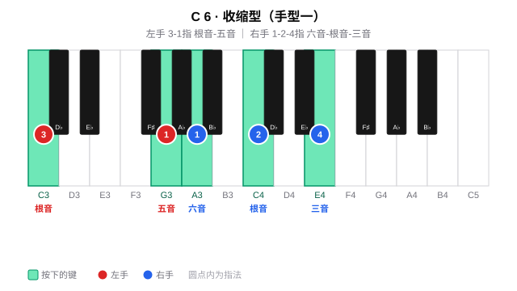

#### 手型二：左手 do-so + 右手 do-mi-so-la（扩张型）

左手 5-2 指弹根音-五音（do-so），右手 1-2-3-4 指弹根音-三音-五音-六音（do-mi-so-la）；右手这四个音正是大三和弦原位加六音。声部丰满，适合柱式伴奏。

| 声部 | 左手 | 右手 |
|------|------|------|
| 指法 | **5-2 指** 弹根音-五音 | **1-2-3-4 指** 弹根音-三音-五音-六音 |
| 示例（C6） | ⑤-C、②-G | ①-C、②-E、③-G、④-A |

> **练习要点**：右手 ③-④ 指（G→A）为大二度，注意这两指不要互相挤压；整体保持圆拱、均匀触键。

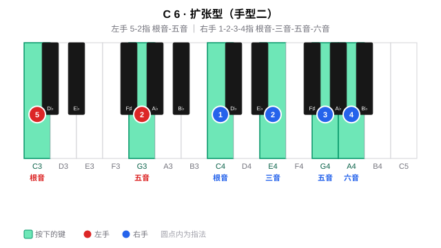

### 大六九和弦（maj6/9）的手型

maj6/9 也有两种基本手型，比 maj6 多一个九音：

#### 手型一：左手 do-so + 右手 la-do-re-mi（收缩型）

左手 3-1 指弹根音-五音（do-so），右手 1-2-3-4 指弹六音-根音-九音-三音（la-do-re-mi），九音（re）夹在根音（do）与三音（mi）之间。声部干净，适合伴奏起步。

| 声部 | 左手 | 右手 |
|------|------|------|
| 指法 | **3-1 指** 弹根音-五音 | **1-2-3-4 指** 弹六音-根音-九音-三音 |
| 示例（C6/9） | ③-C、①-G | ①-A、②-C、③-D、④-E |

> **练习要点**：右手 ②-③-④ 指（C-D-E）是连续的大二度叠置，指间间距较近，注意保持圆拱、均匀触键。

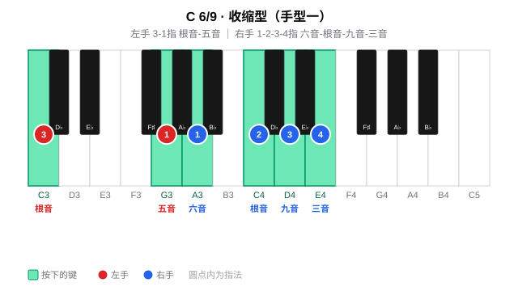

#### 手型二：左手 do-so-do + 右手 re-mi-so-la（扩张型）

左手 5-2-1 指弹根音-五音-高八度根音（do-so-do），右手 1-2-3-4 指弹九音-三音-五音-六音（re-mi-so-la）。声部丰满，适合柱式伴奏。

| 声部 | 左手 | 右手 |
|------|------|------|
| 指法 | **5-2-1 指** 弹根音-五音-高八度根音 | **1-2-3-4 指** 弹九音-三音-五音-六音 |
| 示例（C6/9） | ⑤-C、②-G、①-C（高八度） | ①-D、②-E、③-G、④-A |

> **练习要点**：左手 5→1 跨一个八度（C→C），手腕放松不要僵硬；右手 ③-④ 指（G→A）为大二度，注意两指不挤压。

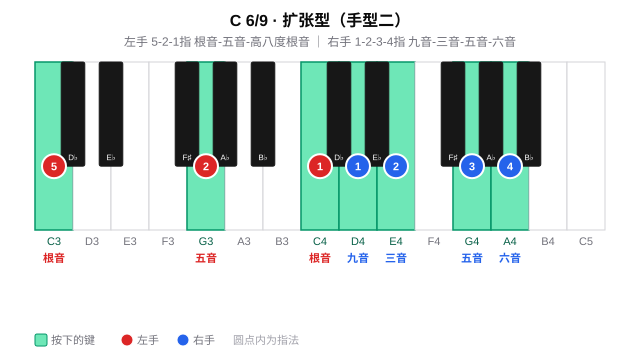

### 手型对比

| 维度 | maj6 手型一（收缩型） | maj6 手型二（扩张型） | maj6/9 手型一（收缩型） | maj6/9 手型二（扩张型） |
|------|----------------------|----------------------|------------------------|------------------------|
| 左手 | 根音 + 五音（3-1） | 根音 + 五音（5-2） | 根音 + 五音（3-1） | 根音 + 五音 + 高八度根音（5-2-1） |
| 右手 | 六音-根音-三音（1-2-4） | 根音-三音-五音-六音（1-2-3-4） | 六音-根音-九音-三音（1-2-3-4） | 九音-三音-五音-六音（1-2-3-4） |
| 声部厚度 | 薄 | 厚 | 薄 | 厚 |
| 典型场景 | 分解伴奏、轻弹唱 | 柱式强奏、段落推进 | 分解伴奏、轻弹唱 | 柱式强奏、段落推进 |

---

## 三、练习方法

maj6 与 maj6/9 的练习只有一条主线：**手型平移**（把每种和弦的两种手型练熟）。两者都保留完整的大三和弦、没有悬置的待解决音，实战里主要作为"色彩加厚"的和弦出现，因此本篇不安排和弦进行练习，专注把手型在 12 个调里平移到位。先掌握下面的手型平移法，再到第四章按天练习。

### 手型平移法

**纵向：柱式 → 琶音**

先练**柱式和弦**（双手同时按下），再练**琶音分解**（逐音弹出）；左手根音力度稍重，建立低音支撑。

| 和弦 | 手型 | 左手 | 右手 |
|------|------|------|------|
| maj6 | 手型一（收缩型） | 3-1 指：根音 - 五音 | 1-2-4 指：六音 - 根音 - 三音 |
| maj6 | 手型二（扩张型） | 5-2 指：根音 - 五音 | 1-2-3-4 指：根音 - 三音 - 五音 - 六音 |
| maj6/9 | 手型一（收缩型） | 3-1 指：根音 - 五音 | 1-2-3-4 指：六音 - 根音 - 九音 - 三音 |
| maj6/9 | 手型二（扩张型） | 5-2-1 指：根音 - 五音 - 高八度根音 | 1-2-3-4 指：九音 - 三音 - 五音 - 六音 |

> 以 C 为例：C6 手型一左手 C-G（3-1）、右手 A-C-E（1-2-4），手型二左手 C-G（5-2）、右手 C-E-G-A（1-2-3-4）；C6/9 手型一左手 C-G（3-1）、右手 A-C-D-E（1-2-3-4），手型二左手 C-G-C（5-2-1）、右手 D-E-G-A（1-2-3-4）。

**横向：五度圈移调（Transposition）**

把在某个调上练熟的手型**整体平移**到五度圈的下一个调：手型关系完全不变，只有根音位置移动。按 C → G → D → A → E → B → F♯ → D♭ → A♭ → E♭ → B♭ → F 逐个平移，每移一个重新执行纵向练习，重点感受黑键六音/九音（如 A6 的 C♯、F♯，E6/9 的 F♯）如何随平移出现。

---

## 四、每日练习

以下按周一到周日，maj6 与 maj6/9 各 12 个逐个练。每个和弦独立成单元，含**（1）手型平移练习**（两种手型）。方法见第三章，此处是每日清单。

### 周一 · F、C、G（六和弦 + 六九和弦）

#### F6

##### （1）手型平移练习

> F6 的四个音是 **F - A - C - D**（根 - 三 - 五 - 六），全白键，无黑键。
> 手型一：左手 F-C（3-1 指）、右手 D-F-A（1-2-4 指）；手型二：左手 F-C（5-2 指）、右手 F-A-C-D（1-2-3-4 指）。
> 先柱式后琶音，重点保持手指放松、均匀触键。

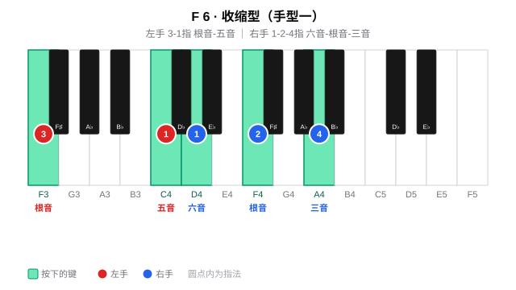

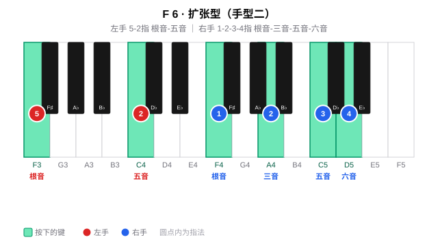

#### F6/9

##### （1）手型平移练习

> F6/9 的五个音是 **F - A - C - D - G**（根 - 三 - 五 - 六 - 九），全白键，无黑键。
> 手型一：左手 F-C（3-1 指）、右手 D-F-G-A（1-2-3-4 指）；手型二：左手 F-C-F（5-2-1 指）、右手 G-A-C-D（1-2-3-4 指）。
> 先柱式后琶音，重点保持手指放松、均匀触键。

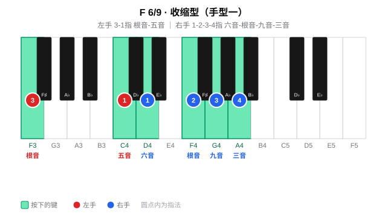

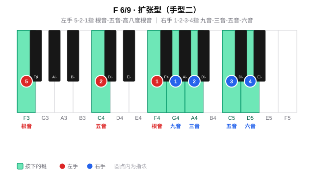

#### C6

##### （1）手型平移练习

> C6 的四个音是 **C - E - G - A**（根 - 三 - 五 - 六），全白键，无黑键。
> 手型一：左手 C-G（3-1 指）、右手 A-C-E（1-2-4 指）；手型二：左手 C-G（5-2 指）、右手 C-E-G-A（1-2-3-4 指）。
> 先柱式后琶音，重点保持手指放松、均匀触键。

#### C6/9

##### （1）手型平移练习

> C6/9 的五个音是 **C - E - G - A - D**（根 - 三 - 五 - 六 - 九），全白键，无黑键。
> 手型一：左手 C-G（3-1 指）、右手 A-C-D-E（1-2-3-4 指）；手型二：左手 C-G-C（5-2-1 指）、右手 D-E-G-A（1-2-3-4 指）。
> 先柱式后琶音，重点保持手指放松、均匀触键。

#### G6

##### （1）手型平移练习

> G6 的四个音是 **G - B - D - E**（根 - 三 - 五 - 六），全白键，无黑键。
> 手型一：左手 G-D（3-1 指）、右手 E-G-B（1-2-4 指）；手型二：左手 G-D（5-2 指）、右手 G-B-D-E（1-2-3-4 指）。
> 先柱式后琶音，重点保持手指放松、均匀触键。

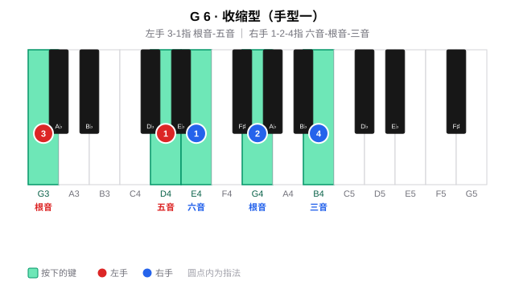

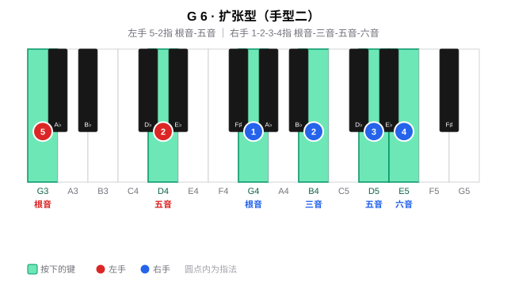

#### G6/9

##### （1）手型平移练习

> G6/9 的五个音是 **G - B - D - E - A**（根 - 三 - 五 - 六 - 九），全白键，无黑键。
> 手型一：左手 G-D（3-1 指）、右手 E-G-A-B（1-2-3-4 指）；手型二：左手 G-D-G（5-2-1 指）、右手 A-B-D-E（1-2-3-4 指）。
> 先柱式后琶音，重点保持手指放松、均匀触键。

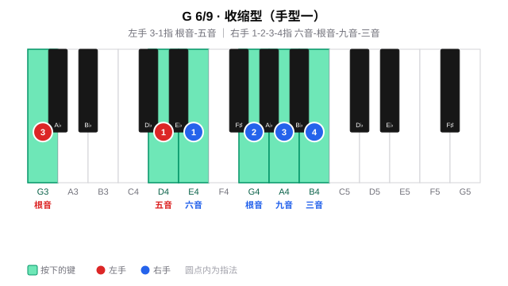

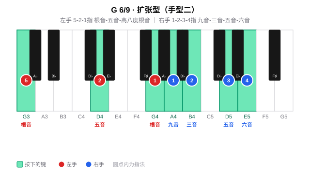

> **周一要点**：F、C、G 三调全白键、无黑键，是手感最友好的一组。重点体会 maj6「六音-根音-三音」与 maj6/9「六音-根音-九音-三音」在无黑键时的手型，再把这份手感带到黑键调。

---

### 周二 · D、A、E（六和弦 + 六九和弦）

#### D6

##### （1）手型平移练习

> D6 的四个音是 **D - F♯ - A - B**（根 - 三 - 五 - 六），黑键在三音 F♯。
> 手型一：左手 D-A（3-1 指）、右手 B-D-F♯（1-2-4 指）；手型二：左手 D-A（5-2 指）、右手 D-F♯-A-B（1-2-3-4 指）。
> 先柱式后琶音，黑键用指腹均匀下键。

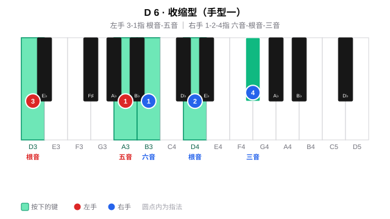

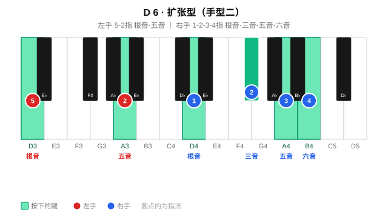

#### D6/9

##### （1）手型平移练习

> D6/9 的五个音是 **D - F♯ - A - B - E**（根 - 三 - 五 - 六 - 九），黑键在三音 F♯。
> 手型一：左手 D-A（3-1 指）、右手 B-D-E-F♯（1-2-3-4 指）；手型二：左手 D-A-D（5-2-1 指）、右手 E-F♯-A-B（1-2-3-4 指）。
> 先柱式后琶音，黑键用指腹均匀下键。

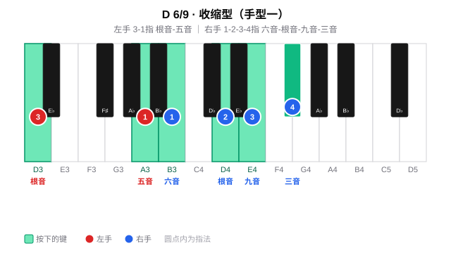

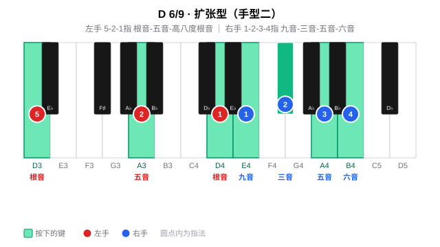

#### A6

##### （1）手型平移练习

> A6 的四个音是 **A - C♯ - E - F♯**（根 - 三 - 五 - 六），黑键在三音 C♯、六音 F♯。
> 手型一：左手 A-E（3-1 指）、右手 F♯-A-C♯（1-2-4 指）；手型二：左手 A-E（5-2 指）、右手 A-C♯-E-F♯（1-2-3-4 指）。
> 先柱式后琶音，黑键用指腹均匀下键。

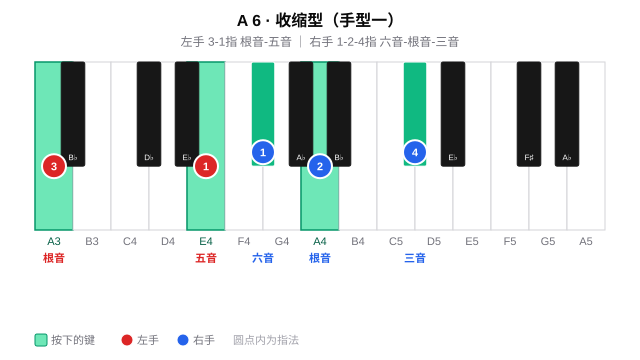

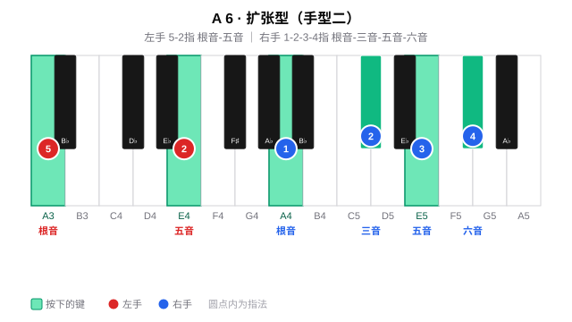

#### A6/9

##### （1）手型平移练习

> A6/9 的五个音是 **A - C♯ - E - F♯ - B**（根 - 三 - 五 - 六 - 九），黑键在三音 C♯、六音 F♯。
> 手型一：左手 A-E（3-1 指）、右手 F♯-A-B-C♯（1-2-3-4 指）；手型二：左手 A-E-A（5-2-1 指）、右手 B-C♯-E-F♯（1-2-3-4 指）。
> 先柱式后琶音，黑键用指腹均匀下键。

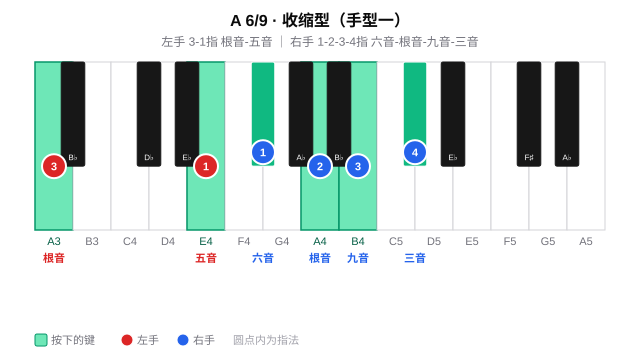

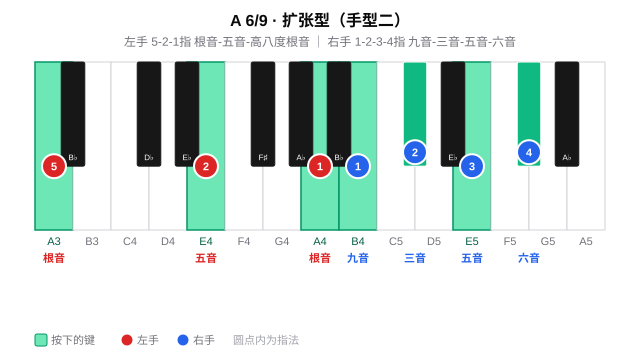

#### E6

##### （1）手型平移练习

> E6 的四个音是 **E - G♯ - B - C♯**（根 - 三 - 五 - 六），黑键在三音 G♯、六音 C♯。
> 手型一：左手 E-B（3-1 指）、右手 C♯-E-G♯（1-2-4 指）；手型二：左手 E-B（5-2 指）、右手 E-G♯-B-C♯（1-2-3-4 指）。
> 先柱式后琶音，黑键用指腹均匀下键。

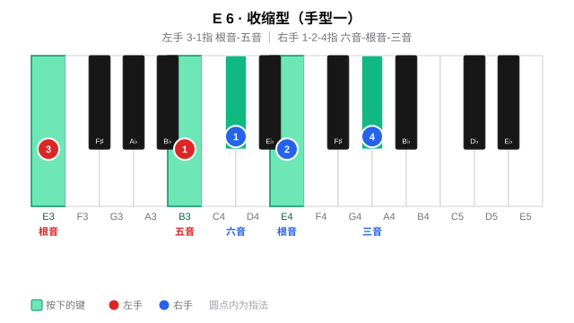

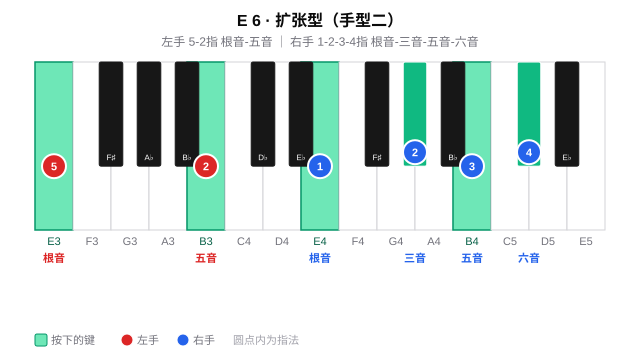

#### E6/9

##### （1）手型平移练习

> E6/9 的五个音是 **E - G♯ - B - C♯ - F♯**（根 - 三 - 五 - 六 - 九），黑键在三音 G♯、六音 C♯、九音 F♯。
> 手型一：左手 E-B（3-1 指）、右手 C♯-E-F♯-G♯（1-2-3-4 指）；手型二：左手 E-B-E（5-2-1 指）、右手 F♯-G♯-B-C♯（1-2-3-4 指）。
> 先柱式后琶音，黑键用指腹均匀下键。

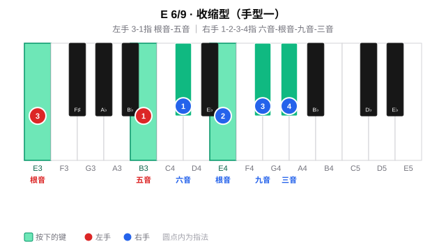

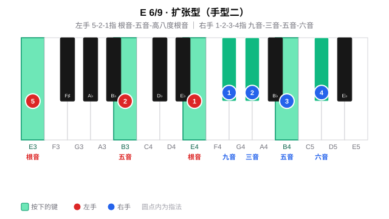

> **周二要点**：D、A、E 的三音开始落在黑键（F♯、C♯、G♯），A6/9 与 E6/9 的六音、九音也多为黑键。手型平移时重点感受三音/六音/九音黑键的指腹下键，手型骨架不变。

---

### 周三~周四 · B、F♯、D♭（六和弦 + 六九和弦）

#### B6

##### （1）手型平移练习

> B6 的四个音是 **B - D♯ - F♯ - G♯**（根 - 三 - 五 - 六），黑键在三音 D♯、五音 F♯、六音 G♯。
> 手型一：左手 B-F♯（3-1 指）、右手 G♯-B-D♯（1-2-4 指）；手型二：左手 B-F♯（5-2 指）、右手 B-D♯-F♯-G♯（1-2-3-4 指）。
> 先柱式后琶音，黑键用指腹均匀下键。

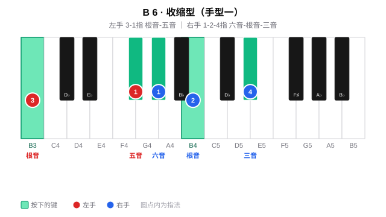

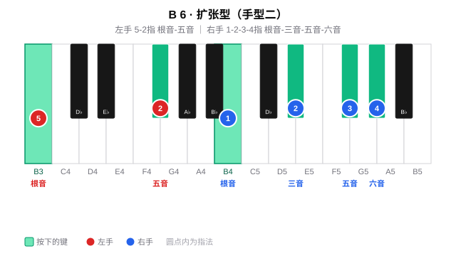

#### B6/9

##### （1）手型平移练习

> B6/9 的五个音是 **B - D♯ - F♯ - G♯ - C♯**（根 - 三 - 五 - 六 - 九），黑键在三音 D♯、五音 F♯、六音 G♯、九音 C♯。
> 手型一：左手 B-F♯（3-1 指）、右手 G♯-B-C♯-D♯（1-2-3-4 指）；手型二：左手 B-F♯-B（5-2-1 指）、右手 C♯-D♯-F♯-G♯（1-2-3-4 指）。
> 先柱式后琶音，黑键用指腹均匀下键。

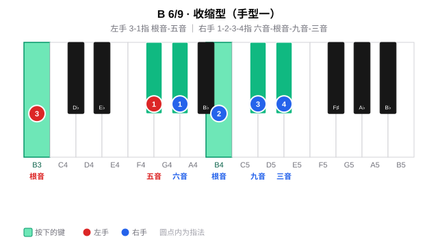

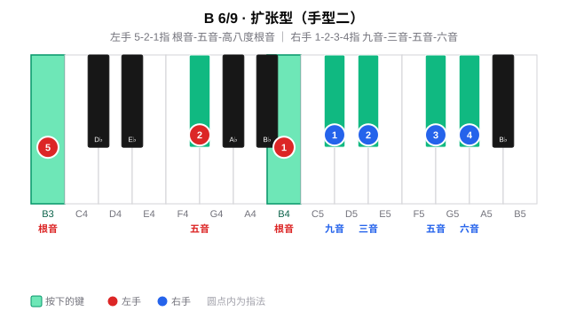

#### F♯6

##### （1）手型平移练习

> F♯6 的四个音是 **F♯ - A♯ - C♯ - D♯**（根 - 三 - 五 - 六），黑键在根音 F♯、三音 A♯、五音 C♯、六音 D♯。
> 手型一：左手 F♯-C♯（3-1 指）、右手 D♯-F♯-A♯（1-2-4 指）；手型二：左手 F♯-C♯（5-2 指）、右手 F♯-A♯-C♯-D♯（1-2-3-4 指）。
> 先柱式后琶音，黑键用指腹均匀下键。

#### F♯6/9

##### （1）手型平移练习

> F♯6/9 的五个音是 **F♯ - A♯ - C♯ - D♯ - G♯**（根 - 三 - 五 - 六 - 九），黑键在根音 F♯、三音 A♯、五音 C♯、六音 D♯、九音 G♯。
> 手型一：左手 F♯-C♯（3-1 指）、右手 D♯-F♯-G♯-A♯（1-2-3-4 指）；手型二：左手 F♯-C♯-F♯（5-2-1 指）、右手 G♯-A♯-C♯-D♯（1-2-3-4 指）。
> 先柱式后琶音，黑键用指腹均匀下键。

#### D♭6

##### （1）手型平移练习

> D♭6 的四个音是 **D♭ - F - A♭ - B♭**（根 - 三 - 五 - 六），黑键在根音 D♭、五音 A♭、六音 B♭。
> 手型一：左手 D♭-A♭（3-1 指）、右手 B♭-D♭-F（1-2-4 指）；手型二：左手 D♭-A♭（5-2 指）、右手 D♭-F-A♭-B♭（1-2-3-4 指）。
> 先柱式后琶音，黑键用指腹均匀下键。

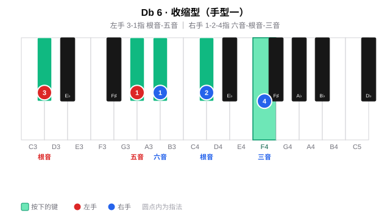

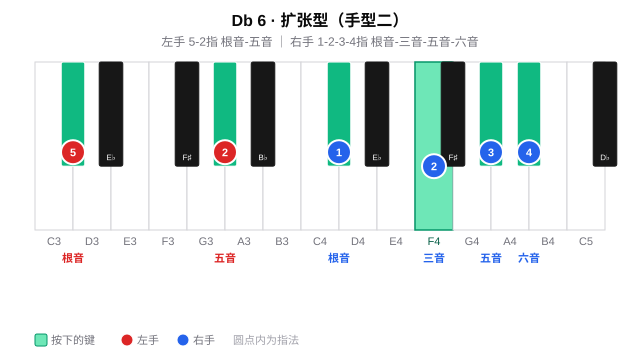

#### D♭6/9

##### （1）手型平移练习

> D♭6/9 的五个音是 **D♭ - F - A♭ - B♭ - E♭**（根 - 三 - 五 - 六 - 九），黑键在根音 D♭、五音 A♭、六音 B♭、九音 E♭。
> 手型一：左手 D♭-A♭（3-1 指）、右手 B♭-D♭-E♭-F（1-2-3-4 指）；手型二：左手 D♭-A♭-D♭（5-2-1 指）、右手 E♭-F-A♭-B♭（1-2-3-4 指）。
> 先柱式后琶音，黑键用指腹均匀下键。

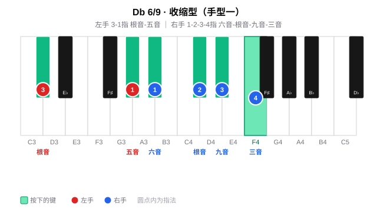

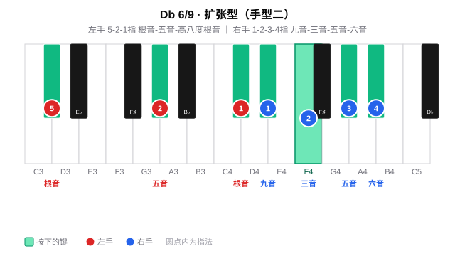

> **周三~周四要点**：升号渐多。B6、F♯6 黑键密集（F♯6 四音全黑），D♭6 转到降号。手型关系与其他调完全一致，重点感受根音/三音/五音/六音/九音整体落在黑键时的平移，尤其六音与五音之间的大二度不要挤压。

---

### 周五~周六 · A♭、E♭、B♭（六和弦 + 六九和弦）

#### A♭6

##### （1）手型平移练习

> A♭6 的四个音是 **A♭ - C - E♭ - F**（根 - 三 - 五 - 六），黑键在根音 A♭、五音 E♭。
> 手型一：左手 A♭-E♭（3-1 指）、右手 F-A♭-C（1-2-4 指）；手型二：左手 A♭-E♭（5-2 指）、右手 A♭-C-E♭-F（1-2-3-4 指）。
> 先柱式后琶音，黑键用指腹均匀下键。

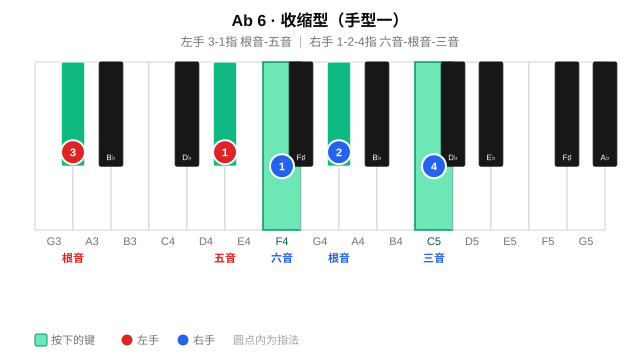

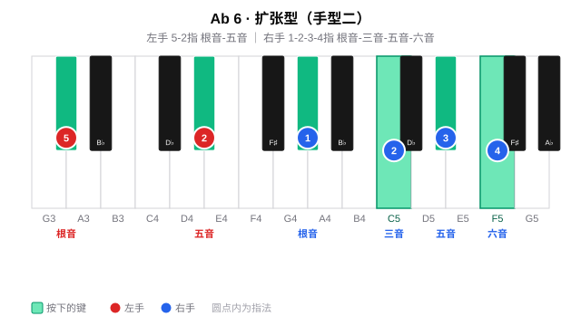

#### A♭6/9

##### （1）手型平移练习

> A♭6/9 的五个音是 **A♭ - C - E♭ - F - B♭**（根 - 三 - 五 - 六 - 九），黑键在根音 A♭、五音 E♭、九音 B♭。
> 手型一：左手 A♭-E♭（3-1 指）、右手 F-A♭-B♭-C（1-2-3-4 指）；手型二：左手 A♭-E♭-A♭（5-2-1 指）、右手 B♭-C-E♭-F（1-2-3-4 指）。
> 先柱式后琶音，黑键用指腹均匀下键。

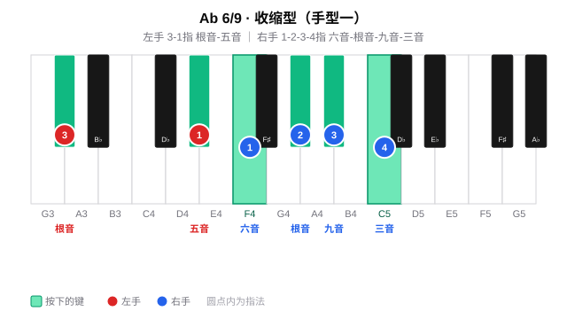

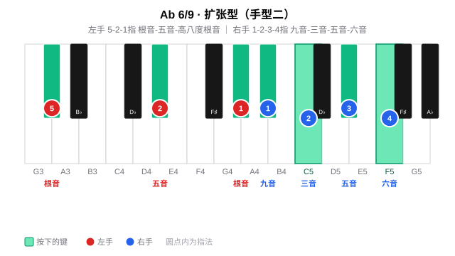

#### E♭6

##### （1）手型平移练习

> E♭6 的四个音是 **E♭ - G - B♭ - C**（根 - 三 - 五 - 六），黑键在根音 E♭、五音 B♭。
> 手型一：左手 E♭-B♭（3-1 指）、右手 C-E♭-G（1-2-4 指）；手型二：左手 E♭-B♭（5-2 指）、右手 E♭-G-B♭-C（1-2-3-4 指）。
> 先柱式后琶音，黑键用指腹均匀下键。

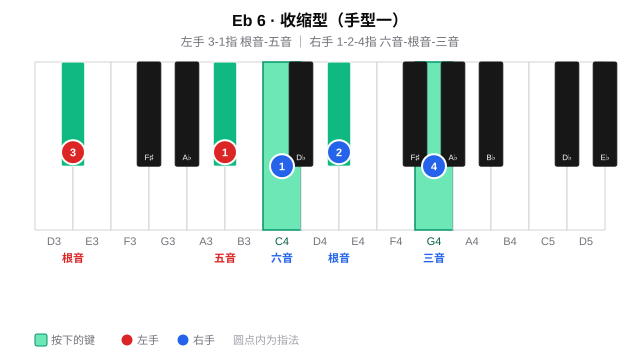

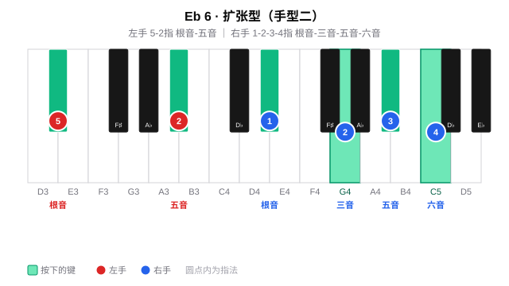

#### E♭6/9

##### （1）手型平移练习

> E♭6/9 的五个音是 **E♭ - G - B♭ - C - F**（根 - 三 - 五 - 六 - 九），黑键在根音 E♭、五音 B♭。
> 手型一：左手 E♭-B♭（3-1 指）、右手 C-E♭-F-G（1-2-3-4 指）；手型二：左手 E♭-B♭-E♭（5-2-1 指）、右手 F-G-B♭-C（1-2-3-4 指）。
> 先柱式后琶音，黑键用指腹均匀下键。

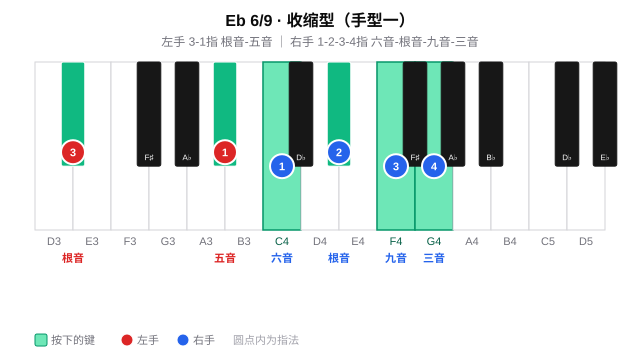

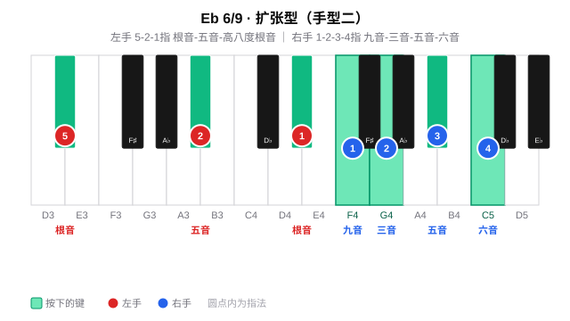

#### B♭6

##### （1）手型平移练习

> B♭6 的四个音是 **B♭ - D - F - G**（根 - 三 - 五 - 六），黑键在根音 B♭。
> 手型一：左手 B♭-F（3-1 指）、右手 G-B♭-D（1-2-4 指）；手型二：左手 B♭-F（5-2 指）、右手 B♭-D-F-G（1-2-3-4 指）。
> 先柱式后琶音，黑键用指腹均匀下键。

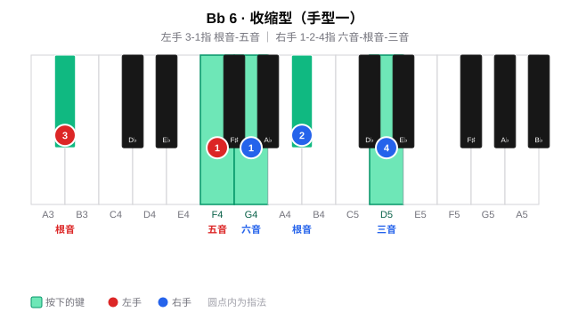

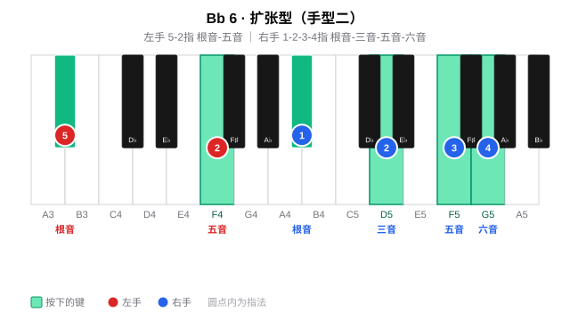

#### B♭6/9

##### （1）手型平移练习

> B♭6/9 的五个音是 **B♭ - D - F - G - C**（根 - 三 - 五 - 六 - 九），黑键在根音 B♭。
> 手型一：左手 B♭-F（3-1 指）、右手 G-B♭-C-D（1-2-3-4 指）；手型二：左手 B♭-F-B♭（5-2-1 指）、右手 C-D-F-G（1-2-3-4 指）。
> 先柱式后琶音，黑键用指腹均匀下键。

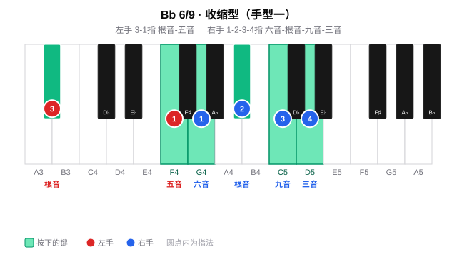

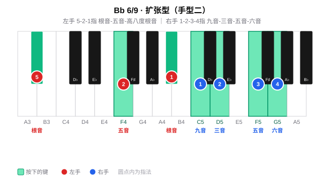

> **周五~周六要点**：降号命名。A♭、E♭、B♭ 的根音都是黑键，五音/六音/九音也多为黑键。手型平移重点感受降号调里「根-三-五-六(-九)」关系不变、只是记谱换名；六音与五音之间的大二度保持不挤压。

---

### 周日 · 全量练习与查漏补缺

**手型平移**：按五度圈顺序 C → G → D → A → E → B → F♯ → D♭ → A♭ → E♭ → B♭ → F 完整跑一遍 maj6 与 maj6/9 的两种手型，标记还不熟的调。

**查漏补缺**：重点回炉黑键较多的调（F♯、D♭、A♭），确认六音/九音落在黑键时手型不塌。12 调的构成音总表如下：

| 调 | maj6（根-三-五-六） | maj6/9（根-三-五-六-九） |
|------|---------------------|--------------------------|
| F | F - A - C - D | F - A - C - D - G |
| C | C - E - G - A | C - E - G - A - D |
| G | G - B - D - E | G - B - D - E - A |
| D | D - F♯ - A - B | D - F♯ - A - B - E |
| A | A - C♯ - E - F♯ | A - C♯ - E - F♯ - B |
| E | E - G♯ - B - C♯ | E - G♯ - B - C♯ - F♯ |
| B | B - D♯ - F♯ - G♯ | B - D♯ - F♯ - G♯ - C♯ |
| F♯ | F♯ - A♯ - C♯ - D♯ | F♯ - A♯ - C♯ - D♯ - G♯ |
| D♭ | D♭ - F - A♭ - B♭ | D♭ - F - A♭ - B♭ - E♭ |
| A♭ | A♭ - C - E♭ - F | A♭ - C - E♭ - F - B♭ |
| E♭ | E♭ - G - B♭ - C | E♭ - G - B♭ - C - F |
| B♭ | B♭ - D - F - G | B♭ - D - F - G - C |
