# 挂留二和弦（sus2）

## 一、和弦结构

挂留二和弦（sus2）由**根音 + 大二度 + 纯五度**构成。

以 Csus2 为例：**C - D - G**

> sus2 用**二音**替代三音：和弦里没有三音，因此不分大三/小三。音色比大小三和弦更"悬空、开放"，常用来制造未解决感。

---

## 二、手型与弹奏位置

右手五指编号：**1**（拇指）、**2**（食指）、**3**（中指）、**4**（无名指）、**5**（小指）。左手同理。

sus2 有两种基本手型，覆盖从简约到丰满的弹奏场景：

### 手型一：左手根音 + 右手 so-do-re

左手单指弹根音，右手 1-2-3 指完成 so-do-re（五音-根音-二音），声部干净，适合伴奏起步。

| 声部 | 左手 | 右手 |
|------|------|------|
| 指法 | **3 指**（中指）弹根音 | **1-2-3 指** 弹五音-根音-二音 |
| 示例（Csus2） | ③ → C（低八度） | ①-G、②-C、③-D |

> **练习要点**：左手根音力度稍重，建立低音支撑感；右手 1-2-3 三音间距较近（纯四度 + 大二度），手指保持放松。

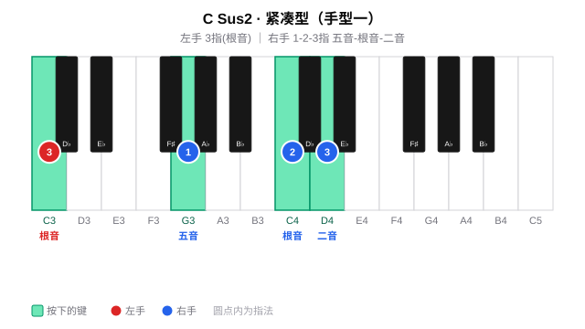

### 手型二：左手 do-so-do + 右手 re-so-re

左手弹 do-so-do（根音-五音-高八度根音，5-2-1 指），右手弹 re-so-re（二音-五音-高八度二音，1-2-5 指），声部丰满，适合副歌、高潮段落的柱式伴奏。

| 声部 | 左手 | 右手 |
|------|------|------|
| 指法 | **5-2-1 指** | **1-2-5 指** |
| 示例（Csus2） | ⑤-C、②-G、①-C（高八度） | ①-D、②-G、⑤-D（高八度） |

> **练习要点**：左手 5→1 跨一个八度、右手 1→5 也跨八度，手腕放松不要僵硬；确保每个音均匀触键。

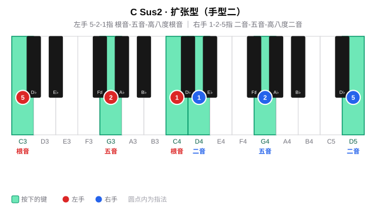

### 两种手型对比

| 维度 | 手型一 | 手型二 |
|------|--------|--------|
| 左手 | 单音（根音） | 三音（根音 + 五音 + 高八度根音） |
| 右手 | 三音和弦（so-do-re） | 三音（二音 + 五音 + 高八度二音） |
| 声部厚度 | 薄，适合主歌 | 厚，适合副歌/高潮 |
| 右手指法 | 1-2-3 | 1-2-5 |
| 典型场景 | 分解伴奏、轻弹唱 | 柱式强奏、段落推进 |

---

## 三、练习分组

按五度圈把 12 个调分成五组，按照节奏练习。

> **每组从右往左练**：下方标题按五度圈从左往右书写（如周一「F、C、G」），练习时请**从右往左**推进（周一即 G → C → F）；每个调内先练手型一（紧凑型）、再切手型二（扩张型）。
>
> **底层逻辑**：每组是「下属（左）— 主（中）— 属（右）」的三角关系。从右往左即「属 → 主 → 下属」的**下行五度**进行，正贴合和声解决的自然重力——属回主是"落地"、主到下属是"舒展"；反向（左→右）是上行五度，终点停在属上"悬而未决"，练起来不顺。

#### 周一 ·（F、C、G）

**F sus2**

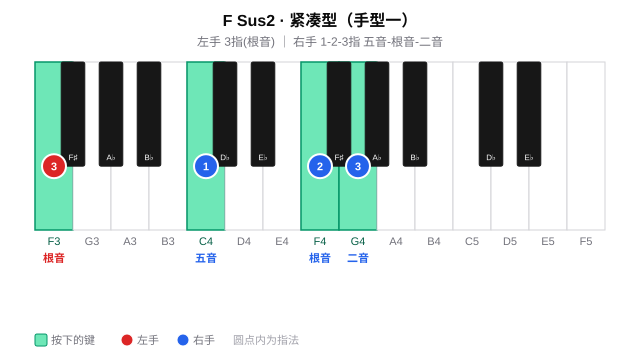

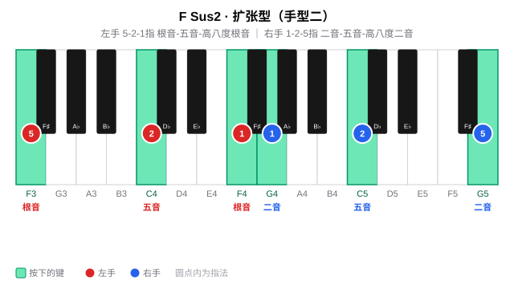

**C sus2**

**G sus2**

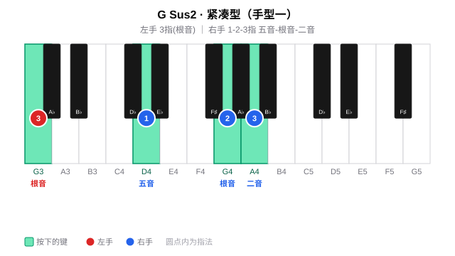

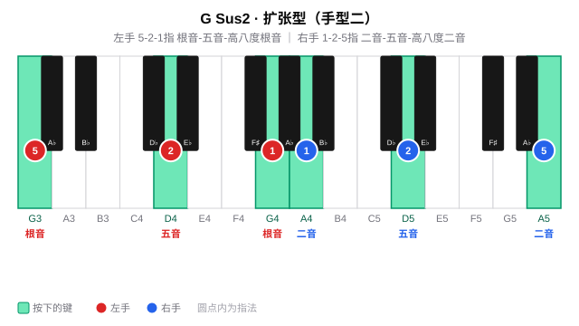

#### 周二 ·（D、A、E）

**D sus2**

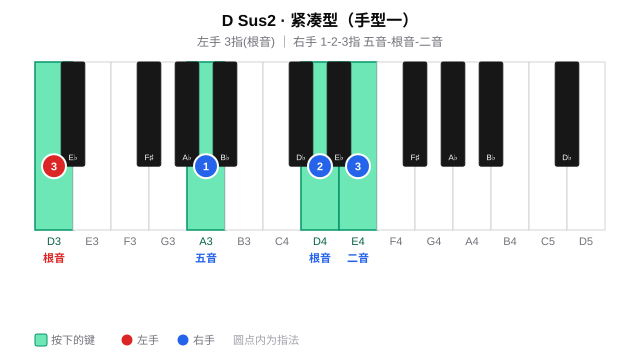

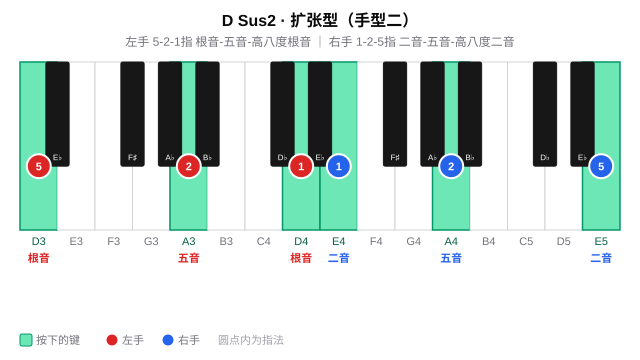

**A sus2**

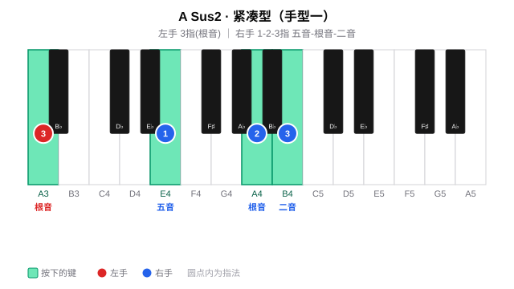

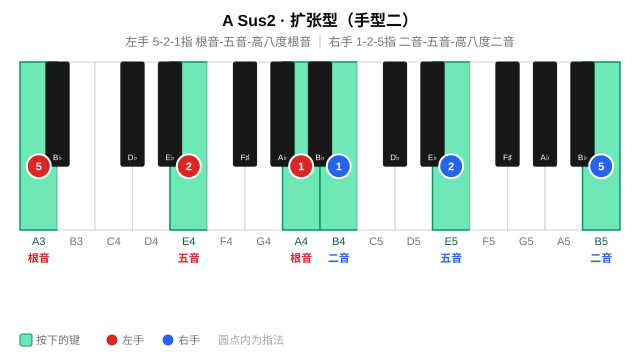

**E sus2**

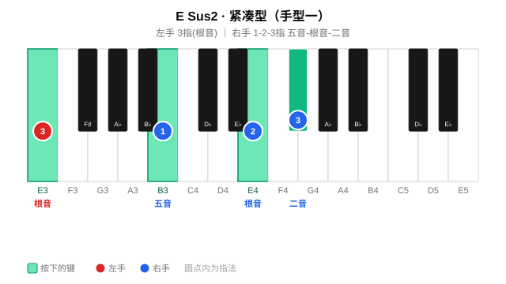

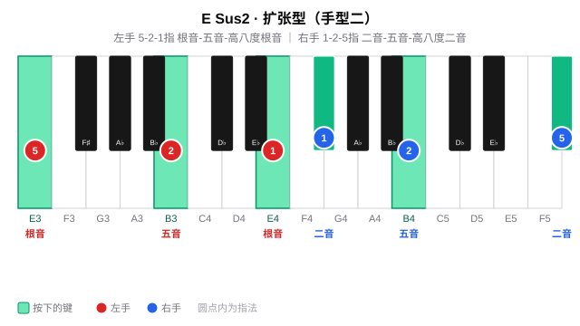

#### 周三~周四 ·（B、F#、Db）

**B sus2**

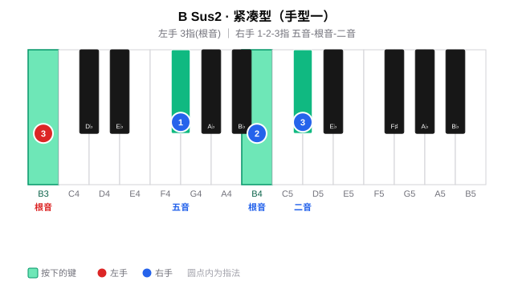

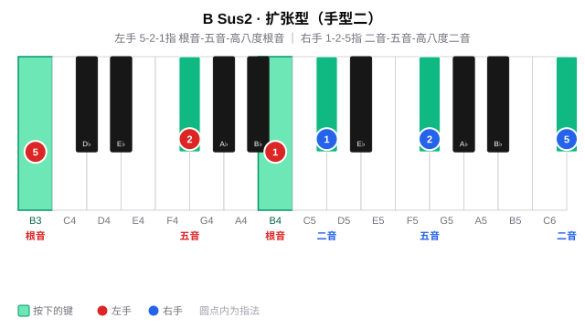

**F# sus2**

**Db sus2**

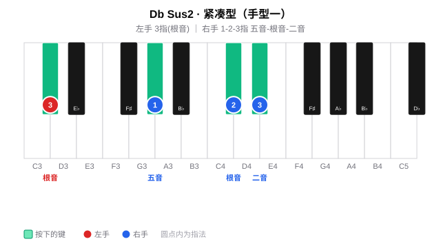

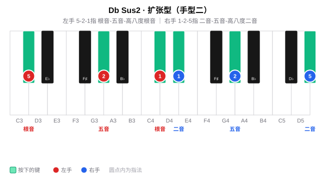

#### 周五~周六 ·（Ab、Eb、Bb）

**Ab sus2**

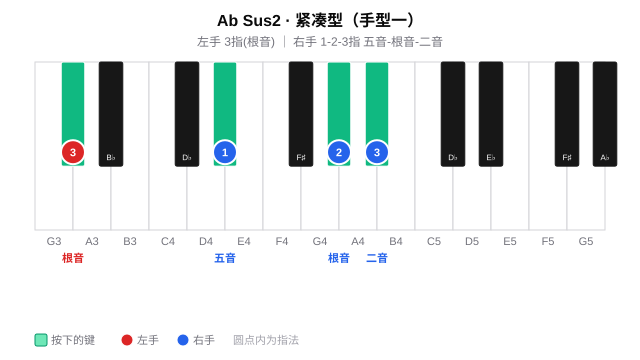

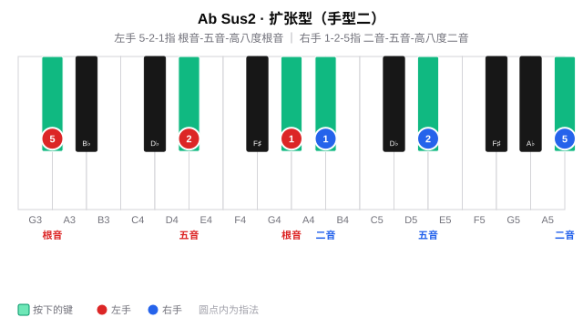

**Eb sus2**

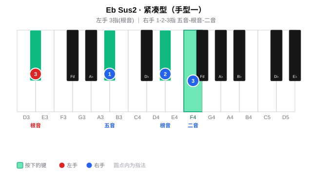

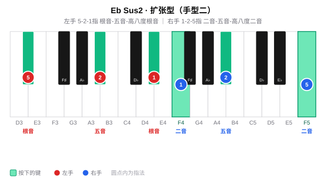

**Bb sus2**

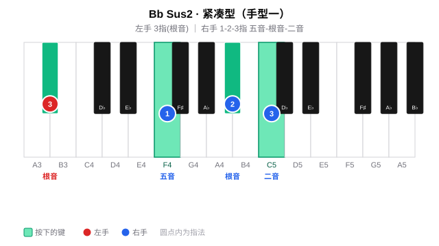

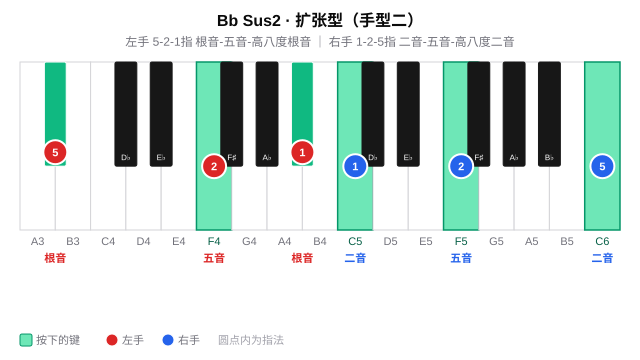

#### 周日 · 全量练习与查漏补缺

周日查漏补缺

## 四、练习步骤（每个调）

每个调的练习沿**纵向 → 横向 → 视唱**三条线展开：先在调内把手型练熟（纵向），再按五度圈做移调横向迁移（横向），全程唱出级数/唱名强化听感（视唱练耳，见 [每日练习模板](1-每日练习模板.md) 的「贯穿原则」）。

### 纵向：调内声部（Voicing）

**第一步 · 手型一（紧凑型）**

左手根音托底不变，右手按 so-do-re（五音-根音-二音，1-2-3 指）练习：

| 声部 | 内容 |
|------|------|
| 左手 | 3 指（根音） |
| 右手 | 1-2-3 指：五音 - 根音 - 二音 |

> 以 Csus2 为例：G - C - D，右手指法 1-2-3。

先练**柱式和弦**（同时按下），再练**琶音分解**（逐音弹出）；左手根音力度稍重，建立低音支撑。

**第二步 · 手型二（扩张型）**

手型二在根音与五音基础上加厚——左手 do-so-do，右手 re-so-re：

| 声部 | 内容 |
|------|------|
| 左手 | 5-2-1 指：根音 - 五音 - 高八度根音 |
| 右手 | 1-2-5 指：二音 - 五音 - 高八度二音 |

同样先柱式后琶音，感受"薄 → 厚"的声部加厚过程。

### 横向：五度圈移调（Transposition）

把在某个调上练熟的手型**整体平移**到五度圈的下一个调：手型关系完全不变，只有根音位置移动。这是键盘上的**移调（Transposition）**，区别于改变调中心的**转调（Modulation）**。

- 按五度圈顺序逐个平移：C → G → D → A → E → B → F# → Db → Ab → Eb → Bb → F；
- 每移一调，重新执行一遍纵向练习（手型一 → 手型二）；
- 重点感受黑键增多时手型如何在键盘上"平移"而非"变形"。
