# 挂留四和弦（sus4）

## 一、和弦结构

挂留四和弦（sus4）由**根音 + 纯四度 + 纯五度**构成。

以 Csus4 为例：**C - F - G**

> sus4 用**四音**替代三音：和弦里没有三音，因此不分大三/小三。四音比三音高半音，与根音形成纯四度，音色比大小三和弦更"紧张、待解决"，四音强烈倾向**下行半音解决到三音**（F → E），常用来制造悬挂、蓄势的张力。

---

## 二、手型与弹奏位置（扩张型）

右手五指编号：**1**（拇指）、**2**（食指）、**3**（中指）、**4**（无名指）、**5**（小指）。左手同理。

sus4 **只需掌握一种手型——扩张型**，直接参考 C 大三和弦的扩张位置：左手不变，右手只把大三扩张型的**三音（mi）换成四音（fa）**。

### 扩张型：左手 do-so + 右手 do-fa-so-do

左手弹 do-so（根音-五音，5-2 指，与大三扩张型完全一致），右手 1-2-3-5 指完成 do-fa-so-do（根音-四音-五音-高八度根音），声部丰满，适合柱式伴奏。

| 声部 | 左手 | 右手 |
|------|------|------|
| 指法 | **5 指**弹根音 + **2 指**弹五音 | **1-2-3-5 指** |
| 示例（Csus4） | ⑤-C（低）、②-G | ①-C、②-F、③-G、⑤-C（高八度） |

> **练习要点**：左手纯五度跨度（C→G）与大三扩张型一致，手腕放松不要僵硬；右手 1-2-3-5 跨度也为纯八度（C→C），唯一变化是 ② 指从大三的 E 移到 F，注意 ② 指（fa）与 ③ 指（so）之间的大二度间距。

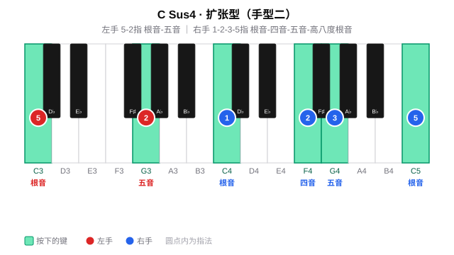

---

## 三、练习分组（十二调手型平移）

按五度圈把 12 个调分成四组，按照节奏练习；每组练一个固定手型（扩张型），换调只是整体平移。

> **每组从右往左练**：下方标题按五度圈从左往右书写（如周一「F、C、G」），练习时请**从右往左**推进（周一即 G → C → F）。
>
> **底层逻辑**：每组是「下属（左）— 主（中）— 属（右）」的三角关系。从右往左即「属 → 主 → 下属」的**下行五度**进行，正贴合和声解决的自然重力——属回主是"落地"、主到下属是"舒展"；反向（左→右）是上行五度，终点停在属上"悬而未决"，练起来不顺。

#### 周一 ·（F、C、G）

**F sus4**

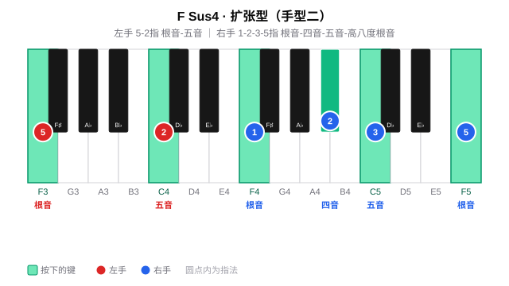

**C sus4**

**G sus4**

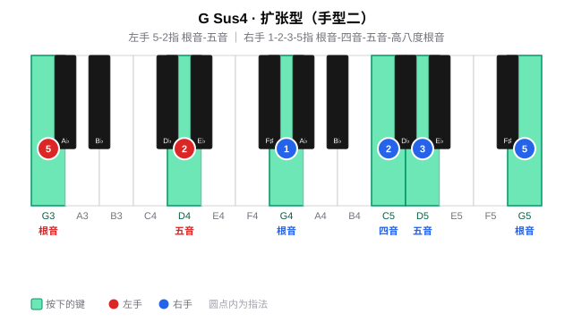

#### 周二 ·（D、A、E）

**D sus4**

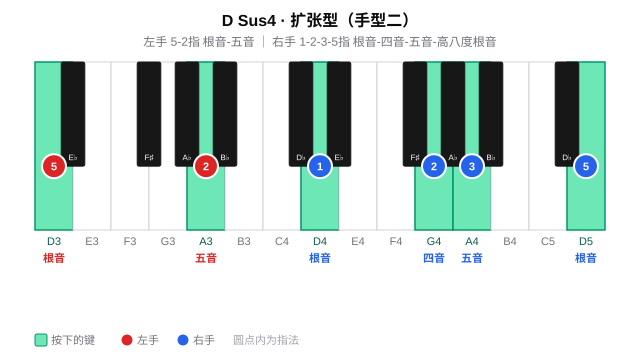

**A sus4**

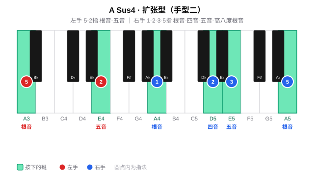

**E sus4**

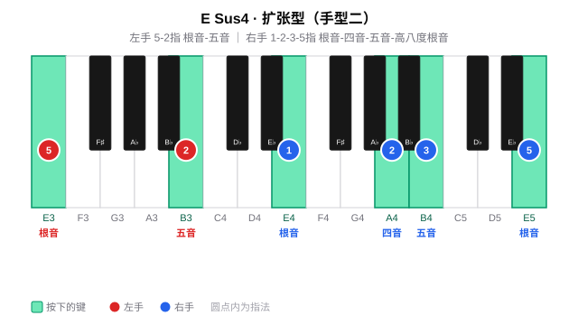

#### 周三~周四 ·（B、F#、Db）

**B sus4**

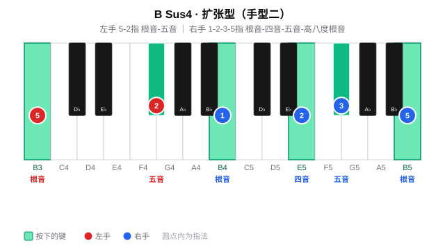

**F# sus4**

**Db sus4**

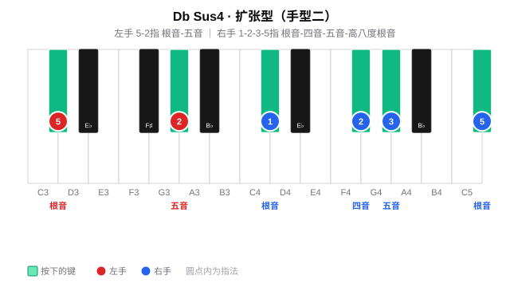

#### 周五~周六 ·（Ab、Eb、Bb）

**Ab sus4**

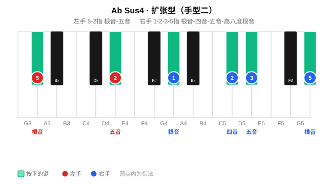

**Eb sus4**

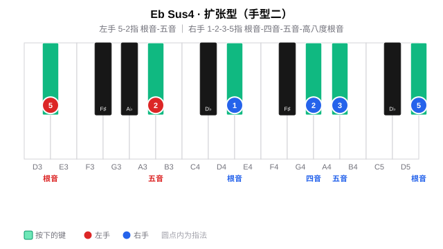

**Bb sus4**

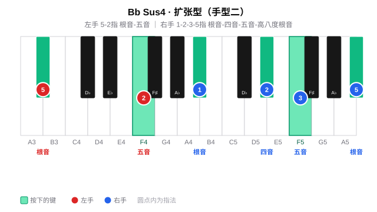

#### 周日 · 全量练习与查漏补缺

周日查漏补缺
---

## 四、练习步骤

sus4 的练习沿两条线展开：先在 12 个调里把手型练熟（**手型平移**），再把 sus4 放进实际和弦进行中体会它的功能（**和弦进行练习**，核心）。全程同步唱级数/唱名（见 [每日练习模板](1-每日练习模板.md) 的「贯穿原则」）。

### （一）手型平移（每个调）

**纵向：柱式 → 琶音**

先练**柱式和弦**（双手同时按下），再练**琶音分解**（逐音弹出）；左手根音力度稍重，建立低音支撑。

| 声部 | 内容 |
|------|------|
| 左手 | 5-2 指：根音 - 五音 |
| 右手 | 1-2-3-5 指：根音 - 四音 - 五音 - 高八度根音 |

**横向：五度圈移调（Transposition）**

把在某个调上练熟的手型**整体平移**到五度圈的下一个调：手型关系完全不变，只有根音位置移动。按 C → G → D → A → E → B → F# → Db → Ab → Eb → Bb → F 逐个平移，每移一调重新执行纵向练习，重点感受黑键四音（如 F 的 Bb、Db 的 Gb）如何随平移出现。

### （二）和弦进行练习：IVsus2 → Vsus4 → I（核心）

sus4 最有用的场景是在**终止式**里制造张力与解决。以 C 大调的经典进行 **F - G - C**（IV → V → I）为例：下属用 sus2、属用 sus4、主回到收缩的大三，三者层层推进。

| 级数 | 和弦 | 手型 | 左手（低→高） | 右手（低→高） |
|------|------|------|--------------|--------------|
| IV | F sus2 | 扩张型 | F - C - F（5-2-1） | G - C - G（1-2-5） |
| V | G sus4 | 扩张型 | G - D（5-2） | G - C - D - G（1-2-3-5） |
| I | C 大三 | 紧凑型（收缩） | C（3） | G - C - E（1-2-4） |

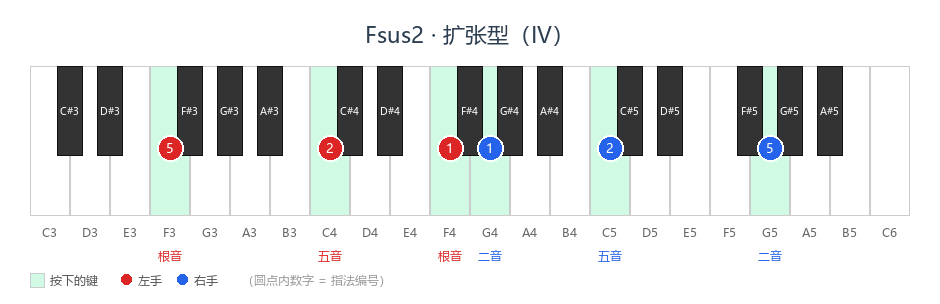

> **挂留音的共同音衔接**：Fsus2 的二音 G 恰是下一个和弦 G 的根音；Gsus4 的四音 C 恰是最终主和弦 C 的根音。挂留音并非凭空消失，而是作为**共同音平滑过渡**到下一个和弦，这正是挂留和弦让声部进行更连贯的原因。

**练习要点**：

1. 先逐个和弦单独练熟（尤其 Fsus2 的左手跨八度、Gsus4 的四音 C）；
2. 再按 IV → V → I 顺序连贯弹奏，体会挂留音作为共同音的平滑过渡——Fsus2 的二音 G 留到 Gsus4（V 的根音）、Gsus4 的四音 C 留到 C 大三（I 的根音）；
3. 最后放慢速度，听属（V）回主（I）的"落地感"，让右手在 Gsus4 与 C 大三之间自然换位，避免硬切。
