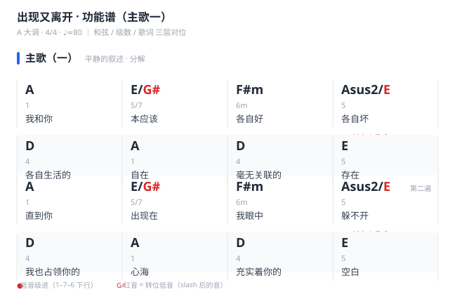

# 出现又离开

[← 返回经典曲目拆解目录](4-实战篇/2-经典曲目拆解/README.md)

> 梁博《出现又离开》：A 大调抒情弹唱曲目。和声骨架是「1–5–6–3–4–1–4–5」级进循环，主歌用低音线条 1–7–6 制造「平静的叙述」，副歌与桥段转柱式 / 琶音「压抑地爆发」，是练习「分解 ↔ 柱式」段落情绪切换与低音级进的进阶首选。

---

## 一、曲目信息

| 项目 | 内容 |
|------|------|
| 调性 | A 大调 |
| 拍号 | 4/4 |
| 速度 | ♩≈ 80（中速抒情） |   
| 难度 | ★★☆☆☆ |
| 核心技术点 | 低音级进（1–7–6）、段落情绪切换（分解 ↔ 柱式 / 琶音） |

---

## 二、和弦进行分析

本曲最核心的和弦进行，概括为 **1–5–6–3–4–1–4–5**（A 调）。按段落落地如下（教学简化版，实际可按原谱调整）：

| 段落 | 和弦进行 | 级数 | 功能 |
|------|---------|------|------|
| 主歌 | A → E/G# → F#m → E → D → A → D → E | 1 → 5/7 → 6m → 5 → 4 → 1 → 4 → 5 | 稳定 → 属（低音级进）→ 色彩 → 下属 → 解决 |
| 副歌 | D → E → A ／ D → E → F#m | 4 → 5 → 1 ／ 4 → 5 → 6m | 下属 → 属 → 解决（两套收束） |
| 桥段 | Bm → E → F#m → D → E → A | 2m → 5 → 6m → 4 → 5 → 1 | 色彩 → 属 → 下属 → 属 → 解决 |

> **关于 3 级**：核心走向「1–5–6–3–4–1–4–5」中的 3 级（iii = C#m）是骨架概括；本曲主歌落地时，第 4 拍常用 5 级（E）替代 3 级，因此具体和弦为「1–5/7–6m–5–4–1–4–5」。

> **低音线条**：主歌开头的 A → E/G# → F#m，根音走 A → G# → F#，形成 **1–7–6 下行级进**，是「以静衬动」的关键——左手低音一步步下沉，右手声部保持薄而留白。

---

## 三、弹唱谱（歌词 ↔ 和弦逐句对应）

> 以下为教学简化版逐句对位。「｜」为换和弦点；副歌个别句尾的最后一个和弦落在延长音上，可按原曲微调。

### 主歌（一）：平静的叙述

| 和弦 | 歌词 |
|------|------|
| A（1） | 我和你 |
| E/G#（5/7） | 本应该 |
| F#m（6m） | 各自好 |
| E（5） | 各自坏 |
| D（4） | 各自生活的 |
| A（1） | 自在 |
| D（4） | 毫无关联的 |
| E（5） | 存在 |
| A（1） | 直到你 |
| E/G#（5/7） | 出现在 |
| F#m（6m） | 我眼中 |
| E（5） | 躲不开 |
| D（4） | 我也占领你的 |
| A（1） | 心海 |
| D（4） | 充实着你的 |
| E（5） | 空白 |

**功能谱（和弦 / 级数 / 歌词三层对位）**

> 功能谱由 [gen_chord_chart.py](file:///Users/liushaozhe/PythonProjects/chords-keys-handbook/scripts/gen_chord_chart.py) 生成。第 4 句按原曲用 **Asus2/E**（上文表格为教学简化写法 E）；**红色音 = 转位低音**，**红点连线 = 低音 1–7–6 下行级进**——主歌「以静衬动」的关键一眼可见。

### 副歌：压抑的爆发

| 和弦 | 歌词 |
|------|------|
| D → E → A（4–5–1） | 为何出现在｜彼此的生活｜又离开 |
| D → E → F#m（4–5–6m） | 只留下在心里｜深深浅浅的｜表白 |
| D → E → A（4–5–1） | 谁也没有想过｜再更改 |
| D → E → F#m（4–5–6m） | 谁也没有想过｜再想回来 |
| D → E → A（4–5–1） | 哦｜我不明白 |

### 主歌（二）：叙述的延续

| 和弦 | 歌词 |
|------|------|
| A（1） | 我和你 |
| E/G#（5/7） | 不应该 |
| F#m（6m） | 制造感觉 |
| E（5） | 表达爱 |
| D（4） | 试探未知和 |
| A（1） | 未来 |
| D（4） | 相信那胡言 |
| E（5） | 一派 |
| A（1） | 当天空 |
| E/G#（5/7） | 暗下来 |
| F#m（6m） | 当周围 |
| E（5） | 又安静起来 |
| D（4） | 当我突然 |
| A（1） | 梦里醒来 |
| D（4） | 就等着 |
| E（5） | 太阳出来 |

### 桥段：情感的释放

| 和弦 | 歌词 |
|------|------|
| Bm（2m） | 我们紧紧相拥 |
| E（5） | 头也不抬 |
| F#m（6m） | 因为不想告别 |
| D（4） | 就悄然离开 |
| E（5） | 不用认真的说 |
| A（1） | 多舍不得你 |

### 结尾：回归副歌进行

| 和弦 | 歌词 |
|------|------|
| Bm → E（2m–5） | 每一个未来 都有人在 |
| Bm → E（2m–5） | 每一个未来 都有人在 |
| D → E（4–5） | 那你无需感慨 我别徘徊 |
| D → E → A（4–5–1） | 因为谁也没有想过再更改 |
| D → E → F#m（4–5–6m） | 谁也没有想过再想回来 |

---

## 四、段落拆解

### 主歌

- 左手：走 **1–7–6 低音级进**（A → G# → F#），根音下沉营造叙述感；可用根音单音或根音 + 五音框架。
- 右手：紧凑型（手型一）为主，分解和弦、声部薄、留白多。

### 副歌

- 左手：根音 + 五音框架，配合柱式 / 琶音增厚织体。
- 右手：扩张型（手型二），完成「薄 → 厚」的压抑式推进。

### 桥段

- 左手：2m–5–6m–4–5–1 根音运动，保持律动。
- 右手：柱式 / 琶音推进，情绪由「压抑」转向「释放」，结尾回到 4–5–1 / 4–5–6m 收束。

---

## 五、伴奏手法

| 段落 | 织体 | 手型 | 情绪 |
|------|------|------|------|
| 前奏 / 主歌（一） | 分解 | 紧凑型 | 平静、叙述 |
| 副歌 | 柱式 / 琶音 | 扩张型 | 压抑、爆发 |
| 桥段 | 柱式 / 琶音（结尾回归分解） | 过渡 | 释放、释然 |

---

## 六、练习要点

1. **先慢后快**：以慢速、均匀、放松为第一原则，速度在准确性之后。
2. **唱级数**：边弹边默念「1–5/7–6m–5–4–1–4–5」，把和声功能与手指落位绑定。
3. **低音级进**：重点练主歌 A → E/G# → F#m 的左手 1–7–6 下行，体会「以静衬动」。
4. **段落切换**：练「分解（主歌）→ 柱式 / 琶音（副歌 / 桥段）」的织体切换，形成条件反射。
5. **词曲对位**：对照第三部分弹唱谱，先弹熟和弦走向，再逐句对歌词，最后整曲连贯。
6. **迁移应用**：同一套级数手型可平移到其他调，参见 [每日练习模板](4-实战篇/1-每日练习/README.md)。
