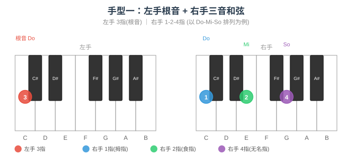
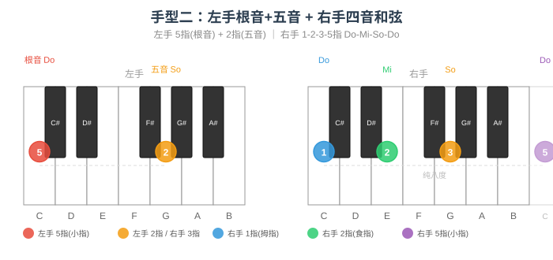

# 大三和弦练习

## 和弦结构

大三和弦由**根音 + 大三度 + 纯五度**构成。

以 C 大调为例：**C - E - G**

---

## 手型与弹奏位置

右手五指编号：**1**（拇指）、**2**（食指）、**3**（中指）、**4**（无名指）、**5**（小指）。左手同理。

大三和弦有两种基本手型，覆盖从简约到丰满的弹奏场景：

### 手型一：左手根音 + 右手三音和弦

左手单指弹根音，右手 1-2-4 指完成三音和弦，声部干净，适合伴奏起步。

| 声部 | 左手 | 右手 |
|------|------|------|
| 指法 | **3 指**（中指）弹根音 | **1-2-4 指** 弹三音和弦 |
| 示例（C 大调） | ③ → C（低八度） | ①-G、②-C、④-E（或自由排列） |

右手三音和弦有三种排列方式，可交替练习：

| 排列 | 右手音（低→高） | 指法 | 说明 |
|------|----------------|------|------|
| **So-Do-Mi** | G - C - E | 1-2-4 | 五音在最低，声部最开放 |
| **Do-Mi-So** | C - E - G | 1-2-4 | 原位密集排列 |
| **Mi-So-Do** | E - G - C | 1-2-4 | 三音在最低（第一转位色彩） |

> **练习要点**：三种排列换着练，手指记忆不同音程间距；左手根音力度稍重，建立低音支撑感。



### 手型二：左手根音+五音 + 右手四音和弦

左手弹根音与五音（空心五度），右手 1-2-3-5 指完成四音和弦，声部丰满，适合副歌、高潮段落的柱式伴奏。

| 声部 | 左手 | 右手 |
|------|------|------|
| 指法 | **5 指**弹根音 + **2 指**弹五音 | **1-2-3-5 指** |
| 示例（C 大调） | ⑤-C（低）、②-G | ①-C、②-E、③-G、⑤-C（高八度） |

> **练习要点**：左手五指与小指间距较大（纯五度），手腕保持放松不要僵硬；右手 1-2-3-5 跨度也为纯五度（C→C），确保每个音均匀触键。



### 两种手型对比

| 维度 | 手型一 | 手型二 |
|------|--------|--------|
| 左手 | 单音（根音） | 双音（根音 + 五音） |
| 右手 | 三音和弦 | 四音和弦（原位+高八度根音） |
| 声部厚度 | 薄，适合主歌 | 厚，适合副歌/高潮 |
| 右手指法 | 1-2-4 | 1-2-3-5 |
| 典型场景 | 分解伴奏、轻弹唱 | 柱式强奏、段落推进 |

---

## 练习方法

按五度圈顺时针方向（C → G → D → A → E → B → F# → Db → Ab → Eb → Bb → F），每个调依次完成以下练习：

### 基础练习（每个调）

| 步骤 | 练习内容 | 使用手型 |
|------|---------|---------|
| ① | 原位柱式和弦 | 手型一（So-Do-Mi）→ 手型二 |
| ② | 第一转位 | 手型一（Do-Mi-So）→ 手型二 |
| ③ | 第二转位 | 手型一（Mi-So-Do）→ 手型二 |
| ④ | 琶音上下行（两个八度） | 右手单手 |
| ⑤ | I → IV → V → I 连接 | 手型一 ↔ 手型二切换 |

### 进阶：手型一 → 手型二 动态切换

同一调内，先用手型一弹两拍，切手型二弹两拍，模拟主歌→副歌的声部加厚过渡：

```
C大调示例：
手型一：左手③-C    手型二：左手⑤-C + ②-G
       右手①-G ②-C ④-E   右手①-C ②-E ③-G ⑤-C
```

> **核心目标**：让两种手型成为肌肉记忆，弹唱时根据段落情绪自动选择，不需要额外思考。

---

## 各调大三和弦速查

| 调 | I 级 | 构成音 |
|----|------|--------|
| C | C | C - E - G |
| G | G | G - B - D |
| D | D | D - F# - A |
| A | A | A - C# - E |
| E | E | E - G# - B |
| B | B | B - D# - F# |
| F# / Gb | F# | F# - A# - C# |
| Db | Db | Db - F - Ab |
| Ab | Ab | Ab - C - Eb |
| Eb | Eb | Eb - G - Bb |
| Bb | Bb | Bb - D - F |
| F | F | F - A - C |
