# 小三和弦练习

## 一、和弦结构

小三和弦由**根音 + 小三度 + 纯五度**构成。

以 C 小调为例：**C - E♭ - G**

> 与大三和弦的唯一差别在三音：大三度为 4 个半音，小三度为 3 个半音（即**降三音**）。

---

## 二、手型与弹奏位置

右手五指编号：**1**（拇指）、**2**（食指）、**3**（中指）、**4**（无名指）、**5**（小指）。左手同理。

小三和弦同样有两种基本手型，覆盖从简约到丰满的弹奏场景：

### 手型一：左手根音 + 右手三音和弦

左手单指弹根音，右手 1-2-4 指完成三音和弦（根音-降三音-五音），声部干净，适合伴奏起步。

| 声部 | 左手 | 右手 |
|------|------|------|
| 指法 | **3 指**（中指）弹根音 | **1-2-4 指** 弹三音和弦 |
| 示例（C 小调） | ③ → C（低八度） | ①-G、②-C、④-E♭（或自由排列） |

右手三音和弦有三种声部排列，按练习顺序为「第二转位排列 → 原位排列 → 第一转位排列」：

| 排列 | 右手音（低→高） | 指法 | 说明 |
|------|----------------|------|------|
| **第二转位排列** | So - Do - Me（G - C - E♭） | 1-2-4 | 五音在最低，声部最开放，是手型一的起步排列 |
| **原位排列** | Do - Me - So（C - E♭ - G） | 1-2-4 | 根音在最低，密集原位 |
| **第一转位排列** | Me - So - Do（E♭ - G - C） | 1-2-4 | 三音在最低 |

> 注：左手根音始终托底、低音固定不变，因此以上是右手的**声部排列（voicing）**，而非由最低音决定的转位。唱名中的 **Me** 即小三度（♭3）。

> **练习要点**：三种排列换着练，手指记忆不同音程间距；左手根音力度稍重，建立低音支撑感。

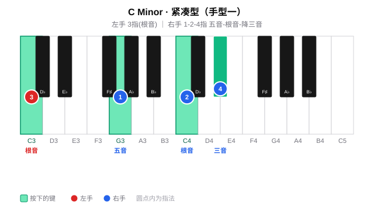

### 手型二：左手根音+五音 + 右手四音和弦

左手弹根音与五音（空心五度），右手 1-2-3-5 指完成四音和弦，声部丰满，适合副歌、高潮段落的柱式伴奏。

| 声部 | 左手 | 右手 |
|------|------|------|
| 指法 | **5 指**弹根音 + **2 指**弹五音 | **1-2-3-5 指** |
| 示例（C 小调） | ⑤-C（低）、②-G | ①-C、②-E♭、③-G、⑤-C（高八度） |

> **练习要点**：左手五指与小指间距较大（纯五度），手腕保持放松不要僵硬；右手 1-2-3-5 跨度也为纯五度（C→C），确保每个音均匀触键。

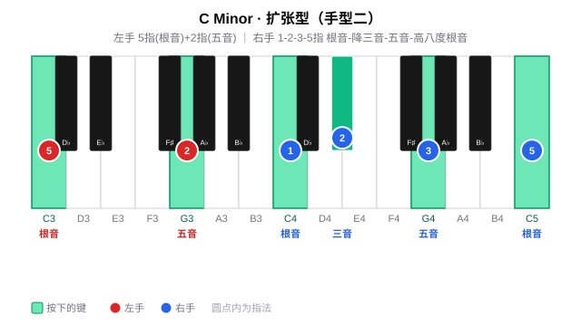

### 两种手型对比

| 维度 | 手型一 | 手型二 |
|------|--------|--------|
| 左手 | 单音（根音） | 双音（根音 + 五音） |
| 右手 | 三音和弦 | 四音和弦（原位+高八度根音） |
| 声部厚度 | 薄，适合主歌 | 厚，适合副歌/高潮 |
| 右手指法 | 1-2-4 | 1-2-3-5 |
| 典型场景 | 分解伴奏、轻弹唱 | 柱式强奏、段落推进 |

---

## 三、练习分组

按五度圈把 12 个调分成五组，按照节奏练习：

#### 周一 ·（F、C、G）

**F 小三和弦**

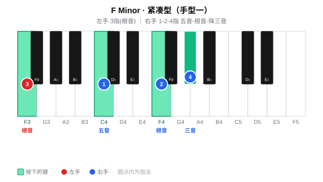

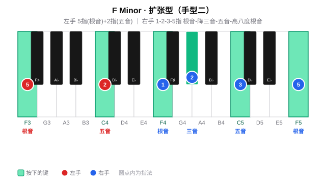

**C 小三和弦**

**G 小三和弦**

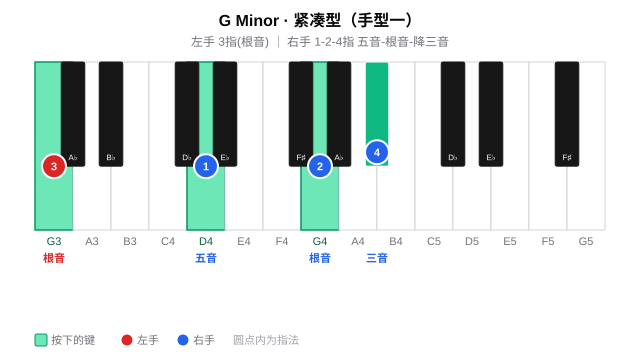

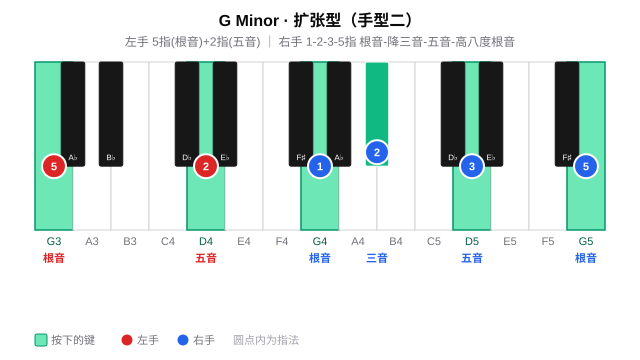

#### 周二 ·（D、A、E）

**D 小三和弦**

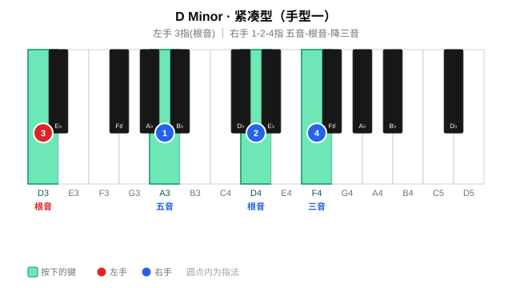

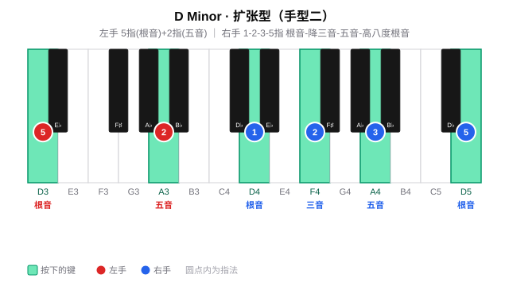

**A 小三和弦**

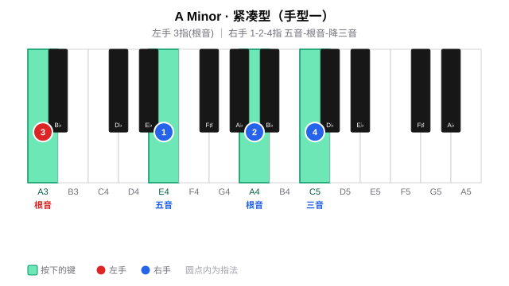

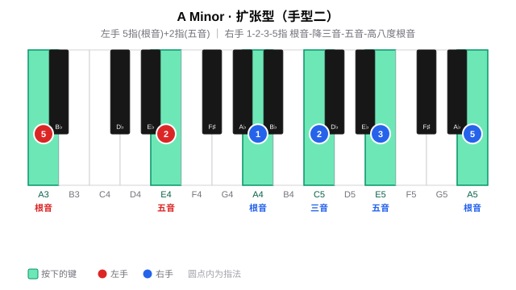

**E 小三和弦**

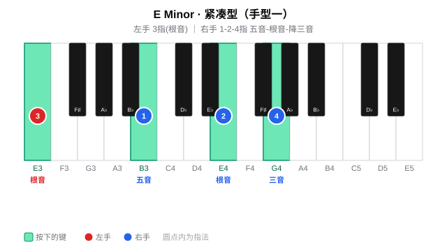

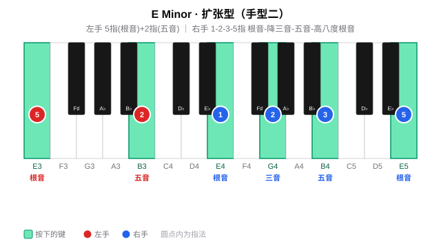

#### 周三~周四 ·（B、F#、Db）

**B 小三和弦**

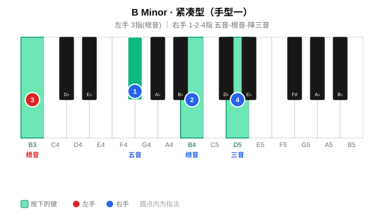

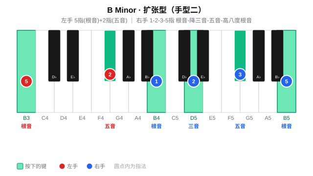

**F# 小三和弦**

**Db 小三和弦**

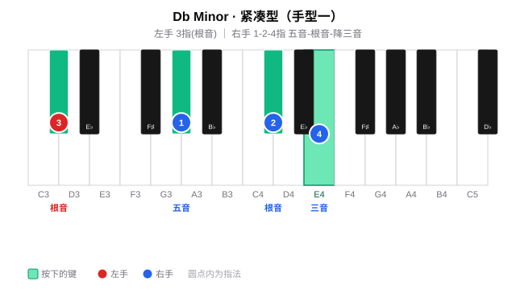

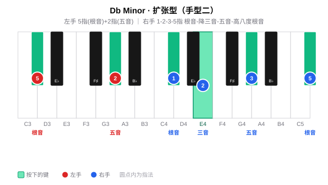

#### 周五~周六 ·（Ab、Eb、Bb）

**Ab 小三和弦**

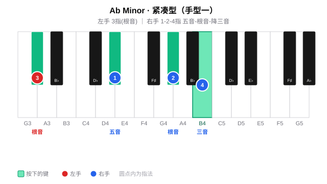

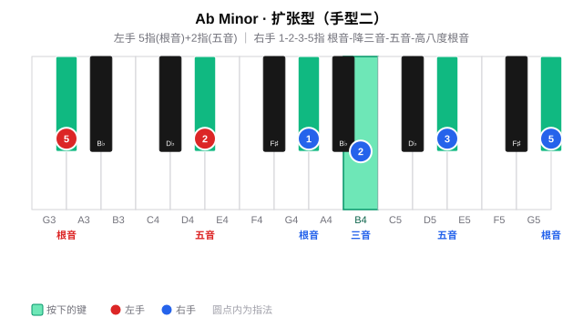

**Eb 小三和弦**

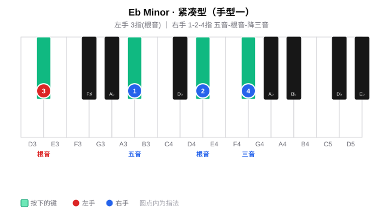

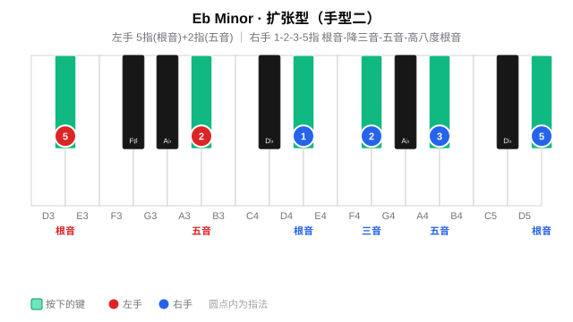

**Bb 小三和弦**

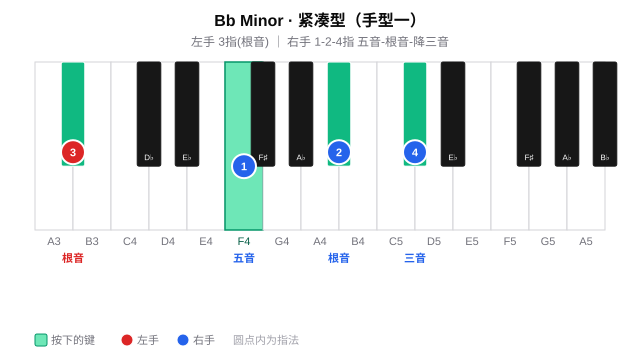

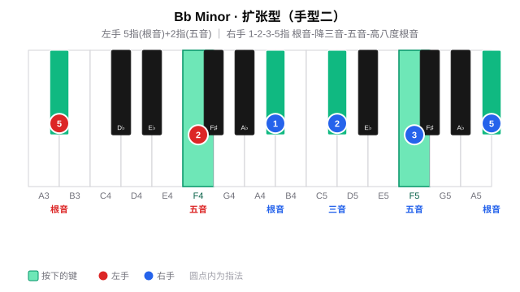

#### 周日 · 全量练习与查漏补缺

周日不引入新调，而是按五度圈顺序 C→G→D→A→E→B→F#→Db→Ab→Eb→Bb→F 全量跑一遍，重点查漏补缺：

- 哪些调的手型还卡顿、哪些黑键根音还按不准；
- 手型一（紧凑型）↔ 手型二（扩张型）切换是否流畅；
- 把薄弱调拎出来单独慢练，直到恢复肌肉记忆。

## 四、练习步骤（每个调）

每个调的练习沿**纵向 → 横向 → 视唱**三条线展开：先在调内把手型与右手声部排列练熟（纵向），再按五度圈做移调横向迁移（横向），全程唱出级数/唱名强化听感（视唱练耳，见 [每日练习模板](daily-routine.md) 的「贯穿原则」）。

### 纵向：调内声部排列（Voicing）

> **低音不变的 voicing 思路**：左手根音始终托底（低音固定为根音），变化的只是右手三音的**声部排列**。因此严格来说这些是"排列（voicing）"，而非由最低音决定的"转位（inversion）"。手型一的右手最低音按练习顺序依次为五音 → 根音 → 三音。

**第一步 · 手型一（紧凑型）**

左手根音不变，右手按顺序切换三种声部排列：

| 顺序 | 右手排列 | 右手音（低→高） | 右手最低音 | 唱名 |
|------|---------|----------------|-----------|------|
| 1 | 第二转位排列 | 五音 - 根音 - 降三音 | 五音 | Sol - Do - Me |
| 2 | 原位排列 | 根音 - 降三音 - 五音 | 根音 | Do - Me - Sol |
| 3 | 第一转位排列 | 降三音 - 五音 - 根音 | 降三音 | Me - Sol - Do |

> 以 C 小调为例：G - C - E♭ → C - E♭ - G → E♭ - G - C，右手指法均为 1-2-4。

每种排列先练**柱式和弦**（同时按下），再练**琶音分解**（逐音弹出）；左手根音力度稍重，建立低音支撑。

**第二步 · 手型二（扩张型）**

手型二在原位排列基础上扩展——左手根音 + 五音，右手根音 - 降三音 - 五音 - 高八度根音：

| 声部 | 内容 |
|------|------|
| 左手 | 5 指（根音）+ 2 指（五音） |
| 右手 | 1-2-3-5 指：根音 - 降三音 - 五音 - 高八度根音 |

同样先柱式后琶音，感受"薄 → 厚"的声部加厚过程。

### 横向：五度圈移调（Transposition）

把在某个调上练熟的手型**整体平移**到五度圈的下一个调：手型关系完全不变，只有根音位置移动。这是键盘上的**移调（Transposition）**，区别于改变调中心的**转调（Modulation）**。

- 按五度圈顺序逐个平移：C → G → D → A → E → B → F# → Db → Ab → Eb → Bb → F；
- 每移一调，重新执行一遍纵向练习（手型一三种排列 → 手型二）；
- 重点感受黑键增多时手型如何在键盘上"平移"而非"变形"。
